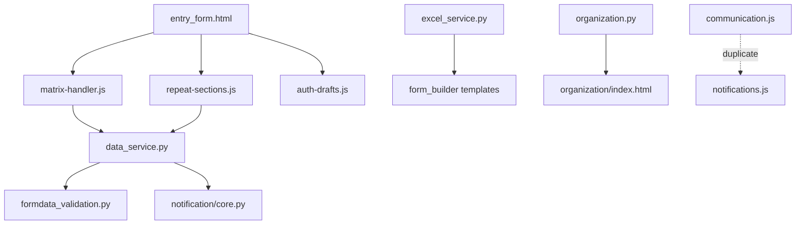

# Backoffice Code Review Report

**Date:** 2026-08-01  
**Scope:** `Backoffice/` — bugs, dead code, god files, duplicate code  
**Method:** Four parallel codebase exploration agents + line-count metrics and spot-check verification

---

## Executive Summary

The Backoffice codebase is functional and well-structured in places (centralized error helpers, plugin utilities, validation services), but **complexity concentrates in a handful of domains** that create merge-conflict risk, duplicate maintenance, and a few security gaps.

| Category | Severity | Top finding |
|----------|----------|-------------|
| **Security / bugs** | Critical | Plugin admin routes lack RBAC; Mapbox keys exposed to any logged-in user |
| **God files** | High | Form pipeline (`data_service.py`, `matrix-handler.js`, `entry_form.html`) and notification stack |
| **Duplicate code** | High | Web/mobile analytics duplication; `communication.js` ↔ `notifications.js` overlap |
| **Dead code** | Medium | Tracked `coverage/` artifacts, orphaned CSS/JS stubs, unwired UPR modules |

**Recommended first sprint:** fix plugin RBAC + key exposure, deduplicate admin notification JS, remove high-confidence dead assets, then begin incremental splits of the form submission pipeline.

---

## 1. God Files & Architectural Bottlenecks

Files exceeding ~2,500 lines or carrying 50+ functions/classes are maintenance bottlenecks. Worst offenders cluster in four domains:



### 1.1 Largest Python files (application code)

| Lines | File | Defs | Issue |
|------:|------|-----:|-------|
| 3,849 | `app/services/notification/core.py` | 53 | Entire notification domain in one module; `create_notification()` alone spans ~1,000 lines |
| 3,738 | `app/services/templates/excel_service.py` | 84 | Single `TemplateExcelService` god class with ~83 methods |
| 3,719 | `app/services/ai/validation/formdata_validation.py` | 57 | Mixes parsing, RAG, business rules, and UI payload construction |
| 3,693 | `app/services/forms/data_service.py` | 78 | Critical save/submit path; must stay in sync with frontend field naming |
| 3,100 | `app/services/upr/visual_chunking.py` | 62 | UPR document chunking heuristics |
| 3,067 | `app/services/ai/agent/executor.py` | — | AI agent orchestration |
| 3,009 | `app/routes/admin/organization.py` | 92 | **54 routes**, 9 WTForms classes, Excel import, SSE translation streaming |
| 2,969 | `app/routes/notifications.py` | 44 | 39 route handlers |
| 2,825 | `app/routes/ai.py` | 57 | AI chat, streaming, conversations |
| 2,832 | `app/routes/admin/ai_management.py` | 47 | AI admin surface |

Import scripts under `scripts/imports/` (2,600–3,400 lines) are large but lower architectural risk.

### 1.2 Largest JavaScript files (first-party, excluding TinyMCE vendor)

| Lines | File | Issue |
|------:|------|-------|
| 6,469 | `app/static/js/forms/modules/matrix-handler.js` | ~166 functions; all matrix runtime behavior in one module |
| 4,879 | `app/static/js/admin/communication.js` | Duplicate `AdminNotifications` class pattern |
| 4,671 | `app/static/js/admin/ai-documents.js` | ~123 top-level functions in IIFE |
| 4,140 | `app/static/js/admin/notifications.js` | Overlaps heavily with `communication.js` |
| 3,796 | `app/static/js/admin/manage-settings.js` | Generated monolith from template |
| 3,573 | `app/static/js/chatbot/immersive.js` | Chat UI sprawl |
| 3,044 | `app/static/js/admin/manage-assignment.js` | Assignment admin UI |
| 2,849 | `plugins/interactive_map/static/js/map_field.js` | Plugin field runtime |

### 1.3 Largest Jinja templates

| Lines | File | Issue |
|------:|------|-------|
| 4,077 | `app/templates/forms/entry_form/entry_form.html` | 23 includes, 34 script blocks; central render bottleneck |
| 3,602 | `app/templates/core/dashboard.html` | Multiple personas in one template |
| 3,633 | `app/templates/admin/data_exploration/explore_data.html` | ~100 lines inline CSS fighting AG Grid |
| 3,045 | `app/templates/admin/organization/index.html` | Mirrors 54-route Python monolith |
| 2,551 | `app/templates/admin/indicator_bank/indicator_bank.html` | Monolithic admin CRUD page |

Generated plugin report HTML under `instance/uploads/pb_progress/` (3,000–5,700 lines) should not drive refactor priorities.

### 1.4 Refactoring recommendations (prioritized)

| Priority | Target | Action |
|----------|--------|--------|
| **P0** | Form pipeline | Split `data_service.py` → processor modules; `matrix-handler.js` → submodules; continue `entry_form/partials/` extraction |
| **P0** | Admin notification JS | Extract shared `AdminNotificationsBase`; stop duplicating between `communication.js` and `notifications.js` |
| **P0** | `notification/core.py` | Split into `creation.py`, `dedup.py`, `validators.py`, `notifiers/*` |
| **P1** | `excel_service.py` | Split export/import/matrix paths |
| **P1** | `organization` blueprint | Package split: `countries.py`, `ns_structure.py`, `secretariat.py`, `import_export.py` |
| **P1** | `formdata_validation.py` | Separate parsers, UPR rules, UI payload |
| **P2** | Admin templates | Move inline CSS/JS out of `explore_data.html`, `dashboard.html` |
| **P2** | `manage-settings.js` | Replace generation with hand-authored ES modules per tab |

---

## 2. Duplicate Code

The biggest gap is **infrastructure that exists but is not consistently applied** (error handling, analytics queries) rather than missing abstractions entirely.

### 2.1 Highest-impact duplications

#### Admin vs mobile analytics (Python) — ~1,500 duplicated lines

| Web | Mobile |
|-----|--------|
| `app/routes/admin/analytics_api.py` (~1,027 lines) | `app/routes/api/mobile/admin_analytics.py` (~526 lines) |

Near-copy of query building, pagination, filtering, and row serialization for login logs, session logs, dashboard stats, and end-session.

**Fix:** Extract `UserAnalyticsQueryService`; web returns `json_ok`, mobile wraps with `mobile_paginated`.

#### Validation scope API — 4 near-identical endpoints

- `validation_dashboard.py` — periods/countries APIs
- `validation_questions.py` — periods/countries APIs

**Fix:** Shared factory or `validation_scope_api.py` mounted under both URL prefixes.

#### Validation JS period/country loading — 4 files

- `validation-dashboard.js`, `validation-dashboard-tracker.js`, `validation-questions-grid.js`
- Duplicate `esc()` in 7+ admin JS files

**Fix:** `validation-scope-loader.js` + shared `html-escape.js`.

#### Form builder create vs update helpers — ~1,750 lines parallel structure

- `item_factories.py` (~819 lines) vs `item_updaters.py` (~932 lines)
- Nested `get_field_value()` redefined 5× in factories alone

**Fix:** Shared field schema + generic `FormItemMutationService`.

#### Documentation routes — ~230 lines duplicated

- `help_docs.py` vs `admin/documentation.py` — identical helpers, different auth decorators

**Fix:** `docs/_shared.py` with `register_docs_routes(bp, auth_decorator, ...)`.

#### Notifications vs communication admin JS — ~9,000 lines combined

Overlapping audience/template-filter logic, campaign picker, assignment filtering, AG Grid wiring.

**Fix:** `admin/campaign-audience-common.js`.

#### Error handling copy-paste — 50+ route files

Existing helpers underused:
- `app/utils/error_handling.py` — `handle_json_view_exception`
- `app/utils/api_responses.py` — `@json_error_handler`

Heavy manual `except Exception` blocks in: `content_management.py` (19×), `assignment_management.py` (20×), `auth.py` (13×), `notifications.py` (13×).

Only **2 route files** use `@json_error_handler`.

**Fix:** Adopt decorator on JSON blueprints; migrate incrementally.

### 2.2 Medium-impact duplications

| Area | Files | Pattern |
|------|-------|---------|
| Validation rules CRUD | `validation_rules.py` | 6 similar upsert/delete endpoints |
| System admin hierarchy | `system_admin/sectors.py` | 5 entity types, same CRUD pattern |
| Content management | `content_management.py` + mobile | Resources vs documents CRUD mirrored |
| Plugin route boilerplate | 3 plugins | Config import fallback duplicated |
| AG Grid admin utilities | `login-logs-grid.js`, `session-logs-grid.js` | Shared escape, user cell renderer, pagination |
| Jinja validation admin | 3 templates | Shared shell, tab bars, feedback divs |
| SQL/query patterns | 20+ routes | `validate_pagination_params`, `safe_ilike_pattern`, date-range parsing |
| Variable resolution | `forms/entry.py` | 18× `VariableResolutionService.replace_variables_in_text` calls — candidate for helper |

### 2.3 Refactoring order

1. Analytics service extraction (largest web/mobile Python win)
2. Validation scope API + JS loader (small, isolated)
3. Docs route factory (~400 → ~80 lines)
4. Error-handling migration (incremental per blueprint)
5. Form builder mutation unification (highest effort, highest long-term win)
6. Notifications/communication JS split (needs campaign regression testing)

---

## 3. Dead Code & Orphaned Files

### 3.1 High confidence — safe to remove

| Item | Evidence | Action |
|------|----------|--------|
| `Backoffice/coverage/` (55 tracked files) | Vitest/Istanbul HTML report; `.gitignore` covers `.coverage` but not this folder | Delete + add `Backoffice/coverage/` to `.gitignore` |
| `app/static/js/core/flash-messages-ui.js` | Marked `DEPRECATED` no-op stub; zero template/JS references | Delete |
| `app/static/css/gantt-chart.css` | No `<link>` anywhere; `gantt_chart.html` uses inline styles with different class names | Delete |
| `app/static/css/interactive-map-field.css` | Stale copy; active styles in `plugins/interactive_map/static/css/map_field.css` | Delete |
| `FormDataService._process_data_availability_flags()` | Docstring: "Deprecated"; body returns `[]`; tests only | Delete method + tests |
| `query_intent_helpers.py` deprecated helpers (~70 lines) | `is_dashboard_country_list_question`, etc. — never imported | Delete |
| `app/services/upr/config.py` → `get_upr_config()` | Never imported; callers use `current_app.config` directly | Delete or wire up |
| `app/services/upr/tools.py` → `register_upr_tools()` | Never called; logic duplicated in `AIToolsRegistry` | Delete or refactor |
| `forms_api.py` presence heartbeat/active-users routes | `# DEPRECATED: use /sync`; `presence.js` uses `/sync` only | Delete after log/metrics check |

### 3.2 Compatibility shims — remove when safe

| Item | Action |
|------|--------|
| `app/utils/activity_middleware.py` | 3-line re-export shim; delete when confirmed zero imports |
| `admin/__init__.py` — `legacy_api_key_admin_redirect` | Keep until analytics show zero hits |
| `upr_excel_import.py` — `legacy_bp` | Keep (bookmarked URLs) |
| `public.py` — `legacy_public_*_redirect` | Keep |
| `api/data.py` — `get_data_tables_legacy_redirect` | Keep (308 + Deprecation header) |
| `indicator_bank_compat` blueprint | Keep (external API consumers) |

### 3.3 JavaScript & CSS health

- Full scan of `app/static/js/`: only `flash-messages-ui.js` is unreferenced
- All other app CSS files are referenced from templates except the two orphans above
- `input.css` is Tailwind source (via `npm run build:css`) — **keep**

### 3.4 False positives to avoid

Naive "unused module" scans flag ~58 Python files; most are live via package `__init__.py` re-exports. Do **not** bulk-delete from automated lists.

---

## 4. Bugs & Security Issues

Findings ordered by severity. Spot-checks confirmed several critical items in source.

### 4.1 Critical

#### Plugin admin routes lack RBAC

**Files:** `app/plugins/plugin_utils.py` (lines 77–141), plugin route modules

`plugin_route_wrapper` applies only `@login_required`. `BasePluginRoutes` exposes `POST /api/config`, cache clear, etc. without `admin.plugins.manage`. Any authenticated user (including focal points) can modify plugin settings.

**Fix:** Add `@permission_required('admin.plugins.manage')` to all mutating plugin routes.

#### Mapbox/API keys exposed to all authenticated users

**File:** `plugins/interactive_map/routes.py` (lines 86–105)

```python
'mapbox_token': api_keys.get('mapbox', ''),
'api_keys': api_keys
```

Returned from `GET /admin/plugins/interactive_map/api/config/field` with only `@login_required`.

**Fix:** Never return raw API keys; use server-side proxy or `"configured": true` indicator. Restrict to plugin admins.

### 4.2 High

#### Unauthenticated plugin HTML rendering

**File:** `app/routes/plugins.py` (lines 9–62)

`GET /api/plugins/field-types/<field_type_id>/render-entry` has no auth. Admin equivalent requires `admin.templates.view`. Attacker-controlled `field_config` / `existing_data` query params create template injection surface.

**Fix:** Require `@login_required` plus assignment/form access checks.

#### Swallowed exceptions in closed-assignment authorization

**File:** `app/services/organization/authorization_service.py` (lines 882–897)

```python
try:
    round_closed = assignment_entity_status.is_round_closed_for_entity()
    ...
except Exception:
    pass
```

If closure check fails, method may treat a closed round as open.

**Fix:** Log warning; fail closed (`return True`) when closure cannot be determined.

#### Notification crash on stale user IDs

**File:** `app/services/notification/core.py` (lines 3252–3254)

```python
admin_emails = [
    User.query.get(uid).email for uid in admin_user_ids
]
```

`User.query.get(uid)` returning `None` raises `AttributeError`, aborting document-upload notifications.

**Fix:** Batch-load users or use walrus-comprehension with null guard.

### 4.3 Medium

| Issue | File | Fix |
|-------|------|-----|
| N+1 on discussion comment authors | `forms_api.py:1553–1559` | Add `joinedload(SubmissionDiscussionComment.created_by_user)` |
| Race on concurrent entity assignment add | `assignment_management.py:765–789` | Handle `IntegrityError` → 409 |
| Unguarded `request.json` access | `assignment_management.py:753–755` | Use `get_json_safe()` |
| Quiz score has no upper bound | `api/quiz.py:43–53` | Cap score server-side |
| PDF handle leak on thumbnail failure | `content_management.py:2230–2253` | Use `with fitz.open(...)` |
| Double DB query + fragile null | `assignment_management.py:673` | Single query, null-safe |
| Redundant query + possible `None.isoformat()` | `api/submissions.py:335` | Single query, null-safe serialization |

### 4.4 Low / informational

- Broad `except Exception: pass` in `authorization_service.py`, `notification/emails.py`, `admin/settings.py` — log at warning level
- Migration `add_completion_rate_to_assignment_entity_status.py` — NULL until backfill (handled by reads)
- Naive `datetime.utcnow()` in dev CLI vs `utcnow()` helper
- No bare `except:` in app Python (good)
- No SQL injection in route handlers (good)
- No hardcoded production secrets (good)
- Public resource downloads in `public.py` — confirm product intent

### 4.5 Remediation order

1. Plugin RBAC
2. Interactive map key leak
3. Unauthenticated plugin render endpoint
4. Notification email list comprehension
5. Authorization fail-closed on closed-assignment checks
6. N+1, race handling, `request.json` guards

---

## 5. Cross-Cutting Observations

### What is working well

- `app/utils/api_responses.py` vs `api_helpers.py` — intentional split with clear guidance
- `app/plugins/plugin_utils.py` — `BasePluginRoutes`, `plugin_error_handler` reduce plugin duplication
- `app/services/validation/dashboard_service.py` — shared by validation routes
- Partial adoption of `handle_json_view_exception` in `forms_api.py` and admin modules
- Form entry partial extraction started under `entry_form/partials/`
- DEBUG-mode dev login presets and CSRF patterns are documented

### Risk hotspots for future changes

Any change touching **matrix fields**, **repeat sections**, or **save/submit** must be coordinated across:
- `matrix-handler.js` ↔ `data_service.py` ↔ `entry_form.html`
- `repeat-sections.js` ↔ `data_service.py`
- `auth-drafts.js` ↔ `forms_api.py`

---

## 6. Recommended Action Plan

### Sprint 1 — Security & quick wins (1–2 days)

- [ ] Add RBAC to plugin mutating routes
- [ ] Stop returning API keys in interactive map config
- [ ] Add auth to `/api/plugins/field-types/*/render-entry`
- [ ] Fix notification email list comprehension crash
- [ ] Delete: `coverage/`, `flash-messages-ui.js`, `gantt-chart.css`, `interactive-map-field.css`
- [ ] Fail-closed on assignment closure check exceptions

### Sprint 2 — Duplication reduction (3–5 days)

- [ ] Extract analytics query service (web + mobile)
- [ ] Shared validation scope API + JS loader
- [ ] Extract `AdminNotifications` shared module from communication/notifications JS
- [ ] Adopt `@json_error_handler` on 2–3 highest-churn blueprints

### Sprint 3 — God file splits (ongoing)

- [ ] `matrix-handler.js` → ES module subpackages
- [ ] `data_service.py` → processor modules with thin orchestrator
- [ ] `notification/core.py` → notifiers package
- [ ] `organization.py` blueprint package + template tab partials

---

## Appendix A — Route density outliers

| File | Route handlers |
|------|---------------:|
| `routes/admin/organization.py` | 54 |
| `routes/notifications.py` | 39 |
| `routes/admin/content_management.py` | 27 |
| `routes/admin/ai_management.py` | 26 |

## Appendix B — Review agents

This report synthesizes findings from four parallel exploration agents:

| Agent focus | Key deliverable |
|-------------|-----------------|
| God files | Line counts, responsibility analysis, split recommendations |
| Duplicate code | 15 duplication clusters with refactor suggestions |
| Dead code | 9 high-confidence removals, shim inventory |
| Bugs | 20 runtime/security findings with severity ratings |

---

*Generated by automated codebase review. Re-run after major refactors or quarterly for drift tracking.*
