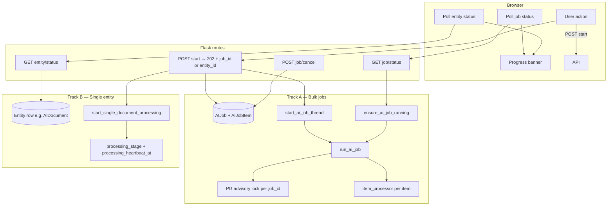

# Background jobs & progress UI — reusable pattern

**Purpose:** Document the server-side job runner + status/heartbeat + frontend progress banner stack used by **AI Documents** (2026 overhaul), so any feature area can migrate away from ad-hoc threads, in-memory-only state, and blocking HTTP handlers.

**Reference implementation:** AI Document Library (`/admin/ai/documents`) — bulk import/reprocess/metadata jobs and single-document upload/reprocess.

**Audience:** Engineers and coding agents implementing long-running Backoffice work that must survive browser close, work across Gunicorn workers / App Service instances without Redis, and show honest progress in the UI.

---

## When to use this pattern

Use it when **all** of the following apply:

| Requirement | Why this pattern helps |
|-------------|------------------------|
| Work takes seconds to minutes | HTTP request must return quickly (`202 Accepted`) |
| User should see progress | Polling + banner, not a spinner on a blocked request |
| Browser may close mid-run | Non-daemon background threads + DB-backed job/entity state |
| Multiple Gunicorn workers or App Service instances | PostgreSQL advisory locks, DB cancellation, persisted heartbeat |
| Bulk operations (N items) | Generic job runner with atomic item claiming |
| Single-entity operations (1 file, 1 export, 1 reindex) | Background thread + entity `processing_*` columns |

**Do not use** for:

- Sub-second CRUD (normal form POST + redirect).
- Work that must run exactly once cluster-wide on a schedule → use APScheduler / external scheduler with advisory locks (see [multi-instance without Redis](../runbooks/deployment/multi-instance-without-redis.md)).
- Real-time streaming where SSE/WebSocket is already the product UX (AI chat streaming).

---

## Architecture overview

Two complementary tracks share UI primitives but differ in persistence:



### Design principles (non-negotiable)

1. **Return immediately** — Slow I/O (network download, large file resolve) runs on the **background thread**, not the request thread. Pass a `resolve_file` callable when needed (see AI Documents reprocess).
2. **DB is source of truth** — In-memory dicts/events are performance hints only; another worker must see the same state via PostgreSQL.
3. **One runner per job** — `pg_try_advisory_lock` on `job_id` before processing; second worker skips cleanly.
4. **Atomic claims** — `UPDATE … WHERE status = 'queued'` before running an item; never assume exclusive access without claiming.
5. **Cooperative cancellation** — `AIJob.status = 'cancel_requested'` in DB **and** `signal_job_cancel(job_id)` for the in-process fast path; item processors poll `job_cancel_requested(job_id)`.
6. **Non-daemon threads** — `daemon=False` so worker recycle does not silently kill in-flight processing without stale recovery having a chance to mark state.
7. **Monotonic UI progress** — Frontend clamps percent so poll jitter does not move the bar backward (unless `resetProgress: true` on a new run).
8. **Stale recovery** — Page load and status polls call reconcile helpers so abandoned `processing` / `queued` rows eventually fail with a clear message.

---

## Track A — Bulk / batch jobs

### Core modules

| Module | Role |
|--------|------|
| `app/models/ai_jobs.py` | `AIJob`, `AIJobItem` — generic queue tables (`job_type`, JSON `meta` / `payload`) |
| `app/services/ai/ai_job_runner.py` | Runner engine: locks, claim, cancel, finalize, stale reconcile, cleanup |
| Route module(s) | Create job, start thread, status/cancel endpoints, thin `_run_*_job` wrappers |

### Job lifecycle

```
queued → running → completed | failed | cancelled
              ↑
      cancel_requested → cancelled
```

**Item statuses:** `queued` → `downloading` | `processing` → `completed` | `failed` | `cancelled`

### Runner API (use these; do not reimplement loops)

```python
from app.services.ai.ai_job_runner import (
    run_ai_job,              # Blocking engine — run inside background thread
    start_ai_job_thread,     # Fire-and-forget thread wrapper
    ensure_ai_job_running,   # Call from status poll + page load — resume orphans
    signal_job_cancel,       # In-process cancel signal
    job_cancel_requested,    # Check DB + in-process event
    get_active_ai_document_jobs_for_user,  # UI resume list (extend or mirror for new job types)
)
```

**`run_ai_job(app, job_id, item_processor, *, concurrency_config_keys, default_concurrency, stagger_seconds)`**

- Acquires advisory lock for `job_id` (no-op skip if held elsewhere).
- Sets job `running`, loops queued items, claims each atomically, runs `item_processor` in a `ThreadPoolExecutor`.
- Periodically pings the lock-holding DB connection during waits (`_LOCK_KEEPALIVE_SECONDS`) so idle timeouts do not drop the lock mid-job.
- Finalizes job: **failed if any item failed** (not merely “all items terminal”).

**Item processor contract:**

```python
def _process_my_job_item_sync(app, *, job_id: str, item_id: int) -> None:
    with app.app_context():
        if job_cancel_requested(job_id):
            # mark item cancelled, commit, return
            ...
        item = AIJobItem.query.get(item_id)
        # claim already happened; set item.status = "processing", commit
        # do work; on success item.status = "completed"
        # on failure item.status = "failed", item.error = user_safe_message
        db.session.commit()
```

### HTTP endpoints (copy this shape)

| Method | Path | Behavior |
|--------|------|----------|
| `POST` | `/…/bulk-action` | Create `AIJob` + `AIJobItem` rows; `start_ai_job_thread(app, job_id, _run_my_job)`; return **`202`** with `{ job_id, total, … }` |
| `GET` | `/…/bulk-action/<job_id>/status` | **`ensure_ai_job_running`** then return job + items + per-entity snapshot |
| `POST` | `/…/bulk-action/<job_id>/cancel` | Set `job.status = cancel_requested`; cancel queued items; `signal_job_cancel(job_id)` |

**Status response should include:**

- Job: `id`, `job_type`, `status`, `total_items`, timestamps, `error`, `counts` (`completed`, `failed`, `cancelled`, `in_progress`).
- Items: stable `index`, item `status`, `error`, link to entity (`entity_type` / `entity_id` or `payload`).
- Optional: nested entity status (e.g. document `processing_status`) for richer banners.

### Registering a new bulk job type

1. **Pick a stable `job_type` string** — e.g. `forms.bulk_reindex` (dotted namespace).
2. **Add to `AI_DOCUMENTS_JOB_TYPES`** in `ai_job_runner.py` *or* introduce a parallel frozenset / generalize the constant if the job is outside AI Documents (see “Generalizing beyond AI” below).
3. **Implement** `_process_*_job_item_sync` and `_run_*_job` (thin wrapper calling `run_ai_job`).
4. **Add routes:** start, status, cancel (mirror `bulk_reprocess_*` in `ai_management.py`).
5. **On admin page load:** for each active job of your type, call `ensure_ai_job_running(app, job_id, _run_my_job)`.
6. **Frontend:** `registerJobSpec` (see Track C).
7. **Tests:** item claim, cancel, `run_ai_job` e2e, lock contention (PostgreSQL), finalize when all items failed.

### Concurrency

- Store per-job override in `AIJob.meta["concurrency"]`.
- Resolve via `_resolve_concurrency(job, config_keys=("MY_FEATURE_CONCURRENCY",), default=1)` — capped at **4**.
- Add a config key in `config.py` and document in DEVELOPER-HANDBOOK.

### Advisory lock namespace

Lock id: `950_000_000 + (zlib.crc32(job_id) % 49_000_000)` — kept separate from digest locks (`702348`, `702349`) and RBAC locks. Document new lock families in [multi-instance without Redis](../runbooks/deployment/multi-instance-without-redis.md).

---

## Track B — Single-entity async processing

For one row (one upload, one reprocess, one export file) **without** creating an `AIJob` row.

### Core helper

`app/routes/ai_documents/upload.py` → **`start_single_document_processing`**

```python
start_single_document_processing(
    app,
    entity_id,
    file_path=...,           # when already resolved
    filename=...,
    resolve_file=callable,   # optional: deferred download/resolve on background thread
    pre_clear_chunks=False,
    clear_storage_path=False,
    temp_path=...,
)
```

**`resolve_file`** — zero-arg callable run inside the background thread’s app context; returns `(file_path, temp_path, filename, clear_storage_path)`. On exception, marks entity `failed` with `_summarize_processing_error` and does not call `_process_document_sync`.

### Entity columns (cross-worker heartbeat)

On the entity table (example: `ai_documents`):

| Column | Purpose |
|--------|---------|
| `processing_status` | `pending` / `processing` / `completed` / `failed` |
| `processing_error` | User-safe message |
| `processing_stage` | Granular step name (`extracting`, `embedding`, …) — **persisted** |
| `processing_heartbeat_at` | Last stage update — used for stuck detection |

Helpers:

- `_mark_processing_stage(entity_id, stage)` — in-memory + DB heartbeat.
- `_clear_processing_stage(entity_id)` — on completion/failure cleanup.
- `get_document_processing_stage_from_db(entity_id)` — status endpoint reads this when in-memory stage is empty (another worker).

### HTTP endpoints

| Method | Path | Behavior |
|--------|------|----------|
| `POST` | `/…/<id>/reprocess` | Set `pending`; `start_single_document_processing(...)`; return **`202`** immediately |
| `GET` | `/…/<id>/status` | Return `processing_status`, `stage`, `progress`, `processing_error`; run stuck detection |

### Stuck detection (important details)

When `processing_status == 'processing'` and no active in-memory stage:

- Compute `last_touched = max(processing_heartbeat_at, updated_at, created_at)` — **not** first-truthy OR. Heartbeat is never cleared between runs; a stale heartbeat must not beat a fresh `updated_at` after reprocess.
- If age ≥ timeout → atomic update to `failed` with explanatory `processing_error`.

Also handle long-idle `pending` (no stage, no active job item) with a separate timeout.

Page load may call `_auto_recover_stale_processing_documents()` for batch self-heal.

---

## Track C — Frontend progress banner

### Modules

| File | Role |
|------|------|
| `app/static/js/admin/ai-documents-job-progress.js` | Generic banner: job polling, per-entity polling, localStorage resume, cancel UX |
| `app/static/js/core/floating-progress-banner.js` | Presentational banner shell |
| Page JS (e.g. `ai-documents.js`) | `registerJobSpec`, wire buttons, start polling |

### Job spec registration

Each bulk `job_type` registers once at page init:

```javascript
jobProgress.registerJobSpec('my_feature_bulk', {
  storageKey: 'my_feature_bulk_job',   // localStorage resume across refresh
  statusUrl: function (jobId) {
    return '/admin/my-feature/bulk/' + encodeURIComponent(jobId) + '/status';
  },
  cancelUrl: function (jobId) {
    return '/admin/my-feature/bulk/' + encodeURIComponent(jobId) + '/cancel';
  },
  titleImport: false,  // true → "Importing…" copy vs "Reprocessing…"
});
```

After POST start returns `202`:

```javascript
jobProgress.startJob('my_feature_bulk', jobId, totalItems);
```

### UI rules implemented in AI Documents (reuse)

- **Monotonic progress** — `updateDocEntry` only increases `progress` unless `resetProgress: true`.
- **Cancel button** — Shown only when job is non-terminal and cancel URL exists; hidden deterministically in `renderBannerState`.
- **Resume on load** — Server embeds `active_jobs` JSON in template; client also reads `storageKey` from localStorage.
- **Single-doc vs bulk** — Same banner; single-doc polls entity `/status` for stage detail.
- **Upload progress** — Use `XMLHttpRequest` + `upload.onprogress` for byte progress; **still** call `refreshCSRFTokenIfStale` before send and retry once on CSRF failure (mirror `csrfFetch`).

### Template bootstrap

```html
<script type="application/json" id="my-page-active-jobs">{{ (active_jobs or [])|tojson }}</script>
<script type="application/json" id="my-page-processing-ids">{{ (processing_ids or [])|tojson }}</script>
```

Page load handler passes these into `jobProgress.init({ … })`.

### Generalizing the JS module

Today the file is named `ai-documents-job-progress.js` but the pattern is domain-agnostic. To adopt elsewhere:

1. Copy or rename to a shared module (e.g. `app/static/js/core/job-progress-banner.js`) when a second consumer exists.
2. Keep `JOB_SPECS` empty by default; pages register specs only for their job types.
3. Avoid hard-coded AI URLs inside the core module — all URLs live in per-page `registerJobSpec` callbacks.

---

## Migration checklist (for agents)

Use this as a step-by-step when moving an existing feature to this stack.

### Discovery

- [ ] List current entry points (routes, Celery?, raw `threading.Thread`, blocking POST).
- [ ] Classify: **bulk** (N items) vs **single** (one entity).
- [ ] Identify entity table + status columns (add migration if missing).
- [ ] Confirm RBAC on start/status/cancel endpoints.

### Server — bulk

- [ ] Define `job_type` string and config keys (`MY_FEATURE_*`).
- [ ] Implement `_process_*_job_item_sync` with cancel checks and user-safe errors.
- [ ] Implement `_run_*_job` → `run_ai_job(...)`.
- [ ] POST start: create `AIJob`/`AIJobItem`, flip entities to `pending`, `start_ai_job_thread`, return 202.
- [ ] GET status: `ensure_ai_job_running`, return job + items JSON.
- [ ] POST cancel: `cancel_requested` + cancel queued items + `signal_job_cancel`.
- [ ] Page load: resume active jobs via `ensure_ai_job_running`.
- [ ] Add job type to cleanup TTL set if using `cleanup_expired_ai_document_jobs` or equivalent.

### Server — single

- [ ] Add `processing_stage`, `processing_heartbeat_at` if granular progress needed (migration).
- [ ] Extract or reuse `start_single_document_processing` pattern.
- [ ] Move slow `resolve_file` work off request thread.
- [ ] POST action returns 202; GET status with stuck detection (`max()` timestamps).
- [ ] `_auto_recover_stale_*` on page load optional but recommended.

### Frontend

- [ ] Include job-progress + floating banner scripts.
- [ ] `registerJobSpec` for each bulk job type.
- [ ] Replace blocking fetch with start + poll; show banner on 202.
- [ ] CSRF: use `csrfFetch` for JSON POSTs; for XHR uploads, pre-refresh + one retry.
- [ ] Embed `active_jobs` / processing ids in template for resume.

### Tests

- [ ] Unit: `_claim_job_item`, cancel, stale reconcile, `run_ai_job` success + all-failed finalize.
- [ ] PostgreSQL: advisory lock contention (second runner no-ops).
- [ ] Route: start returns 202 without blocking; `resolve_file` deferred.
- [ ] Status: fresh `updated_at` beats stale heartbeat (regression).

### Ops / docs

- [ ] Document config keys in `docs/DEVELOPER-HANDBOOK.md`.
- [ ] Note advisory lock in multi-instance runbook if new lock family.
- [ ] Verify behavior with 2+ Gunicorn workers locally if possible.

---

## Reference map (AI Documents)

| Concern | Location |
|---------|----------|
| Generic runner | `Backoffice/app/services/ai/ai_job_runner.py` |
| Job models | `Backoffice/app/models/ai_jobs.py` |
| Bulk reprocess/import | `Backoffice/app/routes/admin/ai_management.py` |
| IFRC bulk import | `Backoffice/app/routes/ai_documents/ifrc.py` |
| Single upload/reprocess | `Backoffice/app/routes/ai_documents/upload.py` |
| Heartbeat migration | `Backoffice/migrations/versions/add_ai_document_processing_heartbeat.py` |
| Progress banner JS | `Backoffice/app/static/js/admin/ai-documents-job-progress.js` |
| Page wiring | `Backoffice/app/static/js/admin/ai-documents.js` |
| Template bootstrap | `Backoffice/app/templates/admin/ai/documents.html` |
| Runner tests | `Backoffice/tests/unit/test_services/test_ai_job_runner.py` |
| FDRS data sync job | `Backoffice/app/services/imports/fdrs_data_sync_job.py` |
| FDRS sync routes | `Backoffice/app/routes/admin/data_sync_imputation.py` |
| Single/single-route tests | `Backoffice/tests/unit/test_routes/test_ai_document_single_processing.py` |
| Config keys | `docs/DEVELOPER-HANDBOOK.md` → “AI document batch jobs & processing (`AI_DOCS_*`)” |
| Multi-instance locks | `Backoffice/docs/runbooks/deployment/multi-instance-without-redis.md` |

### Existing bulk job types (AI Documents)

| `job_type` | Frontend spec key |
|------------|-------------------|
| `docs.bulk_reprocess` | `docs_bulk_reprocess` |
| `docs.bulk_reprocess_metadata` | `docs_bulk_reprocess_metadata` |
| `docs.bulk_import_system` | `docs_b_bulk_import_system` |
| `ifrc_api_bulk` | `ifrc_api_bulk` |
| `fdrs.data_sync` | *(inline modal poll — `data_sync_imputation.html`)* |

---

## Generalizing beyond AI Documents

**Short path (recommended first):** Reuse `AIJob` / `AIJobItem` and `ai_job_runner.py` with a new dotted `job_type` (e.g. `exports.bulk_generate`). Extend `AI_DOCUMENTS_JOB_TYPES` or rename to a neutral `BACKOFFICE_BATCH_JOB_TYPES` when multiple domains share cleanup/resume lists.

**Long path (when AI coupling is unacceptable):**

1. Copy models to `app/models/batch_jobs.py` (or domain-specific tables).
2. Move runner to `app/services/platform/batch_job_runner.py` with parameterized job-type sets and lock namespace.
3. Share frontend module under `app/static/js/core/`.

Do **not** fork the runner loop per feature — the bugs (double runners, lost locks, wrong finalize status) recur.

---

## Anti-patterns (do not migrate toward these)

| Anti-pattern | Why it breaks |
|--------------|---------------|
| Daemon background threads | Worker restart kills work with no recovery path |
| In-memory-only cancel/progress dicts | Invisible to other workers/instances |
| Blocking POST until work finishes | Gateway timeouts, no progress, poor UX |
| `ThreadPoolExecutor` per route without advisory lock | Duplicate processing on multi-instance |
| Download / resolve on request thread before 202 | Defeats async; ties up Gunicorn thread pool |
| `processing_heartbeat_at or updated_at` for stuck detection | False “stuck” after reprocess (stale heartbeat wins) |
| Mark job `completed` when all items merely terminal | All-failed batches reported as success |
| Raw XHR without CSRF refresh/retry | Stale token failures on long-lived admin pages |
| Progress bar that decreases on poll | User distrust; use monotonic clamp |

---

## Configuration template

When adding a new feature area, define keys with a clear prefix:

```python
# config.py (example)
MY_FEATURE_JOB_STALE_SECONDS = 180
MY_FEATURE_CONCURRENCY = 1
MY_FEATURE_STUCK_PROCESSING_TIMEOUT_SECONDS = 3600
MY_FEATURE_STUCK_PENDING_TIMEOUT_SECONDS = 900
```

Wire defaults in the runner/route the same way `AI_DOCS_*` keys are read in `ai_job_runner.py` and `ai_management.py`.

---

## Related documentation

- [Developer handbook — AI document batch jobs (`AI_DOCS_*`)](../../../docs/DEVELOPER-HANDBOOK.md)
- [Multi-instance deployment without Redis](../runbooks/deployment/multi-instance-without-redis.md)
- [Playwright testing — dev login & cache](../../../.cursor/rules/playwright-browser-testing.mdc) (for E2E verification of progress UI)

---

*Last updated: 2026-08-07 — reflects AI Documents job processing overhaul (generic runner, heartbeat columns, progress banner, cross-worker locks).*
