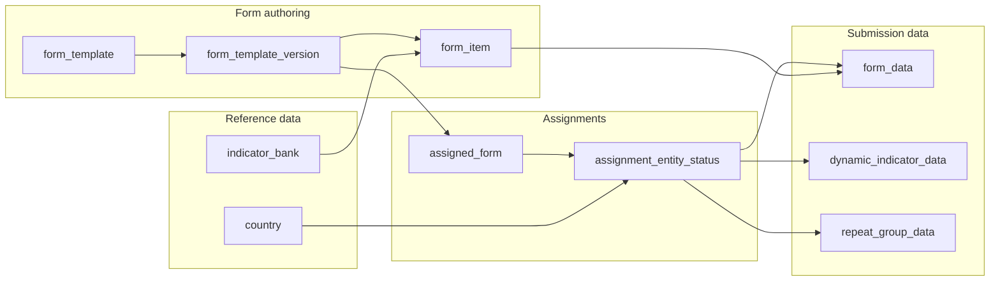

# IFRC Network Databank — Backoffice Database Schema

> Generated from SQLAlchemy models on 2026-07-29. Regenerate with `python scripts/dev/export_database_schema.py` from `Backoffice/`.

## Executive summary

| Item | Value |
|------|-------|
| Database engine | PostgreSQL 16 (production); [pgvector](https://github.com/pgvector/pgvector) for embeddings |
| ORM | SQLAlchemy (Flask-SQLAlchemy) |
| Schema migrations | Flask-Migrate / Alembic (`Backoffice/migrations/`) |
| Application tables | 90 (excludes `alembic_version`) |
| Primary consumers | Backoffice web app, mobile API, public website (read paths), AI/RAG services |

### Domain overview

| Domain | Tables |
|--------|--------|
| Identity & access | 11 |
| Geography & organization | 12 |
| Form authoring | 9 |
| Assignments & workflow | 4 |
| Submission data | 6 |
| Indicator bank | 10 |
| Documents & resources | 5 |
| Notifications & communications | 4 |
| Audit & security | 9 |
| AI & RAG | 15 |
| Data quality | 5 |

### High-level data flow

### Key design patterns

1. **Versioned form templates** — `form_template` holds identity; `form_template_version` holds publishable snapshots (sections, items, config).
2. **Dual-parent submission data** — `form_data`, `dynamic_indicator_data`, and `repeat_group_instance` link to either `assignment_entity_status_id` (authenticated) or `public_submission_id` (public URL), enforced by PostgreSQL `CHECK` constraints.
3. **Unified form items** — Indicators, questions, matrix cells, and plugin fields share the `form_item` table with a typed discriminator.
4. **Polymorphic entity permissions** — `user_entity_permissions` grants access by `(entity_type, entity_id)` across countries and NS hierarchy nodes.
5. **RBAC with scoped grants** — Roles (`rbac_*`) plus optional language/country scopes via `rbac_access_grant`.
6. **Vector search** — `ai_embeddings`, `indicator_bank_embeddings`, and related tables use pgvector columns for RAG and semantic indicator lookup.

---

## Table reference

### Identity & access

#### `api_key_usage`

| Column | Type | Nullable | PK | FK references |
|--------|------|----------|----|---------------|
| `id` | `INTEGER` | no | yes | — |
| `api_key_id` | `INTEGER` | no |  | `api_keys.id` |
| `endpoint` | `VARCHAR(255)` | no |  | — |
| `method` | `VARCHAR(10)` | no |  | — |
| `ip_address` | `VARCHAR(45)` | no |  | — |
| `user_agent` | `VARCHAR(500)` | yes |  | — |
| `status_code` | `INTEGER` | no |  | — |
| `response_time_ms` | `FLOAT` | no |  | — |
| `timestamp` | `TIMESTAMP WITHOUT TIME ZONE` | no |  | — |
| `request_data` | `JSON` | yes |  | — |

**Indexes:** `INDEX (api_key_id)`; `INDEX (timestamp)`; `INDEX (ip_address)`; `INDEX (endpoint)`; `INDEX (api_key_id, timestamp)`

#### `api_keys`

| Column | Type | Nullable | PK | FK references |
|--------|------|----------|----|---------------|
| `id` | `INTEGER` | no | yes | — |
| `key_id` | `VARCHAR(32)` | no |  | — |
| `key_hash` | `VARCHAR(128)` | no |  | — |
| `key_prefix` | `VARCHAR(8)` | no |  | — |
| `user_id` | `INTEGER` | yes |  | `user.id` |
| `client_name` | `VARCHAR(255)` | no |  | — |
| `client_description` | `TEXT` | yes |  | — |
| `permissions` | `JSON` | yes |  | — |
| `rate_limit_per_minute` | `INTEGER` | no |  | — |
| `is_active` | `BOOLEAN` | no |  | — |
| `is_revoked` | `BOOLEAN` | no |  | — |
| `created_at` | `TIMESTAMP WITHOUT TIME ZONE` | no |  | — |
| `expires_at` | `TIMESTAMP WITHOUT TIME ZONE` | yes |  | — |
| `last_used_at` | `TIMESTAMP WITHOUT TIME ZONE` | yes |  | — |
| `revoked_at` | `TIMESTAMP WITHOUT TIME ZONE` | yes |  | — |
| `created_by_user_id` | `INTEGER` | yes |  | `user.id` |
| `revoked_by_user_id` | `INTEGER` | yes |  | `user.id` |
| `revocation_reason` | `TEXT` | yes |  | — |

**Indexes:** `UNIQUE INDEX (key_hash)`; `INDEX (last_used_at)`; `INDEX (expires_at)`; `INDEX (is_revoked)`; `INDEX (user_id, is_active)`; `INDEX (is_active)`; `INDEX (key_prefix)`; `UNIQUE INDEX (key_id)`; `INDEX (key_prefix, is_active)`; `INDEX (created_at)`

#### `api_usage`

| Column | Type | Nullable | PK | FK references |
|--------|------|----------|----|---------------|
| `id` | `INTEGER` | no | yes | — |
| `api_endpoint` | `VARCHAR(255)` | no |  | — |
| `ip_address` | `VARCHAR(45)` | no |  | — |
| `method` | `VARCHAR(10)` | no |  | — |
| `status_code` | `INTEGER` | no |  | — |
| `response_time` | `FLOAT` | no |  | — |
| `timestamp` | `TIMESTAMP WITHOUT TIME ZONE` | yes |  | — |
| `user_agent` | `VARCHAR(255)` | yes |  | — |
| `request_data` | `JSON` | yes |  | — |
| `api_key_id` | `INTEGER` | yes |  | `api_keys.id` |

**Indexes:** `INDEX (api_key_id)`

#### `password_reset_tokens`

| Column | Type | Nullable | PK | FK references |
|--------|------|----------|----|---------------|
| `id` | `INTEGER` | no | yes | — |
| `token_hash` | `VARCHAR(128)` | no |  | — |
| `user_id` | `INTEGER` | no |  | `user.id` |
| `user_email` | `VARCHAR(120)` | no |  | — |
| `is_used` | `BOOLEAN` | no |  | — |
| `is_revoked` | `BOOLEAN` | no |  | — |
| `created_at` | `TIMESTAMP WITHOUT TIME ZONE` | no |  | — |
| `expires_at` | `TIMESTAMP WITHOUT TIME ZONE` | no |  | — |
| `used_at` | `TIMESTAMP WITHOUT TIME ZONE` | yes |  | — |
| `revoked_at` | `TIMESTAMP WITHOUT TIME ZONE` | yes |  | — |
| `ip_address` | `VARCHAR(45)` | yes |  | — |
| `user_agent` | `VARCHAR(500)` | yes |  | — |

**Indexes:** `INDEX (created_at)`; `INDEX (user_email)`; `INDEX (user_id, is_used, is_revoked)`; `INDEX (user_id)`; `INDEX (is_revoked)`; `INDEX (expires_at)`; `INDEX (is_used)`; `UNIQUE INDEX (token_hash)`

#### `rbac_access_grant`

| Column | Type | Nullable | PK | FK references |
|--------|------|----------|----|---------------|
| `id` | `INTEGER` | no | yes | — |
| `principal_type` | `VARCHAR(20)` | no |  | — |
| `principal_id` | `INTEGER` | no |  | — |
| `permission_id` | `INTEGER` | no |  | `rbac_permission.id` |
| `scope_kind` | `VARCHAR(20)` | no |  | — |
| `entity_type` | `VARCHAR(50)` | yes |  | — |
| `entity_id` | `INTEGER` | yes |  | — |
| `template_id` | `INTEGER` | yes |  | `form_template.id` |
| `assigned_form_id` | `INTEGER` | yes |  | `assigned_form.id` |
| `language_code` | `VARCHAR(10)` | yes |  | — |
| `effect` | `VARCHAR(10)` | no |  | — |
| `created_at` | `TIMESTAMP WITHOUT TIME ZONE` | no |  | — |
| `created_by_user_id` | `INTEGER` | yes |  | `user.id` |

**Constraints:** `CHECK principal_type IN ('user','role')`; `CHECK effect IN ('allow','deny')`; `CHECK 
            (
              (scope_kind = 'global'
                AND entity_type IS NULL AND entity_id IS NULL AND template_id IS NULL AND assigned_form_id IS NULL AND language_code IS NULL)
              OR
              (scope_kind = 'entity'
                AND entity_type IS NOT NULL AND entity_type <> '' AND entity_id IS NOT NULL
                AND template_id IS NULL AND assigned_form_id IS NULL AND language_code IS NULL)
              OR
              (scope_kind = 'template'
                AND template_id IS NOT NULL
                AND entity_type IS NULL AND entity_id IS NULL AND assigned_form_id IS NULL AND language_code IS NULL)
              OR
              (scope_kind = 'assignment'
                AND assigned_form_id IS NOT NULL
                AND entity_type IS NULL AND entity_id IS NULL AND template_id IS NULL AND language_code IS NULL)
              OR
              (scope_kind = 'language'
                AND language_code IS NOT NULL AND language_code <> ''
                AND entity_type IS NULL AND entity_id IS NULL AND template_id IS NULL AND assigned_form_id IS NULL)
            )
            `; `CHECK scope_kind IN ('global','entity','template','assignment','language')`

**Indexes:** `INDEX (scope_kind, assigned_form_id)`; `INDEX (scope_kind, entity_type, entity_id)`; `INDEX (principal_type, principal_id)`; `INDEX (permission_id)`; `INDEX (scope_kind, language_code)`; `INDEX (scope_kind, template_id)`

#### `rbac_permission`

| Column | Type | Nullable | PK | FK references |
|--------|------|----------|----|---------------|
| `id` | `INTEGER` | no | yes | — |
| `code` | `VARCHAR(150)` | no |  | — |
| `name` | `VARCHAR(200)` | no |  | — |
| `description` | `TEXT` | yes |  | — |
| `created_at` | `TIMESTAMP WITHOUT TIME ZONE` | no |  | — |

**Indexes:** `UNIQUE INDEX (code)`

#### `rbac_role`

| Column | Type | Nullable | PK | FK references |
|--------|------|----------|----|---------------|
| `id` | `INTEGER` | no | yes | — |
| `code` | `VARCHAR(100)` | no |  | — |
| `name` | `VARCHAR(150)` | no |  | — |
| `description` | `TEXT` | yes |  | — |
| `created_at` | `TIMESTAMP WITHOUT TIME ZONE` | no |  | — |
| `created_by_user_id` | `INTEGER` | yes |  | `user.id` |

**Indexes:** `UNIQUE INDEX (code)`

#### `rbac_role_permission`

| Column | Type | Nullable | PK | FK references |
|--------|------|----------|----|---------------|
| `role_id` | `INTEGER` | no | yes | `rbac_role.id` |
| `permission_id` | `INTEGER` | no | yes | `rbac_permission.id` |
| `created_at` | `TIMESTAMP WITHOUT TIME ZONE` | no |  | — |

**Indexes:** `INDEX (permission_id)`; `INDEX (role_id)`

#### `rbac_user_role`

| Column | Type | Nullable | PK | FK references |
|--------|------|----------|----|---------------|
| `user_id` | `INTEGER` | no | yes | `user.id` |
| `role_id` | `INTEGER` | no | yes | `rbac_role.id` |
| `created_at` | `TIMESTAMP WITHOUT TIME ZONE` | no |  | — |

**Indexes:** `INDEX (user_id)`; `INDEX (role_id)`

#### `user`

| Column | Type | Nullable | PK | FK references |
|--------|------|----------|----|---------------|
| `id` | `INTEGER` | no | yes | — |
| `email` | `VARCHAR(120)` | no |  | — |
| `password_hash` | `VARCHAR(256)` | yes |  | — |
| `name` | `VARCHAR(100)` | yes |  | — |
| `title` | `VARCHAR(100)` | yes |  | — |
| `active` | `BOOLEAN` | no |  | — |
| `deactivated_at` | `TIMESTAMP WITHOUT TIME ZONE` | yes |  | — |
| `chatbot_enabled` | `BOOLEAN` | no |  | — |
| `translation_review_tool_enabled` | `BOOLEAN` | no |  | — |
| `profile_color` | `VARCHAR(7)` | no |  | — |
| `preferred_language` | `VARCHAR(10)` | yes |  | — |
| `quiz_score` | `INTEGER` | no |  | — |
| `api_key` | `VARCHAR(64)` | yes |  | — |
| `external_id` | `UUID` | no |  | — |

**Constraints:** `UNIQUE (external_id)`; `UNIQUE (api_key)`

**Indexes:** `UNIQUE INDEX (email)`; `INDEX (active)`

#### `user_entity_permissions`

| Column | Type | Nullable | PK | FK references |
|--------|------|----------|----|---------------|
| `id` | `INTEGER` | no | yes | — |
| `user_id` | `INTEGER` | no |  | `user.id` |
| `entity_type` | `VARCHAR(50)` | no |  | — |
| `entity_id` | `INTEGER` | no |  | — |
| `created_at` | `TIMESTAMP WITHOUT TIME ZONE` | yes |  | — |

**Constraints:** `UNIQUE (user_id, entity_type, entity_id)`

**Indexes:** `INDEX (user_id)`; `INDEX (entity_type, entity_id)`

### Geography & organization

#### `country`

| Column | Type | Nullable | PK | FK references |
|--------|------|----------|----|---------------|
| `id` | `INTEGER` | no | yes | — |
| `name` | `VARCHAR(100)` | no |  | — |
| `short_name` | `VARCHAR(50)` | yes |  | — |
| `iso3` | `VARCHAR(3)` | no |  | — |
| `iso2` | `VARCHAR(2)` | yes |  | — |
| `secretariat_regional_office_id` | `INTEGER` | yes |  | `secretariat_regional_offices.id` |
| `region` | `VARCHAR(100)` | no |  | — |
| `status` | `VARCHAR(50)` | yes |  | — |
| `preferred_language` | `VARCHAR(10)` | yes |  | — |
| `currency_code` | `VARCHAR(3)` | yes |  | — |
| `fds_member_user_id` | `INTEGER` | yes |  | `user.id` |
| `name_translations` | `JSONB` | yes |  | — |

**Constraints:** `UNIQUE (name)`; `UNIQUE (iso3)`; `UNIQUE (iso2)`

**Indexes:** `INDEX (secretariat_regional_office_id)`

#### `country_access_request`

| Column | Type | Nullable | PK | FK references |
|--------|------|----------|----|---------------|
| `id` | `INTEGER` | no | yes | — |
| `user_id` | `INTEGER` | no |  | `user.id` |
| `country_id` | `INTEGER` | no |  | `country.id` |
| `request_message` | `TEXT` | yes |  | — |
| `status` | `countryaccessrequeststatus` | no |  | — |
| `created_at` | `TIMESTAMP WITHOUT TIME ZONE` | no |  | — |
| `processed_at` | `TIMESTAMP WITHOUT TIME ZONE` | yes |  | — |
| `processed_by_user_id` | `INTEGER` | yes |  | `user.id` |
| `admin_notes` | `TEXT` | yes |  | — |

**Constraints:** `UNIQUE (user_id, country_id, status)`

**Indexes:** `INDEX (status, created_at)`; `INDEX (user_id)`

#### `country_attribute`

| Column | Type | Nullable | PK | FK references |
|--------|------|----------|----|---------------|
| `id` | `INTEGER` | no | yes | — |
| `country_id` | `INTEGER` | no |  | `country.id` |
| `grbmp` | `VARCHAR(255)` | yes |  | — |
| `extra` | `JSON` | yes |  | — |

**Constraints:** `UNIQUE (country_id)`

#### `country_year_reference`

| Column | Type | Nullable | PK | FK references |
|--------|------|----------|----|---------------|
| `id` | `INTEGER` | no | yes | — |
| `country_id` | `INTEGER` | no |  | `country.id` |
| `year` | `INTEGER` | no |  | — |
| `world_bank_population` | `BIGINT` | yes |  | — |
| `awsd_deaths_on_duty` | `INTEGER` | yes |  | — |
| `updated_at` | `TIMESTAMP WITHOUT TIME ZONE` | no |  | — |

**Constraints:** `UNIQUE (country_id, year)`

**Indexes:** `INDEX (country_id)`; `INDEX (year)`

#### `national_societies`

| Column | Type | Nullable | PK | FK references |
|--------|------|----------|----|---------------|
| `id` | `INTEGER` | no | yes | — |
| `name` | `VARCHAR(255)` | no |  | — |
| `code` | `VARCHAR(50)` | yes |  | — |
| `description` | `TEXT` | yes |  | — |
| `name_translations` | `JSONB` | yes |  | — |
| `part_of` | `JSONB` | yes |  | — |
| `is_active` | `BOOLEAN` | no |  | — |
| `display_order` | `INTEGER` | yes |  | — |
| `created_at` | `TIMESTAMP WITHOUT TIME ZONE` | no |  | — |
| `updated_at` | `TIMESTAMP WITHOUT TIME ZONE` | no |  | — |
| `country_id` | `INTEGER` | no |  | `country.id` |

**Constraints:** `UNIQUE (code)`

**Indexes:** `INDEX (country_id)`; `INDEX (is_active)`

#### `ns_branches`

| Column | Type | Nullable | PK | FK references |
|--------|------|----------|----|---------------|
| `id` | `INTEGER` | no | yes | — |
| `name` | `VARCHAR(255)` | no |  | — |
| `code` | `VARCHAR(50)` | yes |  | — |
| `description` | `TEXT` | yes |  | — |
| `name_translations` | `JSONB` | yes |  | — |
| `address` | `TEXT` | yes |  | — |
| `city` | `VARCHAR(100)` | yes |  | — |
| `postal_code` | `VARCHAR(20)` | yes |  | — |
| `coordinates` | `VARCHAR(100)` | yes |  | — |
| `phone` | `VARCHAR(50)` | yes |  | — |
| `email` | `VARCHAR(255)` | yes |  | — |
| `website` | `VARCHAR(255)` | yes |  | — |
| `is_active` | `BOOLEAN` | no |  | — |
| `established_date` | `DATE` | yes |  | — |
| `display_order` | `INTEGER` | yes |  | — |
| `created_at` | `TIMESTAMP WITHOUT TIME ZONE` | no |  | — |
| `updated_at` | `TIMESTAMP WITHOUT TIME ZONE` | no |  | — |
| `country_id` | `INTEGER` | no |  | `country.id` |

**Constraints:** `UNIQUE (code)`

**Indexes:** `INDEX (country_id)`

#### `ns_localunits`

| Column | Type | Nullable | PK | FK references |
|--------|------|----------|----|---------------|
| `id` | `INTEGER` | no | yes | — |
| `name` | `VARCHAR(255)` | no |  | — |
| `code` | `VARCHAR(50)` | yes |  | — |
| `description` | `TEXT` | yes |  | — |
| `name_translations` | `JSONB` | yes |  | — |
| `address` | `TEXT` | yes |  | — |
| `city` | `VARCHAR(100)` | yes |  | — |
| `postal_code` | `VARCHAR(20)` | yes |  | — |
| `coordinates` | `VARCHAR(100)` | yes |  | — |
| `phone` | `VARCHAR(50)` | yes |  | — |
| `email` | `VARCHAR(255)` | yes |  | — |
| `is_active` | `BOOLEAN` | no |  | — |
| `established_date` | `DATE` | yes |  | — |
| `display_order` | `INTEGER` | yes |  | — |
| `created_at` | `TIMESTAMP WITHOUT TIME ZONE` | no |  | — |
| `updated_at` | `TIMESTAMP WITHOUT TIME ZONE` | no |  | — |
| `branch_id` | `INTEGER` | no |  | `ns_branches.id` |
| `subbranch_id` | `INTEGER` | yes |  | `ns_subbranches.id` |

#### `ns_subbranches`

| Column | Type | Nullable | PK | FK references |
|--------|------|----------|----|---------------|
| `id` | `INTEGER` | no | yes | — |
| `name` | `VARCHAR(255)` | no |  | — |
| `code` | `VARCHAR(50)` | yes |  | — |
| `description` | `TEXT` | yes |  | — |
| `name_translations` | `JSONB` | yes |  | — |
| `address` | `TEXT` | yes |  | — |
| `city` | `VARCHAR(100)` | yes |  | — |
| `postal_code` | `VARCHAR(20)` | yes |  | — |
| `coordinates` | `VARCHAR(100)` | yes |  | — |
| `phone` | `VARCHAR(50)` | yes |  | — |
| `email` | `VARCHAR(255)` | yes |  | — |
| `is_active` | `BOOLEAN` | no |  | — |
| `established_date` | `DATE` | yes |  | — |
| `display_order` | `INTEGER` | yes |  | — |
| `created_at` | `TIMESTAMP WITHOUT TIME ZONE` | no |  | — |
| `updated_at` | `TIMESTAMP WITHOUT TIME ZONE` | no |  | — |
| `branch_id` | `INTEGER` | no |  | `ns_branches.id` |

#### `secretariat_cluster_offices`

| Column | Type | Nullable | PK | FK references |
|--------|------|----------|----|---------------|
| `id` | `INTEGER` | no | yes | — |
| `name` | `VARCHAR(255)` | no |  | — |
| `code` | `VARCHAR(50)` | yes |  | — |
| `description` | `TEXT` | yes |  | — |
| `name_translations` | `JSONB` | yes |  | — |
| `regional_office_id` | `INTEGER` | no |  | `secretariat_regional_offices.id` |
| `is_active` | `BOOLEAN` | no |  | — |
| `display_order` | `INTEGER` | yes |  | — |
| `created_at` | `TIMESTAMP WITHOUT TIME ZONE` | no |  | — |
| `updated_at` | `TIMESTAMP WITHOUT TIME ZONE` | no |  | — |

**Constraints:** `UNIQUE (code)`

#### `secretariat_departments`

| Column | Type | Nullable | PK | FK references |
|--------|------|----------|----|---------------|
| `id` | `INTEGER` | no | yes | — |
| `name` | `VARCHAR(255)` | no |  | — |
| `code` | `VARCHAR(50)` | yes |  | — |
| `description` | `TEXT` | yes |  | — |
| `name_translations` | `JSONB` | yes |  | — |
| `is_active` | `BOOLEAN` | no |  | — |
| `display_order` | `INTEGER` | yes |  | — |
| `created_at` | `TIMESTAMP WITHOUT TIME ZONE` | no |  | — |
| `updated_at` | `TIMESTAMP WITHOUT TIME ZONE` | no |  | — |
| `division_id` | `INTEGER` | no |  | `secretariat_divisions.id` |

#### `secretariat_divisions`

| Column | Type | Nullable | PK | FK references |
|--------|------|----------|----|---------------|
| `id` | `INTEGER` | no | yes | — |
| `name` | `VARCHAR(255)` | no |  | — |
| `code` | `VARCHAR(50)` | yes |  | — |
| `description` | `TEXT` | yes |  | — |
| `name_translations` | `JSONB` | yes |  | — |
| `is_active` | `BOOLEAN` | no |  | — |
| `display_order` | `INTEGER` | yes |  | — |
| `created_at` | `TIMESTAMP WITHOUT TIME ZONE` | no |  | — |
| `updated_at` | `TIMESTAMP WITHOUT TIME ZONE` | no |  | — |

**Constraints:** `UNIQUE (code)`

#### `secretariat_regional_offices`

| Column | Type | Nullable | PK | FK references |
|--------|------|----------|----|---------------|
| `id` | `INTEGER` | no | yes | — |
| `name` | `VARCHAR(255)` | no |  | — |
| `short_name` | `VARCHAR(100)` | yes |  | — |
| `code` | `VARCHAR(50)` | yes |  | — |
| `description` | `TEXT` | yes |  | — |
| `name_translations` | `JSONB` | yes |  | — |
| `short_name_translations` | `JSONB` | yes |  | — |
| `is_active` | `BOOLEAN` | no |  | — |
| `display_order` | `INTEGER` | yes |  | — |
| `created_at` | `TIMESTAMP WITHOUT TIME ZONE` | no |  | — |
| `updated_at` | `TIMESTAMP WITHOUT TIME ZONE` | no |  | — |

**Constraints:** `UNIQUE (code)`

### Form authoring

#### `embed_content`

| Column | Type | Nullable | PK | FK references |
|--------|------|----------|----|---------------|
| `id` | `INTEGER` | no | yes | — |
| `title` | `VARCHAR(255)` | no |  | — |
| `description` | `TEXT` | yes |  | — |
| `category` | `VARCHAR(100)` | no |  | — |
| `embed_url` | `TEXT` | no |  | — |
| `embed_type` | `VARCHAR(50)` | no |  | — |
| `aspect_ratio` | `VARCHAR(20)` | yes |  | — |
| `page_slot` | `VARCHAR(50)` | yes |  | — |
| `is_active` | `BOOLEAN` | no |  | — |
| `sort_order` | `INTEGER` | no |  | — |
| `created_at` | `TIMESTAMP WITHOUT TIME ZONE` | yes |  | — |
| `updated_at` | `TIMESTAMP WITHOUT TIME ZONE` | yes |  | — |

**Indexes:** `INDEX (sort_order)`; `INDEX (category)`; `INDEX (is_active)`

#### `form_item`

| Column | Type | Nullable | PK | FK references |
|--------|------|----------|----|---------------|
| `id` | `INTEGER` | no | yes | — |
| `section_id` | `INTEGER` | no |  | `form_section.id` |
| `version_id` | `INTEGER` | no |  | `form_template_version.id` |
| `template_id` | `INTEGER` | yes |  | `form_template.id` |
| `item_type` | `VARCHAR(100)` | no |  | — |
| `stable_key` | `VARCHAR(36)` | yes |  | — |
| `label` | `TEXT` | no |  | — |
| `order` | `FLOAT` | no |  | — |
| `relevance_condition` | `TEXT` | yes |  | — |
| `archived` | `BOOLEAN` | no |  | — |
| `config` | `JSON` | yes |  | — |
| `indicator_bank_id` | `INTEGER` | yes |  | `indicator_bank.id` |
| `type` | `VARCHAR(50)` | yes |  | — |
| `unit` | `VARCHAR(50)` | yes |  | — |
| `indicator_type_id` | `INTEGER` | yes |  | `indicator_bank_type.id` |
| `indicator_unit_id` | `INTEGER` | yes |  | `indicator_bank_unit.id` |
| `validation_condition` | `TEXT` | yes |  | — |
| `validation_message` | `TEXT` | yes |  | — |
| `definition` | `TEXT` | yes |  | — |
| `options_json` | `JSON` | yes |  | — |
| `lookup_list_id` | `VARCHAR(50)` | yes |  | — |
| `list_display_column` | `VARCHAR(100)` | yes |  | — |
| `list_filters_json` | `JSON` | yes |  | — |
| `label_translations` | `JSON` | yes |  | — |
| `definition_translations` | `JSON` | yes |  | — |
| `options_translations` | `JSON` | yes |  | — |
| `description_translations` | `JSON` | yes |  | — |
| `description` | `TEXT` | yes |  | — |

**Indexes:** `INDEX (template_id)`; `INDEX (item_type)`; `INDEX (version_id, order)`; `INDEX (indicator_type_id)`; `INDEX (indicator_bank_id)`; `INDEX (section_id, order)`; `INDEX (indicator_unit_id)`; `INDEX (lookup_list_id)`; `INDEX (template_id, stable_key)`

#### `form_page`

| Column | Type | Nullable | PK | FK references |
|--------|------|----------|----|---------------|
| `id` | `INTEGER` | no | yes | — |
| `version_id` | `INTEGER` | no |  | `form_template_version.id` |
| `template_id` | `INTEGER` | yes |  | `form_template.id` |
| `name` | `VARCHAR(100)` | no |  | — |
| `order` | `INTEGER` | no |  | — |
| `name_translations` | `JSON` | yes |  | — |

**Indexes:** `INDEX (version_id, order)`; `INDEX (template_id)`

#### `form_section`

| Column | Type | Nullable | PK | FK references |
|--------|------|----------|----|---------------|
| `id` | `INTEGER` | no | yes | — |
| `version_id` | `INTEGER` | no |  | `form_template_version.id` |
| `template_id` | `INTEGER` | yes |  | `form_template.id` |
| `name` | `VARCHAR(100)` | no |  | — |
| `order` | `FLOAT` | no |  | — |
| `stable_key` | `VARCHAR(36)` | yes |  | — |
| `parent_section_id` | `INTEGER` | yes |  | `form_section.id` |
| `page_id` | `INTEGER` | yes |  | `form_page.id` |
| `section_type` | `VARCHAR(50)` | no |  | — |
| `max_dynamic_indicators` | `INTEGER` | yes |  | — |
| `allowed_sectors` | `JSON` | yes |  | — |
| `indicator_filters` | `JSON` | yes |  | — |
| `allow_data_not_available` | `BOOLEAN` | no |  | — |
| `allow_not_applicable` | `BOOLEAN` | no |  | — |
| `allowed_disaggregation_options` | `JSON` | yes |  | — |
| `data_entry_display_filters` | `JSON` | yes |  | — |
| `add_indicator_note` | `TEXT` | yes |  | — |
| `name_translations` | `JSON` | yes |  | — |
| `relevance_condition` | `TEXT` | yes |  | — |
| `archived` | `BOOLEAN` | no |  | — |
| `config` | `JSON` | yes |  | — |

**Indexes:** `INDEX (page_id)`; `INDEX (template_id)`; `INDEX (parent_section_id)`; `INDEX (template_id, stable_key)`; `INDEX (section_type)`; `INDEX (version_id, order)`

#### `form_template`

| Column | Type | Nullable | PK | FK references |
|--------|------|----------|----|---------------|
| `id` | `INTEGER` | no | yes | — |
| `created_at` | `TIMESTAMP WITHOUT TIME ZONE` | yes |  | — |
| `created_by` | `INTEGER` | yes |  | `user.id` |
| `owned_by` | `INTEGER` | yes |  | `user.id` |
| `published_version_id` | `INTEGER` | yes |  | `form_template_version.id` |

**Indexes:** `INDEX (created_by)`; `INDEX (owned_by)`

#### `form_template_version`

| Column | Type | Nullable | PK | FK references |
|--------|------|----------|----|---------------|
| `id` | `INTEGER` | no | yes | — |
| `template_id` | `INTEGER` | no |  | `form_template.id` |
| `version_number` | `INTEGER` | no |  | — |
| `status` | `formtemplateversionstatus` | no |  | — |
| `comment` | `TEXT` | yes |  | — |
| `based_on_version_id` | `INTEGER` | yes |  | `form_template_version.id` |
| `created_at` | `TIMESTAMP WITHOUT TIME ZONE` | no |  | — |
| `updated_at` | `TIMESTAMP WITHOUT TIME ZONE` | no |  | — |
| `created_by` | `INTEGER` | yes |  | `user.id` |
| `updated_by` | `INTEGER` | yes |  | `user.id` |
| `name` | `VARCHAR(100)` | yes |  | — |
| `name_translations` | `JSON` | yes |  | — |
| `description` | `TEXT` | yes |  | — |
| `description_translations` | `JSON` | yes |  | — |
| `add_to_self_report` | `BOOLEAN` | no |  | — |
| `display_order_visible` | `BOOLEAN` | no |  | — |
| `is_paginated` | `BOOLEAN` | no |  | — |
| `enable_export_pdf` | `BOOLEAN` | no |  | — |
| `enable_export_excel` | `BOOLEAN` | no |  | — |
| `enable_import_excel` | `BOOLEAN` | no |  | — |
| `enable_ai_validation` | `BOOLEAN` | no |  | — |
| `enable_data_quality` | `BOOLEAN` | no |  | — |
| `data_quality_methodology` | `VARCHAR(64)` | yes |  | — |
| `validation_rule_pack` | `VARCHAR(64)` | yes |  | — |
| `variables` | `JSON` | yes |  | — |

**Constraints:** `UNIQUE (template_id, version_number)`

**Indexes:** `INDEX (template_id, status)`

#### `lookup_list`

| Column | Type | Nullable | PK | FK references |
|--------|------|----------|----|---------------|
| `id` | `INTEGER` | no | yes | — |
| `name` | `VARCHAR(100)` | no |  | — |
| `description` | `TEXT` | yes |  | — |
| `columns_config` | `JSON` | yes |  | — |
| `created_at` | `TIMESTAMP WITHOUT TIME ZONE` | no |  | — |
| `updated_at` | `TIMESTAMP WITHOUT TIME ZONE` | no |  | — |

**Constraints:** `UNIQUE (name)`

**Indexes:** `INDEX (updated_at)`

#### `lookup_list_row`

| Column | Type | Nullable | PK | FK references |
|--------|------|----------|----|---------------|
| `id` | `INTEGER` | no | yes | — |
| `lookup_list_id` | `INTEGER` | no |  | `lookup_list.id` |
| `data` | `JSON` | no |  | — |
| `order` | `INTEGER` | no |  | — |

**Constraints:** `UNIQUE (lookup_list_id, order)`

**Indexes:** `INDEX (lookup_list_id, order)`

#### `template_share`

| Column | Type | Nullable | PK | FK references |
|--------|------|----------|----|---------------|
| `id` | `INTEGER` | no | yes | — |
| `template_id` | `INTEGER` | no |  | `form_template.id` |
| `shared_with_user_id` | `INTEGER` | no |  | `user.id` |
| `shared_at` | `TIMESTAMP WITHOUT TIME ZONE` | yes |  | — |
| `shared_by_user_id` | `INTEGER` | no |  | `user.id` |

**Constraints:** `UNIQUE (template_id, shared_with_user_id)`

**Indexes:** `INDEX (template_id, shared_with_user_id)`; `INDEX (shared_with_user_id)`

### Assignments & workflow

#### `assigned_form`

| Column | Type | Nullable | PK | FK references |
|--------|------|----------|----|---------------|
| `id` | `INTEGER` | no | yes | — |
| `template_id` | `INTEGER` | no |  | `form_template.id` |
| `period_name` | `VARCHAR(100)` | no |  | — |
| `period_id` | `INTEGER` | yes |  | `reporting_period.id` |
| `period_start` | `DATE` | yes |  | — |
| `period_end` | `DATE` | yes |  | — |
| `assigned_at` | `TIMESTAMP WITHOUT TIME ZONE` | yes |  | — |
| `is_active` | `BOOLEAN` | no |  | — |
| `is_closed` | `BOOLEAN` | no |  | — |
| `expiry_date` | `DATE` | yes |  | — |
| `unique_token` | `VARCHAR(36)` | yes |  | — |
| `is_public_active` | `BOOLEAN` | no |  | — |
| `requires_delegation_review` | `BOOLEAN` | no |  | — |
| `custom_name` | `VARCHAR(200)` | yes |  | — |
| `custom_name_translations` | `JSON` | yes |  | — |
| `data_owner_id` | `INTEGER` | yes |  | `user.id` |
| `activated_by_user_id` | `INTEGER` | yes |  | `user.id` |
| `deactivated_by_user_id` | `INTEGER` | yes |  | `user.id` |

**Constraints:** `UNIQUE (unique_token)`; `UNIQUE (template_id, period_name)`

**Indexes:** `INDEX (period_id)`; `INDEX (custom_name)`; `INDEX (deactivated_by_user_id)`; `INDEX (template_id, period_name)`; `INDEX (unique_token)`; `INDEX (period_start, period_end)`; `INDEX (is_public_active)`; `INDEX (is_active)`; `INDEX (data_owner_id)`; `INDEX (assigned_at)`; `INDEX (activated_by_user_id)`

#### `assignment_entity_status`

| Column | Type | Nullable | PK | FK references |
|--------|------|----------|----|---------------|
| `id` | `INTEGER` | no | yes | — |
| `assigned_form_id` | `INTEGER` | no |  | `assigned_form.id` |
| `entity_type` | `VARCHAR(50)` | no |  | — |
| `entity_id` | `INTEGER` | no |  | — |
| `status` | `assignmententitystatus` | no |  | — |
| `status_timestamp` | `TIMESTAMP WITHOUT TIME ZONE` | yes |  | — |
| `due_date` | `TIMESTAMP WITHOUT TIME ZONE` | yes |  | — |
| `is_public_available` | `BOOLEAN` | no |  | — |
| `submitted_by_user_id` | `INTEGER` | yes |  | `user.id` |
| `approved_by_user_id` | `INTEGER` | yes |  | `user.id` |
| `submitted_at` | `TIMESTAMP WITHOUT TIME ZONE` | yes |  | — |
| `sent_for_review_by_user_id` | `INTEGER` | yes |  | `user.id` |
| `sent_for_review_at` | `TIMESTAMP WITHOUT TIME ZONE` | yes |  | — |
| `reopened_after_close` | `BOOLEAN` | no |  | — |

**Constraints:** `UNIQUE (assigned_form_id, entity_type, entity_id)`

**Indexes:** `INDEX (is_public_available)`; `INDEX (status_timestamp)`; `INDEX (sent_for_review_by_user_id)`; `INDEX (submitted_by_user_id)`; `INDEX (sent_for_review_at)`; `INDEX (approved_by_user_id)`; `INDEX (status)`; `INDEX (due_date)`; `INDEX (entity_type, entity_id)`; `INDEX (submitted_at)`; `INDEX (assigned_form_id)`

#### `public_submission`

| Column | Type | Nullable | PK | FK references |
|--------|------|----------|----|---------------|
| `id` | `INTEGER` | no | yes | — |
| `assigned_form_id` | `INTEGER` | yes |  | `assigned_form.id` |
| `country_id` | `INTEGER` | no |  | `country.id` |
| `submitted_at` | `TIMESTAMP WITHOUT TIME ZONE` | no |  | — |
| `status` | `publicsubmissionstatus` | no |  | — |
| `submitter_name` | `VARCHAR(255)` | yes |  | — |
| `submitter_email` | `VARCHAR(255)` | yes |  | — |

**Indexes:** `INDEX (status)`; `INDEX (submitter_email)`; `INDEX (assigned_form_id, country_id)`; `INDEX (submitted_at)`

#### `reporting_period`

| Column | Type | Nullable | PK | FK references |
|--------|------|----------|----|---------------|
| `id` | `INTEGER` | no | yes | — |
| `name` | `VARCHAR(100)` | no |  | — |
| `period_type` | `VARCHAR(20)` | no |  | — |
| `period_start` | `DATE` | no |  | — |
| `period_end` | `DATE` | no |  | — |
| `created_at` | `TIMESTAMP WITHOUT TIME ZONE` | no |  | — |

**Constraints:** `UNIQUE (name)`

**Indexes:** `INDEX (period_type)`; `INDEX (period_start, period_end)`

### Submission data

#### `dynamic_indicator_data`

| Column | Type | Nullable | PK | FK references |
|--------|------|----------|----|---------------|
| `id` | `INTEGER` | no | yes | — |
| `assignment_entity_status_id` | `INTEGER` | yes |  | `assignment_entity_status.id` |
| `public_submission_id` | `INTEGER` | yes |  | `public_submission.id` |
| `section_id` | `INTEGER` | no |  | `form_section.id` |
| `indicator_bank_id` | `INTEGER` | no |  | `indicator_bank.id` |
| `repeat_instance_number` | `INTEGER` | yes |  | — |
| `custom_label` | `VARCHAR(255)` | yes |  | — |
| `order` | `FLOAT` | no |  | — |
| `added_at` | `TIMESTAMP WITHOUT TIME ZONE` | no |  | — |
| `added_by_user_id` | `INTEGER` | no |  | `user.id` |
| `prefilled_value` | `TEXT` | yes |  | — |
| `prefilled_disagg_data` | `JSON` | yes |  | — |
| `imputed_value` | `TEXT` | yes |  | — |
| `imputed_disagg_data` | `JSON` | yes |  | — |
| `imputed_numeric_value` | `FLOAT` | yes |  | — |
| `created_at` | `TIMESTAMP WITHOUT TIME ZONE` | yes |  | — |
| `created_by_user_id` | `INTEGER` | yes |  | `user.id` |
| `value` | `TEXT` | yes |  | — |
| `disagg_data` | `JSON` | yes |  | — |
| `disagg_type` | `VARCHAR(20)` | yes |  | — |
| `data_not_available` | `BOOLEAN` | no |  | — |
| `not_applicable` | `BOOLEAN` | no |  | — |
| `numeric_value` | `FLOAT` | yes |  | — |
| `submitted_at` | `TIMESTAMP WITHOUT TIME ZONE` | yes |  | — |

**Constraints:** `UNIQUE (public_submission_id, section_id, indicator_bank_id, repeat_instance_number)`; `CHECK (assignment_entity_status_id IS NOT NULL) OR (public_submission_id IS NOT NULL)`; `CHECK disagg_data IS NULL OR NOT (disagg_data::jsonb ? 'mode') OR (disagg_data::jsonb ? 'mode' AND disagg_data::jsonb ? 'values')`; `UNIQUE (assignment_entity_status_id, section_id, indicator_bank_id, repeat_instance_number)`

**Indexes:** `INDEX (assignment_entity_status_id)`; `INDEX (added_at)`; `INDEX (public_submission_id)`; `INDEX (created_by_user_id)`; `INDEX (section_id)`; `INDEX (added_by_user_id)`

#### `dynamic_section_context`

| Column | Type | Nullable | PK | FK references |
|--------|------|----------|----|---------------|
| `id` | `INTEGER` | no | yes | — |
| `assignment_entity_status_id` | `INTEGER` | yes |  | `assignment_entity_status.id` |
| `public_submission_id` | `INTEGER` | yes |  | `public_submission.id` |
| `section_id` | `INTEGER` | no |  | `form_section.id` |
| `provider_id` | `VARCHAR(64)` | no |  | — |
| `slot` | `INTEGER` | yes |  | — |
| `context_key` | `VARCHAR(128)` | no |  | — |
| `label_snapshot` | `VARCHAR(512)` | yes |  | — |
| `status` | `VARCHAR(32)` | no |  | — |
| `filters_hash` | `VARCHAR(64)` | yes |  | — |
| `resolved_at` | `TIMESTAMP WITHOUT TIME ZONE` | yes |  | — |
| `created_at` | `TIMESTAMP WITHOUT TIME ZONE` | no |  | — |
| `updated_at` | `TIMESTAMP WITHOUT TIME ZONE` | no |  | — |
| `created_by_user_id` | `INTEGER` | yes |  | `user.id` |

**Constraints:** `CHECK (assignment_entity_status_id IS NOT NULL) OR (public_submission_id IS NOT NULL)`; `UNIQUE (assignment_entity_status_id, section_id, provider_id)`; `UNIQUE (public_submission_id, section_id, provider_id)`

**Indexes:** `INDEX (public_submission_id)`; `INDEX (section_id)`; `INDEX (assignment_entity_status_id)`

#### `form_data`

| Column | Type | Nullable | PK | FK references |
|--------|------|----------|----|---------------|
| `id` | `INTEGER` | no | yes | — |
| `assignment_entity_status_id` | `INTEGER` | yes |  | `assignment_entity_status.id` |
| `public_submission_id` | `INTEGER` | yes |  | `public_submission.id` |
| `form_item_id` | `INTEGER` | no |  | `form_item.id` |
| `prefilled_value` | `TEXT` | yes |  | — |
| `prefilled_disagg_data` | `JSON` | yes |  | — |
| `imputed_value` | `TEXT` | yes |  | — |
| `imputed_disagg_data` | `JSON` | yes |  | — |
| `imputed_numeric_value` | `FLOAT` | yes |  | — |
| `created_at` | `TIMESTAMP WITHOUT TIME ZONE` | yes |  | — |
| `created_by_user_id` | `INTEGER` | yes |  | `user.id` |
| `value` | `TEXT` | yes |  | — |
| `disagg_data` | `JSON` | yes |  | — |
| `disagg_type` | `VARCHAR(20)` | yes |  | — |
| `data_not_available` | `BOOLEAN` | no |  | — |
| `not_applicable` | `BOOLEAN` | no |  | — |
| `numeric_value` | `FLOAT` | yes |  | — |
| `submitted_at` | `TIMESTAMP WITHOUT TIME ZONE` | yes |  | — |

**Constraints:** `CHECK disagg_data IS NULL OR NOT (disagg_data::jsonb ? 'mode') OR (disagg_data::jsonb ? 'mode' AND disagg_data::jsonb ? 'values')`; `CHECK (assignment_entity_status_id IS NOT NULL) OR (public_submission_id IS NOT NULL)`

**Indexes:** `INDEX (form_item_id)`; `INDEX (submitted_at)`; `INDEX (assignment_entity_status_id, form_item_id)`; `INDEX (created_by_user_id)`; `INDEX (public_submission_id, form_item_id)`

#### `plugin_data`

| Column | Type | Nullable | PK | FK references |
|--------|------|----------|----|---------------|
| `id` | `INTEGER` | no | yes | — |
| `plugin_id` | `VARCHAR(100)` | no |  | — |
| `data` | `JSONB` | no |  | — |
| `created_at` | `TIMESTAMP WITHOUT TIME ZONE` | no |  | — |
| `updated_at` | `TIMESTAMP WITHOUT TIME ZONE` | no |  | — |

**Indexes:** `UNIQUE INDEX (plugin_id)`

#### `repeat_group_data`

| Column | Type | Nullable | PK | FK references |
|--------|------|----------|----|---------------|
| `id` | `INTEGER` | no | yes | — |
| `repeat_instance_id` | `INTEGER` | no |  | `repeat_group_instance.id` |
| `form_item_id` | `INTEGER` | no |  | `form_item.id` |
| `prefilled_value` | `TEXT` | yes |  | — |
| `prefilled_disagg_data` | `JSON` | yes |  | — |
| `imputed_value` | `TEXT` | yes |  | — |
| `imputed_disagg_data` | `JSON` | yes |  | — |
| `imputed_numeric_value` | `FLOAT` | yes |  | — |
| `created_at` | `TIMESTAMP WITHOUT TIME ZONE` | yes |  | — |
| `created_by_user_id` | `INTEGER` | yes |  | `user.id` |
| `value` | `TEXT` | yes |  | — |
| `disagg_data` | `JSON` | yes |  | — |
| `disagg_type` | `VARCHAR(20)` | yes |  | — |
| `data_not_available` | `BOOLEAN` | no |  | — |
| `not_applicable` | `BOOLEAN` | no |  | — |
| `numeric_value` | `FLOAT` | yes |  | — |
| `submitted_at` | `TIMESTAMP WITHOUT TIME ZONE` | yes |  | — |

**Constraints:** `CHECK disagg_data IS NULL OR NOT (disagg_data::jsonb ? 'mode') OR (disagg_data::jsonb ? 'mode' AND disagg_data::jsonb ? 'values')`

**Indexes:** `INDEX (form_item_id)`; `INDEX (submitted_at)`; `INDEX (repeat_instance_id)`; `INDEX (created_by_user_id)`; `INDEX (repeat_instance_id, form_item_id)`

#### `repeat_group_instance`

| Column | Type | Nullable | PK | FK references |
|--------|------|----------|----|---------------|
| `id` | `INTEGER` | no | yes | — |
| `assignment_entity_status_id` | `INTEGER` | yes |  | `assignment_entity_status.id` |
| `public_submission_id` | `INTEGER` | yes |  | `public_submission.id` |
| `section_id` | `INTEGER` | no |  | `form_section.id` |
| `instance_number` | `INTEGER` | no |  | — |
| `instance_label` | `VARCHAR(255)` | yes |  | — |
| `created_at` | `TIMESTAMP WITHOUT TIME ZONE` | no |  | — |
| `created_by_user_id` | `INTEGER` | no |  | `user.id` |
| `is_hidden` | `BOOLEAN` | no |  | — |

**Constraints:** `UNIQUE (assignment_entity_status_id, section_id, instance_number)`; `UNIQUE (public_submission_id, section_id, instance_number)`; `CHECK (assignment_entity_status_id IS NOT NULL) OR (public_submission_id IS NOT NULL)`

**Indexes:** `INDEX (instance_label)`; `INDEX (public_submission_id)`; `INDEX (section_id)`; `INDEX (created_by_user_id)`; `INDEX (assignment_entity_status_id)`

### Indicator bank

#### `common_word`

| Column | Type | Nullable | PK | FK references |
|--------|------|----------|----|---------------|
| `id` | `INTEGER` | no | yes | — |
| `term` | `VARCHAR(255)` | no |  | — |
| `meaning` | `TEXT` | no |  | — |
| `meaning_translations` | `JSONB` | yes |  | — |
| `is_active` | `BOOLEAN` | no |  | — |
| `created_at` | `TIMESTAMP WITHOUT TIME ZONE` | no |  | — |
| `updated_at` | `TIMESTAMP WITHOUT TIME ZONE` | no |  | — |
| `created_by_user_id` | `INTEGER` | yes |  | `user.id` |

**Indexes:** `UNIQUE INDEX (term)`; `INDEX (created_by_user_id)`; `INDEX (created_at)`; `INDEX (is_active)`

#### `indicator_bank`

| Column | Type | Nullable | PK | FK references |
|--------|------|----------|----|---------------|
| `id` | `INTEGER` | no | yes | — |
| `name` | `TEXT` | no |  | — |
| `type` | `VARCHAR(50)` | no |  | — |
| `unit` | `VARCHAR(50)` | yes |  | — |
| `indicator_type_id` | `INTEGER` | yes |  | `indicator_bank_type.id` |
| `indicator_unit_id` | `INTEGER` | yes |  | `indicator_bank_unit.id` |
| `fdrs_kpi_code` | `VARCHAR(50)` | yes |  | — |
| `definition` | `TEXT` | yes |  | — |
| `name_translations` | `JSONB` | yes |  | — |
| `definition_translations` | `JSONB` | yes |  | — |
| `aggregated_label` | `TEXT` | yes |  | — |
| `aggregated_label_translations` | `JSONB` | yes |  | — |
| `area` | `VARCHAR(16)` | yes |  | — |
| `indicator_spef_id` | `INTEGER` | yes |  | `indicator_bank_spef.id` |
| `area_label` | `TEXT` | yes |  | — |
| `data_source` | `TEXT` | yes |  | — |
| `disaggregation_guidance` | `TEXT` | yes |  | — |
| `monitoring_questions` | `JSONB` | yes |  | — |
| `tags` | `JSONB` | yes |  | — |
| `archived` | `BOOLEAN` | no |  | — |
| `comments` | `TEXT` | yes |  | — |
| `emergency` | `BOOLEAN` | no |  | — |
| `related_programs_list` | `JSONB` | yes |  | — |
| `sector` | `JSONB` | yes |  | — |
| `sub_sector` | `JSONB` | yes |  | — |
| `created_at` | `TIMESTAMP WITHOUT TIME ZONE` | no |  | — |
| `updated_at` | `TIMESTAMP WITHOUT TIME ZONE` | no |  | — |

**Constraints:** `UNIQUE (name)`

**Indexes:** `INDEX (created_at)`; `INDEX (type, unit)`; `INDEX (indicator_spef_id)`; `INDEX (indicator_unit_id)`; `INDEX (updated_at)`; `INDEX (archived)`; `INDEX (indicator_type_id)`; `INDEX (emergency)`

#### `indicator_bank_embeddings`

| Column | Type | Nullable | PK | FK references |
|--------|------|----------|----|---------------|
| `id` | `INTEGER` | no | yes | — |
| `indicator_bank_id` | `INTEGER` | no |  | `indicator_bank.id` |
| `embedding` | `VECTOR(1536)` | no |  | — |
| `text_embedded` | `TEXT` | yes |  | — |
| `model` | `VARCHAR(100)` | no |  | — |
| `dimensions` | `INTEGER` | no |  | — |
| `generation_cost_usd` | `FLOAT` | yes |  | — |
| `generated_at` | `TIMESTAMP WITHOUT TIME ZONE` | no |  | — |
| `created_at` | `TIMESTAMP WITHOUT TIME ZONE` | no |  | — |

**Indexes:** `UNIQUE INDEX (indicator_bank_id)`; `INDEX (embedding)`

#### `indicator_bank_history`

| Column | Type | Nullable | PK | FK references |
|--------|------|----------|----|---------------|
| `id` | `INTEGER` | no | yes | — |
| `indicator_bank_id` | `INTEGER` | no |  | `indicator_bank.id` |
| `user_id` | `INTEGER` | no |  | `user.id` |
| `name` | `TEXT` | no |  | — |
| `type` | `VARCHAR(50)` | no |  | — |
| `unit` | `VARCHAR(50)` | yes |  | — |
| `fdrs_kpi_code` | `VARCHAR(50)` | yes |  | — |
| `definition` | `TEXT` | yes |  | — |
| `name_translations` | `JSONB` | yes |  | — |
| `definition_translations` | `JSONB` | yes |  | — |
| `aggregated_label` | `TEXT` | yes |  | — |
| `aggregated_label_translations` | `JSONB` | yes |  | — |
| `area` | `VARCHAR(16)` | yes |  | — |
| `area_label` | `TEXT` | yes |  | — |
| `data_source` | `TEXT` | yes |  | — |
| `disaggregation_guidance` | `TEXT` | yes |  | — |
| `monitoring_questions` | `JSONB` | yes |  | — |
| `tags` | `JSONB` | yes |  | — |
| `archived` | `BOOLEAN` | no |  | — |
| `comments` | `TEXT` | yes |  | — |
| `emergency` | `BOOLEAN` | no |  | — |
| `related_programs` | `TEXT` | yes |  | — |
| `sector` | `JSONB` | yes |  | — |
| `sub_sector` | `JSONB` | yes |  | — |
| `change_type` | `VARCHAR(20)` | no |  | — |
| `change_description` | `TEXT` | no |  | — |
| `created_at` | `TIMESTAMP WITHOUT TIME ZONE` | no |  | — |

**Indexes:** `INDEX (indicator_bank_id, created_at)`; `INDEX (user_id)`; `INDEX (change_type)`

#### `indicator_bank_spef`

| Column | Type | Nullable | PK | FK references |
|--------|------|----------|----|---------------|
| `id` | `INTEGER` | no | yes | — |
| `code` | `VARCHAR(16)` | no |  | — |
| `name` | `VARCHAR(200)` | no |  | — |
| `name_translations` | `JSONB` | yes |  | — |
| `sort_order` | `INTEGER` | no |  | — |
| `is_active` | `BOOLEAN` | no |  | — |
| `created_at` | `TIMESTAMP WITHOUT TIME ZONE` | no |  | — |
| `updated_at` | `TIMESTAMP WITHOUT TIME ZONE` | no |  | — |

**Indexes:** `UNIQUE INDEX (code)`

#### `indicator_bank_type`

| Column | Type | Nullable | PK | FK references |
|--------|------|----------|----|---------------|
| `id` | `INTEGER` | no | yes | — |
| `code` | `VARCHAR(64)` | no |  | — |
| `name` | `VARCHAR(200)` | no |  | — |
| `name_translations` | `JSONB` | yes |  | — |
| `sort_order` | `INTEGER` | no |  | — |
| `is_active` | `BOOLEAN` | no |  | — |
| `created_at` | `TIMESTAMP WITHOUT TIME ZONE` | no |  | — |
| `updated_at` | `TIMESTAMP WITHOUT TIME ZONE` | no |  | — |

**Indexes:** `UNIQUE INDEX (code)`

#### `indicator_bank_unit`

| Column | Type | Nullable | PK | FK references |
|--------|------|----------|----|---------------|
| `id` | `INTEGER` | no | yes | — |
| `code` | `VARCHAR(64)` | no |  | — |
| `name` | `VARCHAR(200)` | no |  | — |
| `name_translations` | `JSONB` | yes |  | — |
| `sort_order` | `INTEGER` | no |  | — |
| `is_active` | `BOOLEAN` | no |  | — |
| `allows_disaggregation` | `BOOLEAN` | no |  | — |
| `created_at` | `TIMESTAMP WITHOUT TIME ZONE` | no |  | — |
| `updated_at` | `TIMESTAMP WITHOUT TIME ZONE` | no |  | — |

**Indexes:** `UNIQUE INDEX (code)`

#### `indicator_suggestion`

| Column | Type | Nullable | PK | FK references |
|--------|------|----------|----|---------------|
| `id` | `INTEGER` | no | yes | — |
| `submitter_name` | `VARCHAR(255)` | no |  | — |
| `submitter_email` | `VARCHAR(255)` | no |  | — |
| `suggestion_type` | `indicatorsuggestiontype` | no |  | — |
| `status` | `indicatorsuggestionstatus` | no |  | — |
| `submitted_at` | `TIMESTAMP WITHOUT TIME ZONE` | no |  | — |
| `reviewed_at` | `TIMESTAMP WITHOUT TIME ZONE` | yes |  | — |
| `reviewed_by_user_id` | `INTEGER` | yes |  | `user.id` |
| `indicator_id` | `INTEGER` | yes |  | `indicator_bank.id` |
| `indicator_name` | `VARCHAR(255)` | no |  | — |
| `definition` | `TEXT` | yes |  | — |
| `type` | `VARCHAR(50)` | yes |  | — |
| `unit` | `VARCHAR(50)` | yes |  | — |
| `sector` | `JSONB` | yes |  | — |
| `sub_sector` | `JSONB` | yes |  | — |
| `emergency` | `BOOLEAN` | no |  | — |
| `related_programs` | `TEXT` | yes |  | — |
| `reason` | `TEXT` | no |  | — |
| `additional_notes` | `TEXT` | yes |  | — |
| `admin_notes` | `TEXT` | yes |  | — |

**Indexes:** `INDEX (submitted_at)`; `INDEX (reviewed_by_user_id)`; `INDEX (indicator_id)`; `INDEX (submitter_email)`; `INDEX (status)`

#### `sector`

| Column | Type | Nullable | PK | FK references |
|--------|------|----------|----|---------------|
| `id` | `INTEGER` | no | yes | — |
| `name` | `VARCHAR(100)` | no |  | — |
| `description` | `TEXT` | yes |  | — |
| `logo_filename` | `VARCHAR(255)` | yes |  | — |
| `logo_path` | `VARCHAR(512)` | yes |  | — |
| `display_order` | `INTEGER` | no |  | — |
| `is_active` | `BOOLEAN` | no |  | — |
| `icon_class` | `VARCHAR(50)` | yes |  | — |
| `name_translations` | `JSONB` | yes |  | — |
| `created_at` | `TIMESTAMP WITHOUT TIME ZONE` | no |  | — |
| `updated_at` | `TIMESTAMP WITHOUT TIME ZONE` | no |  | — |

**Constraints:** `UNIQUE (name)`

**Indexes:** `INDEX (is_active, display_order)`

#### `sub_sector`

| Column | Type | Nullable | PK | FK references |
|--------|------|----------|----|---------------|
| `id` | `INTEGER` | no | yes | — |
| `name` | `VARCHAR(100)` | no |  | — |
| `description` | `TEXT` | yes |  | — |
| `logo_filename` | `VARCHAR(255)` | yes |  | — |
| `logo_path` | `VARCHAR(512)` | yes |  | — |
| `display_order` | `INTEGER` | no |  | — |
| `is_active` | `BOOLEAN` | no |  | — |
| `icon_class` | `VARCHAR(50)` | yes |  | — |
| `name_translations` | `JSONB` | yes |  | — |
| `sector_id` | `INTEGER` | yes |  | `sector.id` |
| `created_at` | `TIMESTAMP WITHOUT TIME ZONE` | no |  | — |
| `updated_at` | `TIMESTAMP WITHOUT TIME ZONE` | no |  | — |

**Constraints:** `UNIQUE (name)`

**Indexes:** `INDEX (is_active, display_order)`; `INDEX (sector_id)`

### Documents & resources

#### `resource`

| Column | Type | Nullable | PK | FK references |
|--------|------|----------|----|---------------|
| `id` | `INTEGER` | no | yes | — |
| `resource_type` | `VARCHAR(50)` | no |  | — |
| `default_title` | `VARCHAR(255)` | no |  | — |
| `default_description` | `TEXT` | yes |  | — |
| `publication_date` | `DATE` | yes |  | — |
| `resource_subcategory_id` | `INTEGER` | yes |  | `resource_subcategory.id` |
| `created_at` | `TIMESTAMP WITHOUT TIME ZONE` | yes |  | — |
| `updated_at` | `TIMESTAMP WITHOUT TIME ZONE` | yes |  | — |

**Indexes:** `INDEX (publication_date)`; `INDEX (created_at)`; `INDEX (resource_subcategory_id)`; `INDEX (resource_type)`

#### `resource_subcategory`

| Column | Type | Nullable | PK | FK references |
|--------|------|----------|----|---------------|
| `id` | `INTEGER` | no | yes | — |
| `name` | `VARCHAR(120)` | no |  | — |
| `display_order` | `INTEGER` | no |  | — |
| `created_at` | `TIMESTAMP WITHOUT TIME ZONE` | yes |  | — |
| `updated_at` | `TIMESTAMP WITHOUT TIME ZONE` | yes |  | — |

**Indexes:** `INDEX (display_order)`

#### `resource_translation`

| Column | Type | Nullable | PK | FK references |
|--------|------|----------|----|---------------|
| `id` | `INTEGER` | no | yes | — |
| `resource_id` | `INTEGER` | no |  | `resource.id` |
| `language_code` | `VARCHAR(10)` | no |  | — |
| `title` | `VARCHAR(255)` | no |  | — |
| `description` | `TEXT` | yes |  | — |
| `filename` | `VARCHAR(255)` | yes |  | — |
| `file_relative_path` | `VARCHAR(512)` | yes |  | — |
| `thumbnail_filename` | `VARCHAR(255)` | yes |  | — |
| `thumbnail_relative_path` | `VARCHAR(512)` | yes |  | — |
| `created_at` | `TIMESTAMP WITHOUT TIME ZONE` | yes |  | — |
| `updated_at` | `TIMESTAMP WITHOUT TIME ZONE` | yes |  | — |

**Constraints:** `UNIQUE (resource_id, language_code)`

**Indexes:** `INDEX (language_code)`

#### `submitted_document`

| Column | Type | Nullable | PK | FK references |
|--------|------|----------|----|---------------|
| `id` | `INTEGER` | no | yes | — |
| `assignment_entity_status_id` | `INTEGER` | yes |  | `assignment_entity_status.id` |
| `public_submission_id` | `INTEGER` | yes |  | `public_submission.id` |
| `country_id` | `INTEGER` | yes |  | `country.id` |
| `linked_entity_type` | `VARCHAR(50)` | yes |  | — |
| `linked_entity_id` | `INTEGER` | yes |  | — |
| `form_item_id` | `INTEGER` | yes |  | `form_item.id` |
| `filename` | `VARCHAR(255)` | no |  | — |
| `storage_path` | `VARCHAR(255)` | yes |  | — |
| `source_url` | `VARCHAR(2000)` | yes |  | — |
| `thumbnail_source_url` | `VARCHAR(2000)` | yes |  | — |
| `fdrs_import_key` | `VARCHAR(64)` | yes |  | — |
| `file_pending` | `BOOLEAN` | no |  | — |
| `uploaded_at` | `TIMESTAMP WITHOUT TIME ZONE` | no |  | — |
| `uploaded_by_user_id` | `INTEGER` | no |  | `user.id` |
| `document_type` | `VARCHAR(255)` | yes |  | — |
| `language` | `VARCHAR(10)` | yes |  | — |
| `is_public` | `BOOLEAN` | no |  | — |
| `period` | `VARCHAR(100)` | yes |  | — |
| `status` | `documentstatus` | no |  | — |
| `thumbnail_filename` | `VARCHAR(255)` | yes |  | — |
| `thumbnail_relative_path` | `VARCHAR(512)` | yes |  | — |
| `archived_versions` | `JSON` | yes |  | — |

**Indexes:** `UNIQUE INDEX (fdrs_import_key)`; `INDEX (period)`; `INDEX (uploaded_by_user_id)`; `INDEX (country_id)`; `INDEX (is_public)`; `INDEX (uploaded_at)`; `INDEX (linked_entity_type, linked_entity_id)`; `INDEX (assignment_entity_status_id)`; `INDEX (language)`; `INDEX (status)`; `INDEX (form_item_id)`; `INDEX (public_submission_id)`

#### `submitted_document_countries`

| Column | Type | Nullable | PK | FK references |
|--------|------|----------|----|---------------|
| `submitted_document_id` | `INTEGER` | no | yes | `submitted_document.id` |
| `country_id` | `INTEGER` | no | yes | `country.id` |

### Notifications & communications

#### `email_delivery_log`

| Column | Type | Nullable | PK | FK references |
|--------|------|----------|----|---------------|
| `id` | `INTEGER` | no | yes | — |
| `notification_id` | `INTEGER` | yes |  | `notification.id` |
| `user_id` | `INTEGER` | no |  | `user.id` |
| `email_address` | `VARCHAR(255)` | no |  | — |
| `subject` | `VARCHAR(500)` | yes |  | — |
| `status` | `emaildeliverystatus` | no |  | — |
| `error_message` | `TEXT` | yes |  | — |
| `retry_count` | `INTEGER` | no |  | — |
| `created_at` | `TIMESTAMP WITHOUT TIME ZONE` | no |  | — |
| `sent_at` | `TIMESTAMP WITHOUT TIME ZONE` | yes |  | — |
| `failed_at` | `TIMESTAMP WITHOUT TIME ZONE` | yes |  | — |
| `next_retry_at` | `TIMESTAMP WITHOUT TIME ZONE` | yes |  | — |

**Indexes:** `INDEX (next_retry_at)`; `INDEX (notification_id)`; `INDEX (status)`; `INDEX (user_id)`

#### `notification`

| Column | Type | Nullable | PK | FK references |
|--------|------|----------|----|---------------|
| `id` | `INTEGER` | no | yes | — |
| `user_id` | `INTEGER` | no |  | `user.id` |
| `entity_type` | `VARCHAR(50)` | yes |  | — |
| `entity_id` | `INTEGER` | yes |  | — |
| `notification_type` | `notificationtype` | no |  | — |
| `title` | `VARCHAR(255)` | no |  | — |
| `message` | `TEXT` | no |  | — |
| `related_object_type` | `VARCHAR(50)` | yes |  | — |
| `related_object_id` | `INTEGER` | yes |  | — |
| `related_url` | `VARCHAR(500)` | yes |  | — |
| `created_at` | `TIMESTAMP WITHOUT TIME ZONE` | no |  | — |
| `is_read` | `BOOLEAN` | no |  | — |
| `read_at` | `TIMESTAMP WITHOUT TIME ZONE` | yes |  | — |
| `priority` | `VARCHAR(20)` | no |  | — |
| `icon` | `VARCHAR(50)` | yes |  | — |
| `is_archived` | `BOOLEAN` | no |  | — |
| `archived_at` | `TIMESTAMP WITHOUT TIME ZONE` | yes |  | — |
| `notification_hash` | `VARCHAR(64)` | yes |  | — |
| `expires_at` | `TIMESTAMP WITHOUT TIME ZONE` | yes |  | — |
| `group_id` | `VARCHAR(64)` | yes |  | — |
| `action_buttons` | `JSON` | yes |  | — |
| `action_taken` | `VARCHAR(50)` | yes |  | — |
| `action_taken_at` | `TIMESTAMP WITHOUT TIME ZONE` | yes |  | — |
| `title_key` | `VARCHAR(255)` | yes |  | — |
| `title_params` | `JSON` | yes |  | — |
| `message_key` | `VARCHAR(255)` | yes |  | — |
| `message_params` | `JSON` | yes |  | — |
| `viewed_at` | `TIMESTAMP WITHOUT TIME ZONE` | yes |  | — |
| `category` | `VARCHAR(50)` | yes |  | — |
| `tags` | `JSON` | yes |  | — |
| `scheduled_for` | `TIMESTAMP WITHOUT TIME ZONE` | yes |  | — |
| `sent_at` | `TIMESTAMP WITHOUT TIME ZONE` | yes |  | — |

**Constraints:** `UNIQUE (user_id, notification_hash)`

**Indexes:** `INDEX (scheduled_for)`; `INDEX (notification_hash, user_id, created_at)`; `INDEX (notification_hash)`; `INDEX (is_read)`; `INDEX (created_at)`; `INDEX (user_id, is_read, is_archived, created_at)`; `INDEX (expires_at)`; `INDEX (priority)`; `INDEX (entity_type, entity_id)`; `INDEX (category)`; `INDEX (group_id)`; `INDEX (is_archived)`; `INDEX (notification_type)`; `INDEX (user_id, created_at)`

#### `notification_campaign`

| Column | Type | Nullable | PK | FK references |
|--------|------|----------|----|---------------|
| `id` | `INTEGER` | no | yes | — |
| `name` | `VARCHAR(255)` | no |  | — |
| `description` | `TEXT` | yes |  | — |
| `title` | `VARCHAR(255)` | no |  | — |
| `message` | `TEXT` | no |  | — |
| `priority` | `VARCHAR(20)` | no |  | — |
| `category` | `VARCHAR(50)` | yes |  | — |
| `tags` | `JSON` | yes |  | — |
| `send_email` | `BOOLEAN` | no |  | — |
| `send_push` | `BOOLEAN` | no |  | — |
| `override_preferences` | `BOOLEAN` | no |  | — |
| `redirect_type` | `VARCHAR(20)` | yes |  | — |
| `redirect_url` | `VARCHAR(500)` | yes |  | — |
| `scheduled_for` | `TIMESTAMP WITHOUT TIME ZONE` | yes |  | — |
| `status` | `notificationcampaignstatus` | no |  | — |
| `user_selection_type` | `VARCHAR(20)` | no |  | — |
| `user_ids` | `JSON` | yes |  | — |
| `user_filters` | `JSON` | yes |  | — |
| `entity_selection` | `JSON` | yes |  | — |
| `email_distribution_rules` | `JSON` | yes |  | — |
| `attachment_config` | `JSON` | yes |  | — |
| `created_by` | `INTEGER` | no |  | `user.id` |
| `created_at` | `TIMESTAMP WITHOUT TIME ZONE` | no |  | — |
| `updated_at` | `TIMESTAMP WITHOUT TIME ZONE` | no |  | — |
| `sent_at` | `TIMESTAMP WITHOUT TIME ZONE` | yes |  | — |
| `sent_count` | `INTEGER` | no |  | — |
| `failed_count` | `INTEGER` | no |  | — |
| `error_message` | `TEXT` | yes |  | — |

**Indexes:** `INDEX (status)`; `INDEX (scheduled_for)`; `INDEX (created_by)`; `INDEX (created_at)`

#### `notification_preferences`

| Column | Type | Nullable | PK | FK references |
|--------|------|----------|----|---------------|
| `id` | `INTEGER` | no | yes | — |
| `user_id` | `INTEGER` | no |  | `user.id` |
| `email_notifications` | `BOOLEAN` | no |  | — |
| `notification_types_enabled` | `JSON` | no |  | — |
| `notification_frequency` | `VARCHAR(20)` | no |  | — |
| `digest_day` | `VARCHAR(10)` | yes |  | — |
| `digest_time` | `VARCHAR(10)` | yes |  | — |
| `sound_enabled` | `BOOLEAN` | no |  | — |
| `push_notifications` | `BOOLEAN` | no |  | — |
| `push_notification_types_enabled` | `JSON` | no |  | — |
| `timezone` | `VARCHAR(50)` | yes |  | — |
| `last_digest_sent_at` | `TIMESTAMP WITHOUT TIME ZONE` | yes |  | — |
| `created_at` | `TIMESTAMP WITHOUT TIME ZONE` | no |  | — |
| `updated_at` | `TIMESTAMP WITHOUT TIME ZONE` | no |  | — |

**Constraints:** `UNIQUE (user_id)`

### Audit & security

#### `admin_action_log`

| Column | Type | Nullable | PK | FK references |
|--------|------|----------|----|---------------|
| `id` | `INTEGER` | no | yes | — |
| `admin_user_id` | `INTEGER` | no |  | `user.id` |
| `action_type` | `VARCHAR(50)` | no |  | — |
| `action_description` | `TEXT` | no |  | — |
| `timestamp` | `TIMESTAMP WITHOUT TIME ZONE` | no |  | — |
| `target_type` | `VARCHAR(50)` | yes |  | — |
| `target_id` | `INTEGER` | yes |  | — |
| `target_description` | `VARCHAR(255)` | yes |  | — |
| `ip_address` | `VARCHAR(45)` | no |  | — |
| `user_agent` | `TEXT` | yes |  | — |
| `endpoint` | `VARCHAR(255)` | yes |  | — |
| `old_values` | `JSON` | yes |  | — |
| `new_values` | `JSON` | yes |  | — |
| `risk_level` | `VARCHAR(20)` | no |  | — |
| `requires_review` | `BOOLEAN` | no |  | — |

**Indexes:** `INDEX (admin_user_id, timestamp)`; `INDEX (action_type)`; `INDEX (target_type, target_id)`; `INDEX (risk_level)`

#### `chatbot_telemetry`

*Defined in migration add_chatbot_telemetry_table; no ORM model.*

| Column | Type | Nullable | PK | FK references |
|--------|------|----------|----|---------------|
| `id` | `INTEGER` | no | yes | — |
| `user_id` | `INTEGER` | no |  | — |
| `session_id` | `VARCHAR(255)` | yes |  | — |
| `timestamp` | `TIMESTAMP WITHOUT TIME ZONE` | no |  | — |
| `message_length` | `INTEGER` | yes |  | — |
| `language` | `VARCHAR(50)` | yes |  | — |
| `page_context` | `TEXT` | yes |  | — |
| `llm_provider` | `VARCHAR(50)` | yes |  | — |
| `model_name` | `VARCHAR(100)` | yes |  | — |
| `function_calls_made` | `TEXT` | yes |  | — |
| `response_time_ms` | `DOUBLE PRECISION` | yes |  | — |
| `success` | `BOOLEAN` | yes |  | — |
| `error_type` | `VARCHAR(255)` | yes |  | — |
| `input_tokens` | `INTEGER` | yes |  | — |
| `output_tokens` | `INTEGER` | yes |  | — |
| `estimated_cost_usd` | `DOUBLE PRECISION` | yes |  | — |
| `response_length` | `INTEGER` | yes |  | — |
| `used_provenance` | `BOOLEAN` | yes |  | — |
| `created_at` | `TIMESTAMP WITHOUT TIME ZONE` | yes |  | — |

**Indexes:** `INDEX (user_id, timestamp DESC)`

#### `entity_activity_log`

| Column | Type | Nullable | PK | FK references |
|--------|------|----------|----|---------------|
| `id` | `INTEGER` | no | yes | — |
| `user_id` | `INTEGER` | no |  | `user.id` |
| `entity_type` | `VARCHAR(50)` | no |  | — |
| `entity_id` | `INTEGER` | no |  | — |
| `country_id` | `INTEGER` | yes |  | `country.id` |
| `activity_type` | `VARCHAR(50)` | no |  | — |
| `activity_description` | `TEXT` | no |  | — |
| `summary_key` | `VARCHAR(255)` | no |  | — |
| `summary_params` | `JSON` | yes |  | — |
| `timestamp` | `TIMESTAMP WITHOUT TIME ZONE` | no |  | — |
| `related_object_type` | `VARCHAR(50)` | yes |  | — |
| `related_object_id` | `INTEGER` | yes |  | — |
| `assignment_id` | `INTEGER` | yes |  | — |
| `related_url` | `VARCHAR(500)` | yes |  | — |
| `icon` | `VARCHAR(50)` | yes |  | — |
| `activity_category` | `VARCHAR(30)` | no |  | — |

**Indexes:** `INDEX (assignment_id)`; `INDEX (entity_type, entity_id, timestamp)`; `INDEX (entity_type, entity_id)`; `INDEX (activity_type)`; `INDEX (country_id, timestamp)`; `INDEX (activity_category)`; `INDEX (user_id, timestamp)`

#### `security_event`

| Column | Type | Nullable | PK | FK references |
|--------|------|----------|----|---------------|
| `id` | `INTEGER` | no | yes | — |
| `user_id` | `INTEGER` | yes |  | `user.id` |
| `event_type` | `VARCHAR(50)` | no |  | — |
| `severity` | `VARCHAR(20)` | no |  | — |
| `description` | `TEXT` | no |  | — |
| `timestamp` | `TIMESTAMP WITHOUT TIME ZONE` | no |  | — |
| `ip_address` | `VARCHAR(45)` | no |  | — |
| `user_agent` | `TEXT` | yes |  | — |
| `context_data` | `JSON` | yes |  | — |
| `is_resolved` | `BOOLEAN` | no |  | — |
| `resolved_by_user_id` | `INTEGER` | yes |  | `user.id` |
| `resolved_at` | `TIMESTAMP WITHOUT TIME ZONE` | yes |  | — |
| `resolution_notes` | `TEXT` | yes |  | — |

**Indexes:** `INDEX (is_resolved)`; `INDEX (user_id, timestamp)`; `INDEX (resolved_by_user_id)`; `INDEX (event_type)`; `INDEX (severity)`

#### `system_settings`

| Column | Type | Nullable | PK | FK references |
|--------|------|----------|----|---------------|
| `id` | `INTEGER` | no | yes | — |
| `setting_key` | `VARCHAR(100)` | no |  | — |
| `setting_value` | `JSON` | no |  | — |
| `description` | `TEXT` | yes |  | — |
| `updated_at` | `TIMESTAMP WITHOUT TIME ZONE` | no |  | — |
| `updated_by_user_id` | `INTEGER` | yes |  | `user.id` |

**Indexes:** `INDEX (setting_key)`; `UNIQUE INDEX (setting_key)`

#### `user_activity_log`

| Column | Type | Nullable | PK | FK references |
|--------|------|----------|----|---------------|
| `id` | `INTEGER` | no | yes | — |
| `user_id` | `INTEGER` | no |  | `user.id` |
| `user_session_id` | `VARCHAR(255)` | yes |  | — |
| `activity_type` | `VARCHAR(50)` | no |  | — |
| `activity_description` | `TEXT` | yes |  | — |
| `timestamp` | `TIMESTAMP WITHOUT TIME ZONE` | no |  | — |
| `endpoint` | `VARCHAR(255)` | yes |  | — |
| `http_method` | `VARCHAR(10)` | yes |  | — |
| `url_path` | `VARCHAR(500)` | yes |  | — |
| `referrer` | `VARCHAR(500)` | yes |  | — |
| `ip_address` | `VARCHAR(45)` | no |  | — |
| `user_agent` | `TEXT` | yes |  | — |
| `context_data` | `JSON` | yes |  | — |
| `response_time_ms` | `INTEGER` | yes |  | — |
| `response_status_code` | `INTEGER` | yes |  | — |

**Indexes:** `INDEX (user_session_id)`; `INDEX (timestamp)`; `INDEX (user_id)`; `INDEX (activity_type)`

#### `user_devices`

| Column | Type | Nullable | PK | FK references |
|--------|------|----------|----|---------------|
| `id` | `INTEGER` | no | yes | — |
| `user_id` | `INTEGER` | no |  | `user.id` |
| `device_token` | `VARCHAR(255)` | no |  | — |
| `platform` | `VARCHAR(20)` | no |  | — |
| `app_version` | `VARCHAR(20)` | yes |  | — |
| `device_model` | `VARCHAR(100)` | yes |  | — |
| `device_name` | `VARCHAR(100)` | yes |  | — |
| `os_version` | `VARCHAR(50)` | yes |  | — |
| `ip_address` | `VARCHAR(45)` | yes |  | — |
| `timezone` | `VARCHAR(50)` | yes |  | — |
| `created_at` | `TIMESTAMP WITHOUT TIME ZONE` | no |  | — |
| `last_active_at` | `TIMESTAMP WITHOUT TIME ZONE` | no |  | — |
| `logged_out_at` | `TIMESTAMP WITHOUT TIME ZONE` | yes |  | — |
| `consecutive_failures` | `INTEGER` | no |  | — |

**Constraints:** `UNIQUE (device_token)`; `UNIQUE (device_token)`

**Indexes:** `INDEX (platform)`; `INDEX (user_id)`; `INDEX (device_token)`

#### `user_login_log`

| Column | Type | Nullable | PK | FK references |
|--------|------|----------|----|---------------|
| `id` | `INTEGER` | no | yes | — |
| `user_id` | `INTEGER` | yes |  | `user.id` |
| `email_attempted` | `VARCHAR(120)` | no |  | — |
| `event_type` | `VARCHAR(20)` | no |  | — |
| `timestamp` | `TIMESTAMP WITHOUT TIME ZONE` | no |  | — |
| `ip_address` | `VARCHAR(45)` | no |  | — |
| `user_agent` | `TEXT` | yes |  | — |
| `browser` | `VARCHAR(100)` | yes |  | — |
| `operating_system` | `VARCHAR(100)` | yes |  | — |
| `device_type` | `VARCHAR(50)` | yes |  | — |
| `country` | `VARCHAR(100)` | yes |  | — |
| `city` | `VARCHAR(100)` | yes |  | — |
| `is_suspicious` | `BOOLEAN` | no |  | — |
| `failed_attempts_count` | `INTEGER` | no |  | — |
| `failure_reason` | `VARCHAR(100)` | yes |  | — |
| `is_bot_detected` | `BOOLEAN` | no |  | — |
| `session_id` | `VARCHAR(255)` | yes |  | — |
| `session_duration_minutes` | `INTEGER` | yes |  | — |
| `referrer_url` | `VARCHAR(500)` | yes |  | — |

**Indexes:** `INDEX (timestamp)`; `INDEX (user_id)`; `INDEX (event_type)`

#### `user_session_log`

| Column | Type | Nullable | PK | FK references |
|--------|------|----------|----|---------------|
| `id` | `INTEGER` | no | yes | — |
| `user_id` | `INTEGER` | no |  | `user.id` |
| `session_id` | `VARCHAR(255)` | no |  | — |
| `session_start` | `TIMESTAMP WITHOUT TIME ZONE` | no |  | — |
| `session_end` | `TIMESTAMP WITHOUT TIME ZONE` | yes |  | — |
| `last_activity` | `TIMESTAMP WITHOUT TIME ZONE` | no |  | — |
| `duration_minutes` | `INTEGER` | yes |  | — |
| `page_views` | `INTEGER` | no |  | — |
| `page_view_path_counts` | `JSON` | yes |  | — |
| `actions_performed` | `INTEGER` | no |  | — |
| `forms_submitted` | `INTEGER` | no |  | — |
| `files_uploaded` | `INTEGER` | no |  | — |
| `ip_address` | `VARCHAR(45)` | no |  | — |
| `user_agent` | `TEXT` | yes |  | — |
| `browser` | `VARCHAR(100)` | yes |  | — |
| `operating_system` | `VARCHAR(100)` | yes |  | — |
| `device_type` | `VARCHAR(50)` | yes |  | — |
| `is_active` | `BOOLEAN` | no |  | — |
| `ended_by` | `VARCHAR(50)` | yes |  | — |

**Constraints:** `UNIQUE (session_id)`

### AI & RAG

#### `ai_conversation`

| Column | Type | Nullable | PK | FK references |
|--------|------|----------|----|---------------|
| `id` | `VARCHAR(36)` | no | yes | — |
| `user_id` | `INTEGER` | no |  | `user.id` |
| `title` | `VARCHAR(200)` | yes |  | — |
| `created_at` | `TIMESTAMP WITHOUT TIME ZONE` | no |  | — |
| `updated_at` | `TIMESTAMP WITHOUT TIME ZONE` | no |  | — |
| `last_message_at` | `TIMESTAMP WITHOUT TIME ZONE` | yes |  | — |
| `is_archived` | `BOOLEAN` | no |  | — |
| `archived_at` | `TIMESTAMP WITHOUT TIME ZONE` | yes |  | — |
| `archive_provider` | `VARCHAR(32)` | yes |  | — |
| `archive_path` | `TEXT` | yes |  | — |
| `archive_size_bytes` | `BIGINT` | yes |  | — |
| `archive_sha256` | `VARCHAR(64)` | yes |  | — |
| `meta` | `JSONB` | yes |  | — |

**Indexes:** `INDEX (archived_at)`; `INDEX (user_id)`; `INDEX (is_archived)`

#### `ai_document_chunks`

| Column | Type | Nullable | PK | FK references |
|--------|------|----------|----|---------------|
| `id` | `INTEGER` | no | yes | — |
| `document_id` | `INTEGER` | no |  | `ai_documents.id` |
| `content` | `TEXT` | no |  | — |
| `content_length` | `INTEGER` | no |  | — |
| `token_count` | `INTEGER` | yes |  | — |
| `chunk_index` | `INTEGER` | no |  | — |
| `page_number` | `INTEGER` | yes |  | — |
| `section_title` | `VARCHAR(500)` | yes |  | — |
| `chunk_type` | `VARCHAR(50)` | no |  | — |
| `overlap_with_previous` | `INTEGER` | yes |  | — |
| `semantic_type` | `VARCHAR(50)` | yes |  | — |
| `heading_hierarchy` | `JSON` | yes |  | — |
| `confidence_score` | `FLOAT` | yes |  | — |
| `extra_metadata` | `JSON` | yes |  | — |
| `created_at` | `TIMESTAMP WITHOUT TIME ZONE` | no |  | — |

**Indexes:** `INDEX (document_id)`

#### `ai_document_countries`

| Column | Type | Nullable | PK | FK references |
|--------|------|----------|----|---------------|
| `ai_document_id` | `INTEGER` | no | yes | `ai_documents.id` |
| `country_id` | `INTEGER` | no | yes | `country.id` |

#### `ai_documents`

| Column | Type | Nullable | PK | FK references |
|--------|------|----------|----|---------------|
| `id` | `INTEGER` | no | yes | — |
| `submitted_document_id` | `INTEGER` | yes |  | `submitted_document.id` |
| `title` | `VARCHAR(500)` | no |  | — |
| `filename` | `VARCHAR(500)` | no |  | — |
| `file_type` | `VARCHAR(50)` | no |  | — |
| `file_size_bytes` | `INTEGER` | yes |  | — |
| `storage_path` | `VARCHAR(1000)` | yes |  | — |
| `source_url` | `VARCHAR(2000)` | yes |  | — |
| `country_id` | `INTEGER` | yes |  | `country.id` |
| `country_name` | `VARCHAR(200)` | yes |  | — |
| `geographic_scope` | `VARCHAR(50)` | yes |  | — |
| `content_hash` | `VARCHAR(64)` | yes |  | — |
| `processing_status` | `aidocumentprocessingstatus` | no |  | — |
| `processing_error` | `TEXT` | yes |  | — |
| `processed_at` | `TIMESTAMP WITHOUT TIME ZONE` | yes |  | — |
| `total_chunks` | `INTEGER` | yes |  | — |
| `total_embeddings` | `INTEGER` | yes |  | — |
| `total_tokens` | `INTEGER` | yes |  | — |
| `total_pages` | `INTEGER` | yes |  | — |
| `embedding_model` | `VARCHAR(100)` | yes |  | — |
| `embedding_dimensions` | `INTEGER` | yes |  | — |
| `user_id` | `INTEGER` | yes |  | `user.id` |
| `is_public` | `BOOLEAN` | yes |  | — |
| `allowed_roles` | `JSON` | yes |  | — |
| `searchable` | `BOOLEAN` | yes |  | — |
| `document_date` | `DATE` | yes |  | — |
| `document_language` | `VARCHAR(10)` | yes |  | — |
| `source_organization` | `VARCHAR(300)` | yes |  | — |
| `document_category` | `VARCHAR(100)` | yes |  | — |
| `quality_score` | `FLOAT` | yes |  | — |
| `last_verified_at` | `TIMESTAMP WITHOUT TIME ZONE` | yes |  | — |
| `extra_metadata` | `JSON` | yes |  | — |
| `created_at` | `TIMESTAMP WITHOUT TIME ZONE` | no |  | — |
| `updated_at` | `TIMESTAMP WITHOUT TIME ZONE` | no |  | — |

**Indexes:** `INDEX (is_public)`; `INDEX (user_id)`; `INDEX (document_category)`; `INDEX (processing_status)`; `INDEX (searchable)`; `INDEX (submitted_document_id)`; `INDEX (document_language)`; `INDEX (content_hash)`; `INDEX (country_id)`; `INDEX (source_url)`; `INDEX (document_date)`

#### `ai_embeddings`

| Column | Type | Nullable | PK | FK references |
|--------|------|----------|----|---------------|
| `id` | `INTEGER` | no | yes | — |
| `document_id` | `INTEGER` | no |  | `ai_documents.id` |
| `chunk_id` | `INTEGER` | no |  | `ai_document_chunks.id` |
| `embedding` | `VECTOR(1536)` | no |  | — |
| `model` | `VARCHAR(100)` | no |  | — |
| `dimensions` | `INTEGER` | no |  | — |
| `embedding_version` | `VARCHAR(20)` | yes |  | — |
| `is_stale` | `BOOLEAN` | no |  | — |
| `generated_at` | `TIMESTAMP WITHOUT TIME ZONE` | no |  | — |
| `generation_cost_usd` | `FLOAT` | yes |  | — |
| `created_at` | `TIMESTAMP WITHOUT TIME ZONE` | no |  | — |

**Indexes:** `INDEX (embedding)`; `INDEX (document_id)`; `UNIQUE INDEX (chunk_id)`

#### `ai_formdata_validation`

| Column | Type | Nullable | PK | FK references |
|--------|------|----------|----|---------------|
| `id` | `INTEGER` | no | yes | — |
| `form_data_id` | `INTEGER` | yes |  | `form_data.id` |
| `assignment_entity_status_id` | `INTEGER` | yes |  | `assignment_entity_status.id` |
| `form_item_id` | `INTEGER` | yes |  | `form_item.id` |
| `status` | `aiformdatavalidationstatus` | no |  | — |
| `verdict` | `aiformdatavalidationverdict` | yes |  | — |
| `confidence` | `FLOAT` | yes |  | — |
| `opinion_text` | `TEXT` | yes |  | — |
| `evidence` | `JSON` | yes |  | — |
| `provider` | `VARCHAR(32)` | yes |  | — |
| `model` | `VARCHAR(128)` | yes |  | — |
| `run_by_user_id` | `INTEGER` | yes |  | `user.id` |
| `created_at` | `TIMESTAMP WITHOUT TIME ZONE` | no |  | — |
| `updated_at` | `TIMESTAMP WITHOUT TIME ZONE` | no |  | — |

**Constraints:** `UNIQUE (assignment_entity_status_id, form_item_id)`; `CHECK (form_data_id IS NOT NULL) OR (assignment_entity_status_id IS NOT NULL AND form_item_id IS NOT NULL)`

**Indexes:** `INDEX (status)`; `INDEX (form_item_id)`; `INDEX (run_by_user_id)`; `INDEX (updated_at)`; `UNIQUE INDEX (form_data_id)`; `INDEX (assignment_entity_status_id)`; `INDEX (verdict)`

#### `ai_job_items`

| Column | Type | Nullable | PK | FK references |
|--------|------|----------|----|---------------|
| `id` | `INTEGER` | no | yes | — |
| `job_id` | `VARCHAR(36)` | no |  | `ai_jobs.id` |
| `item_index` | `INTEGER` | no |  | — |
| `entity_type` | `VARCHAR(64)` | yes |  | — |
| `entity_id` | `INTEGER` | yes |  | — |
| `status` | `aijobitemstatus` | no |  | — |
| `error` | `TEXT` | yes |  | — |
| `payload` | `JSONB` | yes |  | — |
| `created_at` | `TIMESTAMP WITHOUT TIME ZONE` | no |  | — |
| `updated_at` | `TIMESTAMP WITHOUT TIME ZONE` | no |  | — |

**Indexes:** `INDEX (entity_id)`; `INDEX (entity_type)`; `UNIQUE INDEX (job_id, item_index)`; `INDEX (status)`; `INDEX (job_id)`

#### `ai_jobs`

| Column | Type | Nullable | PK | FK references |
|--------|------|----------|----|---------------|
| `id` | `VARCHAR(36)` | no | yes | — |
| `job_type` | `VARCHAR(64)` | no |  | — |
| `user_id` | `INTEGER` | no |  | `user.id` |
| `status` | `aijobstatus` | no |  | — |
| `total_items` | `INTEGER` | no |  | — |
| `created_at` | `TIMESTAMP WITHOUT TIME ZONE` | no |  | — |
| `started_at` | `TIMESTAMP WITHOUT TIME ZONE` | yes |  | — |
| `finished_at` | `TIMESTAMP WITHOUT TIME ZONE` | yes |  | — |
| `error` | `TEXT` | yes |  | — |
| `meta` | `JSONB` | yes |  | — |

**Indexes:** `INDEX (job_type)`; `INDEX (status)`; `INDEX (user_id)`

#### `ai_message`

| Column | Type | Nullable | PK | FK references |
|--------|------|----------|----|---------------|
| `id` | `INTEGER` | no | yes | — |
| `conversation_id` | `VARCHAR(36)` | no |  | `ai_conversation.id` |
| `user_id` | `INTEGER` | no |  | `user.id` |
| `role` | `VARCHAR(16)` | no |  | — |
| `content` | `TEXT` | no |  | — |
| `created_at` | `TIMESTAMP WITHOUT TIME ZONE` | no |  | — |
| `client_message_id` | `VARCHAR(64)` | yes |  | — |
| `meta` | `JSONB` | yes |  | — |

**Constraints:** `UNIQUE (conversation_id, user_id, client_message_id)`

**Indexes:** `INDEX (conversation_id)`; `INDEX (created_at)`; `INDEX (user_id)`; `INDEX (client_message_id)`

#### `ai_reasoning_traces`

| Column | Type | Nullable | PK | FK references |
|--------|------|----------|----|---------------|
| `id` | `INTEGER` | no | yes | — |
| `conversation_id` | `VARCHAR(36)` | yes |  | `ai_conversation.id` |
| `user_id` | `INTEGER` | yes |  | `user.id` |
| `trace_diagnostics` | `JSON` | yes |  | — |
| `query` | `TEXT` | no |  | — |
| `original_query` | `TEXT` | yes |  | — |
| `query_language` | `VARCHAR(10)` | yes |  | — |
| `agent_mode` | `VARCHAR(50)` | no |  | — |
| `max_iterations` | `INTEGER` | yes |  | — |
| `actual_iterations` | `INTEGER` | yes |  | — |
| `status` | `aireasoningtracestatus` | no |  | — |
| `error_message` | `TEXT` | yes |  | — |
| `steps` | `JSON` | no |  | — |
| `tools_used` | `JSON` | yes |  | — |
| `tool_call_count` | `INTEGER` | yes |  | — |
| `total_input_tokens` | `INTEGER` | yes |  | — |
| `total_output_tokens` | `INTEGER` | yes |  | — |
| `total_cost_usd` | `FLOAT` | yes |  | — |
| `execution_time_ms` | `INTEGER` | yes |  | — |
| `final_answer` | `TEXT` | yes |  | — |
| `llm_provider` | `VARCHAR(50)` | yes |  | — |
| `llm_model` | `VARCHAR(100)` | yes |  | — |
| `execution_path` | `VARCHAR(50)` | yes |  | — |
| `output_payloads` | `JSON` | yes |  | — |
| `user_rating` | `VARCHAR(20)` | yes |  | — |
| `grounding_score` | `FLOAT` | yes |  | — |
| `confidence_level` | `VARCHAR(20)` | yes |  | — |
| `llm_quality_score` | `FLOAT` | yes |  | — |
| `llm_quality_verdict` | `VARCHAR(30)` | yes |  | — |
| `llm_quality_reasoning` | `TEXT` | yes |  | — |
| `llm_needs_review` | `BOOLEAN` | yes |  | — |
| `progress_steps` | `JSON` | yes |  | — |
| `created_at` | `TIMESTAMP WITHOUT TIME ZONE` | no |  | — |

**Indexes:** `INDEX (created_at)`; `INDEX (user_id)`; `INDEX (execution_path)`; `INDEX (status)`; `INDEX (user_rating)`; `INDEX (conversation_id)`

#### `ai_term_concept_embeddings`

| Column | Type | Nullable | PK | FK references |
|--------|------|----------|----|---------------|
| `id` | `INTEGER` | no | yes | — |
| `concept_id` | `INTEGER` | no |  | `ai_term_concepts.id` |
| `embedding` | `VECTOR(1536)` | no |  | — |
| `text_embedded` | `TEXT` | yes |  | — |
| `model` | `VARCHAR(100)` | no |  | — |
| `dimensions` | `INTEGER` | no |  | — |
| `generation_cost_usd` | `FLOAT` | yes |  | — |
| `generated_at` | `TIMESTAMP WITHOUT TIME ZONE` | no |  | — |
| `created_at` | `TIMESTAMP WITHOUT TIME ZONE` | no |  | — |
| `updated_at` | `TIMESTAMP WITHOUT TIME ZONE` | no |  | — |

**Indexes:** `INDEX (embedding)`; `UNIQUE INDEX (concept_id)`

#### `ai_term_concepts`

| Column | Type | Nullable | PK | FK references |
|--------|------|----------|----|---------------|
| `id` | `INTEGER` | no | yes | — |
| `concept_key` | `VARCHAR(100)` | no |  | — |
| `display_name` | `VARCHAR(255)` | no |  | — |
| `definition` | `TEXT` | yes |  | — |
| `is_active` | `BOOLEAN` | no |  | — |
| `created_at` | `TIMESTAMP WITHOUT TIME ZONE` | no |  | — |
| `updated_at` | `TIMESTAMP WITHOUT TIME ZONE` | no |  | — |

**Indexes:** `UNIQUE INDEX (concept_key)`; `INDEX (is_active)`

#### `ai_term_glossary`

| Column | Type | Nullable | PK | FK references |
|--------|------|----------|----|---------------|
| `id` | `INTEGER` | no | yes | — |
| `concept_id` | `INTEGER` | no |  | `ai_term_concepts.id` |
| `term` | `VARCHAR(500)` | no |  | — |
| `language` | `VARCHAR(10)` | no |  | — |
| `term_type` | `VARCHAR(50)` | no |  | — |
| `weight` | `INTEGER` | no |  | — |
| `source` | `VARCHAR(50)` | no |  | — |
| `is_active` | `BOOLEAN` | no |  | — |
| `created_at` | `TIMESTAMP WITHOUT TIME ZONE` | no |  | — |
| `updated_at` | `TIMESTAMP WITHOUT TIME ZONE` | no |  | — |

**Constraints:** `UNIQUE (concept_id, term, language)`

**Indexes:** `INDEX (term)`; `INDEX (source)`; `INDEX (is_active, weight)`; `INDEX (term_type)`; `INDEX (concept_id)`; `INDEX (is_active)`; `INDEX (language)`

#### `ai_tool_usage`

| Column | Type | Nullable | PK | FK references |
|--------|------|----------|----|---------------|
| `id` | `INTEGER` | no | yes | — |
| `trace_id` | `INTEGER` | yes |  | `ai_reasoning_traces.id` |
| `tool_name` | `VARCHAR(100)` | no |  | — |
| `tool_input` | `JSON` | yes |  | — |
| `tool_output` | `JSON` | yes |  | — |
| `success` | `BOOLEAN` | no |  | — |
| `error_message` | `TEXT` | yes |  | — |
| `execution_time_ms` | `INTEGER` | yes |  | — |
| `user_id` | `INTEGER` | yes |  | `user.id` |
| `created_at` | `TIMESTAMP WITHOUT TIME ZONE` | no |  | — |

**Indexes:** `INDEX (created_at)`; `INDEX (user_id)`; `INDEX (trace_id)`; `INDEX (success)`; `INDEX (tool_name)`

#### `ai_trace_reviews`

| Column | Type | Nullable | PK | FK references |
|--------|------|----------|----|---------------|
| `id` | `INTEGER` | no | yes | — |
| `trace_id` | `INTEGER` | no |  | `ai_reasoning_traces.id` |
| `reviewer_id` | `INTEGER` | yes |  | `user.id` |
| `status` | `aitracereviewstatus` | no |  | — |
| `verdict` | `aitracereviewverdict` | yes |  | — |
| `reviewer_notes` | `TEXT` | yes |  | — |
| `ground_truth_answer` | `TEXT` | yes |  | — |
| `created_at` | `TIMESTAMP WITHOUT TIME ZONE` | no |  | — |
| `assigned_at` | `TIMESTAMP WITHOUT TIME ZONE` | yes |  | — |
| `completed_at` | `TIMESTAMP WITHOUT TIME ZONE` | yes |  | — |

**Indexes:** `INDEX (trace_id)`; `INDEX (status)`; `INDEX (reviewer_id)`; `INDEX (created_at)`

### Data quality

#### `validation_dispatch_batch`

| Column | Type | Nullable | PK | FK references |
|--------|------|----------|----|---------------|
| `id` | `INTEGER` | no | yes | — |
| `template_id` | `INTEGER` | no |  | `form_template.id` |
| `period_name` | `VARCHAR(64)` | no |  | — |
| `created_by_user_id` | `INTEGER` | yes |  | `user.id` |
| `created_at` | `TIMESTAMP WITHOUT TIME ZONE` | no |  | — |
| `sent_at` | `TIMESTAMP WITHOUT TIME ZONE` | yes |  | — |
| `channels` | `JSON` | yes |  | — |
| `scope` | `JSON` | yes |  | — |
| `status` | `VARCHAR(16)` | no |  | — |
| `summary` | `JSON` | yes |  | — |
| `intro_message` | `TEXT` | yes |  | — |

#### `validation_kpi_check_type`

| Column | Type | Nullable | PK | FK references |
|--------|------|----------|----|---------------|
| `id` | `INTEGER` | no | yes | — |
| `kpi_code` | `VARCHAR(64)` | no |  | — |
| `check_type` | `VARCHAR(64)` | no |  | — |
| `template_id` | `INTEGER` | yes |  | — |

**Constraints:** `UNIQUE (kpi_code, template_id)`

**Indexes:** `INDEX (template_id)`; `INDEX (kpi_code)`

#### `validation_question`

| Column | Type | Nullable | PK | FK references |
|--------|------|----------|----|---------------|
| `id` | `INTEGER` | no | yes | — |
| `template_id` | `INTEGER` | no |  | `form_template.id` |
| `entity_type` | `VARCHAR(32)` | no |  | — |
| `entity_id` | `INTEGER` | no |  | — |
| `period_name` | `VARCHAR(64)` | no |  | — |
| `assigned_form_id` | `INTEGER` | yes |  | `assigned_form.id` |
| `assignment_entity_status_id` | `INTEGER` | yes |  | `assignment_entity_status.id` |
| `form_item_id` | `INTEGER` | yes |  | `form_item.id` |
| `rule_code` | `VARCHAR(64)` | no |  | — |
| `question_text` | `TEXT` | no |  | — |
| `definition_text` | `TEXT` | yes |  | — |
| `severity` | `VARCHAR(16)` | no |  | — |
| `status` | `VARCHAR(16)` | no |  | — |
| `context` | `JSON` | yes |  | — |
| `language` | `VARCHAR(8)` | no |  | — |
| `source` | `VARCHAR(16)` | no |  | — |
| `asked_at` | `TIMESTAMP WITHOUT TIME ZONE` | no |  | — |
| `drafted_at` | `TIMESTAMP WITHOUT TIME ZONE` | yes |  | — |
| `answered_at` | `TIMESTAMP WITHOUT TIME ZONE` | yes |  | — |
| `answered_by_user_id` | `INTEGER` | yes |  | `user.id` |
| `answer_text` | `TEXT` | yes |  | — |
| `answer_outcome` | `VARCHAR(32)` | yes |  | — |
| `changes_made_approved_at` | `TIMESTAMP WITHOUT TIME ZONE` | yes |  | — |
| `no_changes_approved_at` | `TIMESTAMP WITHOUT TIME ZONE` | yes |  | — |
| `parent_question_id` | `INTEGER` | yes |  | `validation_question.id` |
| `follow_up_round` | `INTEGER` | no |  | — |
| `dispatch_batch_id` | `INTEGER` | yes |  | `validation_dispatch_batch.id` |
| `sent_at` | `TIMESTAMP WITHOUT TIME ZONE` | yes |  | — |
| `delivery_channels` | `JSON` | yes |  | — |

**Indexes:** `INDEX (form_item_id)`; `INDEX (assignment_entity_status_id)`; `INDEX (template_id, entity_type, entity_id, period_name, rule_code, form_item_id)`; `INDEX (period_name)`; `INDEX (template_id)`; `INDEX (entity_id)`; `INDEX (parent_question_id)`; `INDEX (status)`; `INDEX (entity_type)`; `INDEX (rule_code)`

#### `validation_question_template`

| Column | Type | Nullable | PK | FK references |
|--------|------|----------|----|---------------|
| `id` | `INTEGER` | no | yes | — |
| `question_code` | `VARCHAR(64)` | no |  | — |
| `language` | `VARCHAR(8)` | no |  | — |
| `template_text` | `TEXT` | no |  | — |
| `needs_ending_value` | `BOOLEAN` | no |  | — |
| `rule_pack` | `VARCHAR(64)` | yes |  | — |

**Constraints:** `UNIQUE (question_code, language, rule_pack)`

**Indexes:** `INDEX (question_code)`

#### `validation_threshold`

| Column | Type | Nullable | PK | FK references |
|--------|------|----------|----|---------------|
| `id` | `INTEGER` | no | yes | — |
| `country_id` | `INTEGER` | no |  | `country.id` |
| `kpi_code` | `VARCHAR(64)` | no |  | — |
| `threshold_fraction` | `FLOAT` | no |  | — |
| `template_id` | `INTEGER` | yes |  | — |

**Constraints:** `UNIQUE (country_id, kpi_code, template_id)`

**Indexes:** `INDEX (kpi_code)`; `INDEX (template_id)`; `INDEX (country_id)`

---

## Companion files

- [`database-schema.html`](database-schema.html) — interactive browser viewer (single file; open locally or host statically)
- [`database-schema-catalog.csv`](database-schema-catalog.csv) — full column catalog for Excel/filtering
- [`database-schema-ddl.sql`](database-schema-ddl.sql) — PostgreSQL DDL from SQLAlchemy metadata (approximate; apply migrations for authoritative DDL)

## Related documentation

- [DEVELOPER-HANDBOOK.md — Database architecture](https://github.com/IFRC-C2/IFRCNetworkDatabank/blob/main/docs/DEVELOPER-HANDBOOK.md)
- [Backoffice migrations README](https://github.com/IFRC-C2/IFRCNetworkDatabank/blob/main/Backoffice/migrations/README.md)
- [Flask-Migrate and pgvector runbook](https://github.com/IFRC-C2/IFRCNetworkDatabank/blob/main/Backoffice/docs/runbooks/data/flask-migrate-and-pgvector.md)
- [Redis provisioning runbook](https://github.com/IFRC-C2/IFRCNetworkDatabank/blob/main/Backoffice/docs/runbooks/deployment/redis-provisioning.md)
