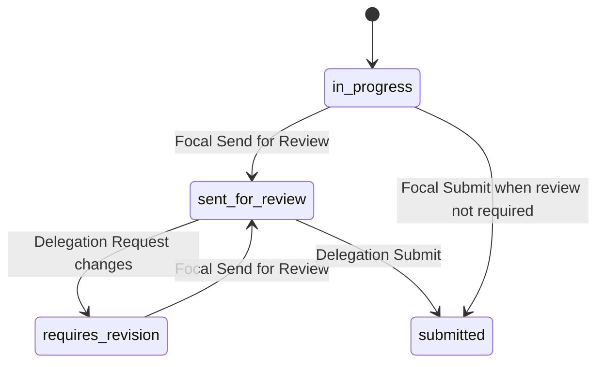

# Focal Point Browser Smoke Test (Data Entry Workflow)

Repeatable browser checklist for exercising **National Society focal point** form workflows: matrix editing, row search, save, delegation review, submit, and related monitoring. Use after refactors touching form entry, matrix JS, assignment workflow, or notifications.

**Environment:** local dev only (`DEBUG=true`, Flask on `http://127.0.0.1:5000`).

**Automation:** [`Backoffice/scripts/dev/focal_point_browser_smoke.mjs`](../../scripts/dev/focal_point_browser_smoke.mjs) mirrors this runbook. Playwright MCP conventions live in [`.cursor/rules/playwright-browser-testing.mdc`](../../../../.cursor/rules/playwright-browser-testing.mdc).

---

## 1. Prerequisites

| Requirement | Check |
|-------------|-------|
| Backoffice dev server running | `http://127.0.0.1:5000/login` loads |
| `DEBUG=true` / development config | Yellow **Act as (dev only)** panel on `/login` |
| Loopback request | Panel hidden off `127.0.0.1` / `::1` |
| Seed data: Testland focal user | `test_focal@<org-domain>` has assignments |
| Matrix assignment | `/forms/assignment/4120` — *Reporting - International Bilateral Support* (2 matrices) |
| Delegation-review assignment (optional) | Assignment with `requires_delegation_review=true`, status `in_progress` or `requires_revision` |

> **Assignment IDs are environment-specific.** Replace `4120` / `3657` below with IDs from the focal dashboard if your DB differs. Prefer assignments listed under **Testland** for the dev focal preset.

---

## 2. Monitoring setup

Run these checks **throughout** the flow. Any failure is a regression signal.

### Browser console

Watch for:

- `matrixHandler.init` failures, `ReferenceError`, `TypeError`
- Missing import errors after JS splits (e.g. `ROW_TOTAL_COLUMN_NAME is not defined`)
- CSP or script load failures

**Playwright MCP:** `browser_console_messages` after each major step.

**DevTools:** Console tab → filter *Errors* and *Warnings*.

### Network

Watch for:

| Endpoint pattern | Expected |
|------------------|----------|
| `GET /api/forms/assignment/<id>/entry-bootstrap` | 200, typically &lt; 3 s |
| `GET /api/forms/lookup-lists/national_society/options` | 200 (matrix row search) |
| `POST /api/forms/presence/assignment/<id>/sync` | 200 (heartbeat) |
| `POST /forms/assignment/<id>` (Save / Submit / Send for Review) | 200; flash message on redirect/reload |

Flag any **≥ 400** status or request **&gt; 3 s** on non-static URLs.

**Playwright MCP:** `browser_network_requests`.

### Terminal (Flask)

In the dev server terminal, watch for:

- `[EntryTiming]` lines — form GET should usually complete in **&lt; 1 s** locally
- `Completed Assignment Form Handling in Xs` — spikes &gt; 2 s warrant investigation
- Tracebacks on `app.routes.forms.entry` or `forms_api`
- `[SCHED_JOB]` errors (background noise unless correlated with user action)

Enable deeper investigation temporarily: `VERBOSE_FORM_DEBUG=true` (see [Submissions & Excel notes](submissions-and-excel-notes.md)).

---

## 3. Login and role switching

1. Open `http://127.0.0.1:5000/login`
2. Click **Act as Focal Point** (native form submit — wait for navigation)
3. Confirm dashboard loads as Testland focal (`test_focal@…`)

To test delegation actions (**Request changes**), log out and switch role:

1. `http://127.0.0.1:5000/logout`
2. `/login` → **Act as System Manager** or **Act as Admin** (org-domain / delegation users)

Preset selectors: `[data-dev-act-as-preset="focal"]`, `"admin"`, `"sys_manager"`.

---

## 4. Focal point workflow — matrix assignment (4120)

### 4.1 Open form

1. Dashboard → open **Reporting - International Bilateral Support** (or go directly to `/forms/assignment/4120`)
2. Wait for matrices to render (lookup list fetches in Network tab)
3. **Expect:** no console errors; header shows **Status: In Progress**; sidebar shows **Save** and **Submit** (no *Send for Review* when `requires_delegation_review` is false)

### 4.2 Matrix cell edit

1. Expand **Financial Overview** / **Staff Presence** via section nav if needed
2. Scroll the matrix into view
3. Edit a numeric cell (e.g. Algerian Red Crescent delegates column) — enter a whole number
4. Tab or blur the cell
5. **Expect:** value formats with thousands separators; no `matrixHandler` init errors

### 4.3 Matrix row search (add row)

1. In **Search and select a row to add…**, type partial NS name (e.g. `Belg`)
2. Wait ~2 s for lookup API
3. **Expect:** dropdown/results from `national_society` lookup; selecting a row adds it to the matrix

### 4.4 Save

1. Click **Save** in the sidebar

> **Automation note:** The fixed sidebar can sit outside the Playwright viewport. If click times out, use a programmatic click:
> `document.querySelector('button[name="action"][value="save"]')?.click()`

2. **Expect:** flash **Progress saved successfully!**; `POST /forms/assignment/4120` → 200
3. Reload the page
4. **Expect:** edited matrix value persisted

### 4.5 Submit (direct submission path)

Only when assignment does **not** require delegation review.

1. Click **Submit** → confirm in styled dialog (**Submit Form?**)
2. Confirm button id: `#confirm-ok`
3. **Expect:** status moves to **Submitted**; form becomes read-only; flash success

> If status stays **In Progress** after 200 POST, check server flash/errors — incomplete required fields or validation rules may block final submit while still accepting save.

---

## 5. Delegation review workflow (optional)

Applies when the assigned form has **Requires delegation review** enabled (`AssignedForm.requires_delegation_review`).

### Status flow



### 5.1 Focal — Send for Review

**Precondition:** status `in_progress` or `requires_revision`; button **Send for Review** visible.

1. Edit fields as needed → **Save**
2. Click **Send for Review** → confirm (*Send this assignment to delegation for review?*)
3. Click `#confirm-ok`
4. **Expect:** status **Sent for Review**; focal cannot edit until returned

### 5.2 Delegation — Request changes

**Role:** System Manager, Admin, or other delegation user (`is_delegation_user`).

**Preferred path:** entry-form sidebar **Request changes** (standalone form linked via HTML `form=""` attribute) or dashboard assignment row.

1. Open assignment in **Sent for Review**
2. Click **Request changes** → confirm dialog shows:
   - **Title:** Request changes?
   - **Message:** Return this assignment to the National Society for changes?
   - **Confirm button:** Request changes (not “Submit”)
3. **Expect:** redirect to dashboard; flash *Assignment returned to the National Society for changes*; status **Requires Revision**
4. Log back in as focal → fields editable; **Send for Review** available again

### 5.3 Delegation — Submit after review

When status is **Sent for Review**, delegation user uses **Submit** to finalize (same confirm dialog as focal direct submit).

---

## 6. Results checklist (pass/fail)

| Step | Pass criteria |
|------|----------------|
| Login (focal) | Dashboard loads; assignments visible |
| Form load | 200; entry-bootstrap 200; no console errors |
| Matrix edit | Cell accepts input; formatting works |
| Row search | Lookup API 200; results appear |
| Save | Flash success; value survives reload |
| Send for Review | Status → Sent for Review (delegation assignments only) |
| Request changes | Status → Requires Revision (via dashboard / valid form) |
| Submit | Status → Submitted; entry disabled |
| Console | No errors (ignore benign favicon / AG Grid deprecation warnings) |
| Network | No 4xx/5xx on form APIs; no sustained &gt; 3 s latency |
| Terminal | No tracebacks during actions |

---

## 7. Known quirks (local dev)

| Issue | Workaround |
|-------|------------|
| Sidebar Save/Submit outside viewport (Playwright) | Programmatic `button[name="action"][value="save"].click()` |
| Stale JS after edits | Playwright MCP `--isolated`: `browser_close` then re-navigate |
| Confirm dialogs | Always click `#confirm-ok` / `#confirm-cancel` — not native `window.confirm` |
| Submit vs Save | Submit runs presave + validation; Save can succeed when Submit does not |
| Confirm dialog labels | Each action uses matching `data-confirm-title` / `data-confirm-label` / `data-confirm-message`; never “Submit Form?” for non-submit actions |

---

## 8. Confirm dialog conventions (assignment actions)

Standalone POST forms (dashboard cards, entry-form header) and entry sidebar workflow buttons use **`data-confirm-*` attributes** resolved by `getConfirmDialogOptions()` in `confirm-dialogs.js`:

| Action | Title | Confirm button | Handler |
|--------|-------|----------------|---------|
| Save | *(none — no confirm)* | — | Direct POST |
| Send for Review | Send for Review? | Send for Review | `form-events.js` → `showSubmitConfirmation` |
| Submit | Submit Form? | Submit | `form-events.js` → `showSubmitConfirmation` |
| Request changes | Request changes? | Request changes | `.return-for-revision-trigger` or global submit on `.return-for-revision-form` |
| Validate (entry form header) | Validate Assignment? | Validate | Global submit on `.approve-assignment-form` |
| Approve (dashboard) | Approve Assignment? | Approve | Global submit on `.approve-assignment-form` |
| Reopen | Reopen Assignment? | Reopen | Global submit on `.reopen-assignment-form` |
| Delete self-report | Delete Self-Report? | Delete | Global submit + `data-confirm-danger="true"` |

**HTML rule:** never nest `<form>` inside `#focalDataEntryForm`. Delegation return uses a standalone form outside `#entry-form-ui` plus a `type="button"` trigger.

---

## 9. Automated rerun

From repo root (requires Playwright — see script header for install):

```bash
cd Backoffice
npm install -D playwright   # first time only
npx playwright install chromium
node scripts/dev/focal_point_browser_smoke.mjs
```

**Alternative:** run the same steps interactively with **Playwright MCP** in Cursor (see §2–§5 above). No local Playwright install needed.

Environment variables:

| Variable | Default | Purpose |
|----------|---------|---------|
| `BASE_URL` | `http://127.0.0.1:5000` | Dev server |
| `MATRIX_AES_ID` | `4120` | Matrix smoke assignment |
| `SKIP_SUBMIT` | `1` | Set `0` to run destructive submit test |

The script prints a JSON summary and exits non-zero on console errors or failed HTTP checks.

---

## 10. Related docs

- [Submissions & Excel notes](submissions-and-excel-notes.md) — AES terminology, `VERBOSE_FORM_DEBUG`
- [Form operations](../operations/form-operations.md) — operational form management
- [Developer handbook](../../../../docs/DEVELOPER-HANDBOOK.md) — local setup
