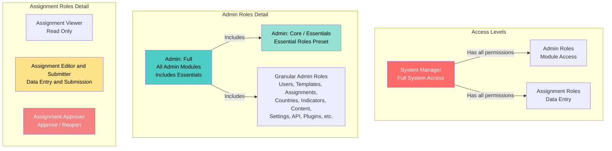

# Пользовательские роли и права

В этом руководстве объясняются различные пользовательские роли в системе и когда их назначать.

## Обзор

Система использует систему **Role-based Access Control (RBAC)**, где пользователи могут выполнять несколько ролей. Каждая роль предоставляет конкретные разрешения для выполнения действий в системе.

## Категории ролей

Существует три основные категории ролей:

1. **System Manager** - Полный доступ суперпользователя
2. **Административные роли** - Административный доступ к конкретным модулям
3. **Assignment Roles** — для ввода данных и управления назначениями

## Иерархия ролей

### Ролевые отношения

- **Системный менеджер** имеет все права как от ролей администратора, так и от назначения
- **Admin: Full** — это пресет, включающий все роли модуля админ-модуля (кроме настроек и плагинов)
- **Admin: Full** включает пресет **Admin Essentials** плюс дополнительные роли администратора
- **Admin: Core** (также называемый «Admin Essentials») — это пресет, включающий важные роли администратора и назначения
- **Admin Essentials** включает несколько детализированных ролей (Пользователи, Шаблоны, Назначения, Страны, Индикаторы, плюс все роли Assignment)
- **Детализированные роли администратора** предоставляют доступ к конкретным модулям (могут комбинироваться отдельно или через пресеты)
- **Назначенные роли** являются независимыми и могут сочетаться с административными ролями

## Системный менеджер

**Код роли:** `system_manager`

**Описание:** Полный доступ ко всем возможностям платформы (суперпользователь).

**Когда использовать:**
- Для ИТ-администраторов, которым нужен полный доступ к системе
- Для системных администраторов, управляющих инфраструктурой платформы
- **Используйте экономно** — назначайте только доверенным сотрудникам, которым нужен полный контроль

**Ключевые возможности:**
- Все права администратора
- Все права на присвоение
- Может назначать любую роль любому пользователю
- Может управлять настройками системы
- Доступ к функциям безопасности и аудита

## Административные должности

Административные роли предоставляют доступ к административным функциям. Пользователи могут выполнять несколько административных ролей.

### Админ: Полный

**Код роли:** `admin_full`

**Описание:** Пресет, включающий все роли админ-модуля (не предоставляет полномочия Системного менеджера). Это удобный пресет, который автоматически выбирает несколько детализированных ролей администратора.

**Когда использовать:**
- Для старших администраторов, которым нужен широкий доступ
- Для администраторов, управляющих несколькими областями
- Альтернатива ручному выбору многих детальных администраторских ролей

**Включает:**
- Все роли административных модулей (Пользователи, Шаблоны, Запределения, Страны, Индикаторы, Контент, Аналитика, Аудит, Исследователь данных, ИИ, Коммуникация, Переводы, API)
- **Исключает:** Настройки и плагины (они должны быть назначены отдельно)
- **Включает:** Все роли из пресета Admin Essentials (см. ниже)

**Ключевые возможности:**
- Все права администраторских модулей (кроме настроек и плагинов)
- Нельзя назначить роль менеджера системы
- Не может выполнять операции на уровне системы

**Примечание:** Когда вы выбираете «Admin: Full», система автоматически выбирает все детализированные роли. Вы всё равно можете настраивать, добавляя или удаляя отдельные роли.

### Админ: Core (Essentials)

**Код роли:** `admin_core`

**Также известно как:** Admin Essentials

**Описание:** Пресет, включающий важные административные и назначенные роли. Это удобный пресет, который автоматически выбирает несколько детализированных ролей для общих административных задач.

**Когда использовать:**
- Для администраторов, которым необходим важный административный доступ
- Для целей отчётности и мониторинга
- В качестве базового пресета в сочетании с конкретными дополнительными ролями

**Включает:**

**Административные роли:**
- Пользователи: просмотр и управление
- Шаблоны: просмотр и управление
- Задания: просмотр и управление
- Страны и организация: просмотр и управление
- Индикаторный банк: Просмотр

**Роли по назначению:**
- Просмотрщик заданий
- Редактор и отправитель заданий
- Оценщик заданий

**Ключевые возможности:**
- Просмотр и управление пользователями, шаблонами, назначениями, странами и индикаторами
- Полный доступ к рабочему процессу назначения (просмотр, редактирование, отправка, утверждение)

**Примечание:** Когда вы выбираете «Admin Essentials», система автоматически выбирает все включённые детализированные роли. Этот пресет включён в «Admin: Full» — при выборе Full также выберётся все роли Essentials.

### Детализированные административные роли

Эти роли предоставляют доступ к конкретным административным модулям. Назначать несколько ролей по необходимости.

#### Админ: Менеджер пользователей
**Код роли:** `admin_users_manager`

**Возможности:**
- Создавать, редактировать, деактивировать и удалять пользователей
- Назначать роли пользователям
- Управление грантами доступа
- Просмотр и управление пользовательскими устройствами

**Когда использовать:** Для HR-администраторов или менеджеров по учетной записи пользователей.

#### Админ: менеджер шаблонов
**Код роли:** `admin_templates_manager`

**Возможности:**
- Создавать, редактировать и удалять шаблоны
- Шаблоны публикации
- Шаблоны для обмена
- Шаблоны импорта/экспорта

**Когда использовать:** Для дизайнеров форм и администраторов шаблонов.

#### Админ: менеджер по заданиям
**Код роли:** `admin_assignments_manager`

**Возможности:**
- Создавать, редактировать и удалять назначения
- Управление присваивающими организациями (странами/организациями)
- Управление публичными подачами

**Когда использовать:** Для администраторов, которые распространяют формы и управляют сбором данных.

#### Админ: менеджер по странам и организациям
**Код роли:** `admin_countries_manager`

**Возможности:**
- Просмотр и редактирование стран
- Управление структурой организации
- Просмотр и одобрение/отклонение запросов на доступ

**Когда использовать:** Для администраторов, управляющих организационной структурой.

#### Админ: Менеджер индикаторного банка
**Код роли:** `admin_indicator_bank_manager`

**Возможности:**
- Просмотр, создание, редактирование и архивирование индикаторов
- Рекомендации по индикаторам обзора

**Когда использовать:** Для администраторов стандартов данных.

#### Админ: Контент-менеджер
**Код роли:** `admin_content_manager`

**Возможности:**
- Управление ресурсами
- Управление публикациями
- Управление документами

**Когда использовать:** Для администраторов контента и библиотекарей.

#### Админ: Менеджер настроек
**Код роли:** `admin_settings_manager`

**Возможности:**
- Управление настройками системы

**Когда использовать:** Для администраторов системной конфигурации.

#### Админ: API Manager
**Код роли:** `admin_api_manager`

**Возможности:**
- Управление ключами API
- Управление настройками API

**Когда использовать:** Для разработчиков и администраторов API.

#### Админ: Менеджер плагинов
**Код роли:** `admin_plugins_manager`

**Возможности:**
- Управление плагинами

**Когда использовать:** Для системных администраторов, управляющих расширениями.

#### Админ: Data Explorer
**Код роли:** `admin_data_explorer`

**Возможности:**
- Использование инструментов исследования данных

**Когда использовать:** Для аналитиков данных и исследователей.

#### Админ: Аналитический просмотрщик
**Код роли:** `admin_analytics_viewer`

**Возможности:**
- Просмотр аналитики

**Когда использовать:** Для целей отчётности и мониторинга.

#### Админ: Audit Viewer
**Код роли:** `admin_audit_viewer`

**Возможности:**
- Просмотр аудиторского следа

**Когда использовать:** Для мониторинга соблюдения требований и безопасности.

#### Админ: Просмотрщик/Ответчик безопасности
**Коды ролей:** `admin_security_viewer`, `admin_security_responder`

**Возможности:**
- Просмотр панели безопасности (Просмотр)
- Реагировать на события безопасности (Responder)

**Когда использовать:** Для администраторов безопасности.

#### Админ: AI Manager
**Код роли:** `admin_ai_manager`

**Возможности:**
- Управление системой ИИ
- Управление панелью управления ИИ
- Управление библиотекой документов
- Просмотр следов рассуждения

**Когда использовать:** Для системных администраторов с ИИ.

#### Админ: менеджер по коммуникациям
**Код роли:** `admin_communication_manager`

**Возможности:**
- Просмотр всех коммуникаций
- Отправка уведомлений, электронная почта и push из Центра связи

**Когда использовать:** Для администраторов связи.

#### Админ: менеджер переводов
**Код роли:** `admin_translations_manager`

**Возможности:**
- Управление строками перевода
- Компиляция переводов
- Перезагрузка переводов

**Когда использовать:** Для многоязычных администраторов контента.

## Назначенные роли

Эти роли предназначены для пользователей, работающих с заданиями (ввод данных, подача данных, утверждение).

### Просмотрщик заданий

**Код роли:** `assignment_viewer`

**Описание:** Доступ только для чтения к заданиям.

**Когда использовать:**
- Для пользователей, которым нужно просматривать назначения, но не редактировать
- Для целей отчетности
- В сочетании с другими ролями для доступа только для чтения

**Ключевые возможности:**
- Просмотр назначений (только для чтения)

### Редактор заданий и отправитель

**Код роли:** `assignment_editor_submitter`

**Описание:** Может вводить данные и отправлять задания (без полномочий на утверждение).

**Когда использовать:**
- **Основная роль для ключевых точек** — персонал по вводу данных
- Для пользователей, которые заполняют формы и отправляют данные
- Это стандартная роль для национальных центров

**Ключевые возможности:**
- Просмотр назначений
- Ввод/редактирование данных присваивания
- Сдавать задания
- Загрузка документов по назначению

**Примечание:** Пользователи с этой ролью также должны быть назначены в определённые страны или организации, чтобы видеть назначения для этих организаций.

### Оценка назначения

**Код роли:** `assignment_approver`

**Описание:** Может утверждать и возобновлять задания.

**Когда использовать:**
- Для руководителей, которые рассматривают и одобряют поступки
- Для персонала по контролю качества
- Обычно объединяется с `assignment_viewer` или `assignment_editor_submitter`

**Ключевые возможности:**
- Просмотр назначений
- Утверждение поданных заданий
- Возобновление одобренных/поданных заданий

### Загрузчик документов задания

**Код роли:** `assignment_documents_uploader`

**Описание:** Загрузить сопутствующие документы, связанные с заданием (без ввода или подачи данных).

**Когда использовать:**
- Для пользователей, которым нужно загружать только сопутствующие документы
- Для персонала по управлению документами

**Ключевые возможности:**
- Просмотр назначений
- Загрузка документов по назначению

## Распространённые комбинации ролей

### Стандартная точка фокуса
- **Роли:** `assignment_editor_submitter`
- **Назначение по стране:** Обязательно (назначение конкретным странам)
- **Кейс использования:** Страны — ключевые лица, которые вводят и отправляют данные

### Старший координатор (с одобрения)
- **Роли:** `assignment_editor_submitter`, `assignment_approver`
- **Распределение по стране:** Требуется
- **Случай использования:** Ключевые лица, которые также одобряют материалы

### Просмотр только для чтения
- **Роли:** `assignment_viewer`
- **Распределение по стране:** Необязательно
- **Случай использования:** Пользователи, которым нужно просматривать назначения, но не редактировать

### Младший администратор
- **Роли:** `admin_core`, `admin_templates_viewer`, `admin_assignments_viewer`
- **Кейс использования:** Новые администраторы, изучающие систему

### Администратор контента
- **Роли:** `admin_core`, `admin_content_manager`
- **Кейс использования:** Администраторы, управляющие ресурсами и публикациями

### Полный администратор
- **Роли:** `admin_full` (пресет, включающий Essentials + все остальные административные роли)
- **Пример использования:** Опытные администраторы, управляющие несколькими областями
- **Примечание:** Пресет `admin_full` автоматически включает все роли из `admin_core` (Essentials) плюс дополнительные административные роли

## Лучшие практики

### Распределение ролей

1. **Принцип наименьшей привилегии:** Назначайте только те роли, которые нужны пользователям для выполнения своих обязанностей
2. **Начните с Core:** Начните с `admin_core` для новых администраторов, затем добавьте конкретные роли менеджера
3. **Комбинировать роли:** Пользователи могут иметь несколько ролей — комбинируйте детализированные роли для конкретных нужд
4. **Регулярно проверяйте:** Периодически проверяйте роли пользователей и удаляйте ненужные права

### Для Focal Points

1. **Всегда назначайте страны:** Контактные точки должны быть назначены в конкретные страны/организации
2. **Использовать `assignment_editor_submitter`:** Это стандартная роль для ввода данных
3. **При необходимости добавить роль аккредитора:** Только если требуется одобрение подачи

### Для администраторов

1. **Избегайте Системного Менеджера:** Назначать только ИТ/системным администраторам
2. **Используйте детализированные роли:** По возможности предпочитайте конкретные менеджерские роли вместо `admin_full`
3. **Объединить с Core:** Начать с `admin_core` плюс конкретные роли менеджера
4. **Документируйте распределение ролей:** Ведите записи о причинах назначения каждой роли

## Устранение неполадок

### Пользователь не видит назначения
- **Проверить:** Пользователь имеет роль `assignment_editor_submitter` или `assignment_viewer`
- **Проверить:** Пользователю назначается страна/организация в назначении

### Пользователь не может получить доступ к страницам администратора
- **Проверить:** У пользователя есть хотя бы одна админная роль (любая роль `admin_*`)
- **Проверить:** Пользователь имеет конкретное право на эту страницу

### Пользователь не может назначать роли другим
- **Проверить:** Пользователь имеет разрешение `admin.users.roles.assign`
- **Проверить:** Пользователь имеет роль `admin_users_manager` или `admin_full`
- **Примечание:** Только системные менеджеры могут назначать роль системного менеджера

### Пользователь не может одобрять назначения
- **Проверить:** Пользователь имеет роль `assignment_approver`
- **Проверить:** Пользователь имеет доступ к назначению (назначение по стране)

## Связанное

- [Add New User](add-user.md) - Как создавать пользователей и назначать роли
- [Управление пользователями](manage-users.md) - Как обновлять пользовательские роли
- [Устранение неполадок Access](troubleshooting-access.md) - Распространённые проблемы доступа
