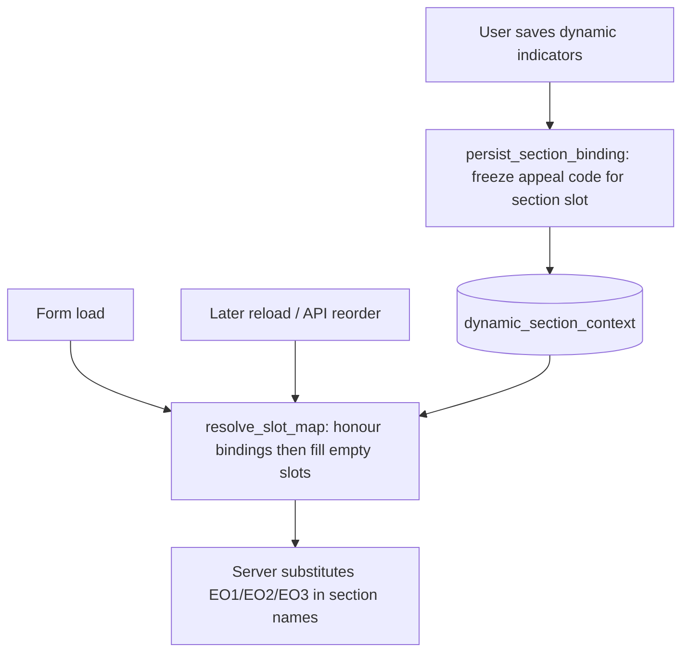

# Emergency section identity binding

This document describes how dynamic-indicator sections that use `[EO1]`, `[EO2]`, and `[EO3]` in their names stay tied to a **specific emergency appeal** per assignment, even when the GO API reorders results or filters change.

## Problem

Templates such as **Unified Country Report** (template 25) define three dynamic-indicator sections under “Emergency Appeals Indicators”, named e.g. `Emergency Appeal 1 Indicators: [EO1]`. Focal points add indicators and values into those sections; rows are stored in `dynamic_indicator_data` keyed by `(assignment_entity_status_id, section_id, indicator_bank_id)`.

Before binding, two defects compounded:

1. **No emergency identity on saved data** — only `section_id` (a positional slot) was stored. There was no appeal code or name on the row.
2. **Volatile slot assignment** — `[EO1]` / `[EO2]` / `[EO3]` were the first three appeals in the **raw GO API order** after operation-type filtering (client-side in `emergency_operations_field.js`). If the API order changed, or filters/timeframe changed membership, the section **label** could switch to a different appeal while **data** stayed on the same `section_id`.

## Approach (Direction A)

Keep the three fixed EO slots in the template, but **anchor each slot to a stable appeal code** per assignment:

- **Stable key:** appeal `code` (e.g. `MDRAF019`), not list position.
- **When bound:** first save of dynamic-indicator data into an emergency section freezes the binding server-side.
- **On reload:** existing bindings are honoured first; empty slots are filled from the current filtered list in **deterministic order** (newest `start_date` first, tie-break `code` ascending).
- **If a bound appeal drops out of the filtered set:** the binding and data are kept; status becomes `dropped` and the frozen label snapshot is still shown.

This is intentionally **provider-generic**: the table and service pattern can support other list-type plugins later; Emergency Operations is the first implementer.

## Data model

Table: `dynamic_section_context` ([`Backoffice/app/models/forms.py`](../../app/models/forms.py))

| Column | Purpose |
|--------|---------|
| `assignment_entity_status_id` / `public_submission_id` | Parent submission (same dual-FK pattern as other data tables) |
| `section_id` | The dynamic section (e.g. section 384 = EO1 slot) |
| `provider_id` | e.g. `emergency_operations` |
| `slot` | Positional slot the section references (1 = EO1, 2 = EO2, 3 = EO3) |
| `context_key` | Stable external key — appeal **code** |
| `label_snapshot` | Human label at bind time, e.g. `Afghanistan - Earthquake (MDRAF019)` |
| `status` | `active` or `dropped` (appeal no longer in current filtered set) |
| `filters_hash` | Snapshot of country ISO + EO field filters used when resolving |

Unique constraint: one binding per `(assignment, section, provider)`.

Migration: [`Backoffice/migrations/versions/add_dynamic_section_context.py`](../../migrations/versions/add_dynamic_section_context.py)

## Code paths

| Layer | File | Role |
|-------|------|------|
| Service | [`Backoffice/app/services/emergency_section_binding.py`](../../app/services/emergency_section_binding.py) | Fetch/filter/sort operations; `resolve_slot_map`, `resolve_eo_variables`, `persist_section_binding`, `slot_for_section` |
| Render | [`Backoffice/app/routes/forms/entry.py`](../../app/routes/forms/entry.py) | Injects binding-aware `EO1`/`EO2`/`EO3` into `resolved_variables` before section names are substituted |
| Save | [`Backoffice/app/services/form_data_service.py`](../../app/services/form_data_service.py) | After dynamic indicators are processed, calls `_persist_emergency_section_binding` when the section has `[EOn]` and at least one dynamic row |
| Export | [`Backoffice/app/routes/forms/export.py`](../../app/routes/forms/export.py) | PDF export uses the same binding-aware EO resolution |

Operations are loaded with the **template’s Emergency Operations field config** (operation types, date filters, closed/active) via `get_emergency_operations_data` in [`routes.py`](routes.py).

Client-side `[EO1]` replacement in [`plugin-label-variables.js`](../../app/static/js/forms/modules/plugin-label-variables.js) remains as a fallback when the server does not resolve a value (e.g. plugin not loaded yet).

## Lifecycle

1. **First visit, no binding:** slots are filled from the deterministic ordered list; section headings show current appeals; no row in `dynamic_section_context` until save.
2. **Save with indicators in section 384 (EO1):** binding created, e.g. `context_key=MDRAF019`, `slot=1`.
3. **Later visit, API order changed:** slot 1 still shows `MDRAF019`; remaining appeals fill slots 2 and 3 without displacing bound codes.
4. **Bound appeal no longer matches filters:** binding `status=dropped`, label from `label_snapshot`; data in `dynamic_indicator_data` unchanged and still tied to that section/binding.

## Template conventions

- Section names (or translations) must contain `[EO1]`, `[EO2]`, or `[EO3]` for the binder to detect the slot (`slot_for_section`).
- Relevance on `plugin_*_operations_count` is unchanged (see [RELEVANCE_RULES_EXAMPLE.md](RELEVANCE_RULES_EXAMPLE.md)).
- **Known quirk:** section 386 in template 25 uses `equal_to 3` for operations count; with 4+ appeals, EO3’s section can be hidden. Consider `greater_than_or_equal_to` / `>= 3` in the form builder.

## Backfill and limits

- **Existing data** before this feature was deployed is not auto-backfilled; bindings are created on the next save into that emergency section.
- **Public submissions** are not wired to persist bindings yet (assignment flow only).
- **Cap:** three slots (EO1–EO3); scaling beyond that would be Direction B (fully dynamic one-section-per-emergency).

## Related docs

- [RELEVANCE_RULES_EXAMPLE.md](RELEVANCE_RULES_EXAMPLE.md) — operations count and EO label variables in relevance rules
- [Developer handbook — form submission tables](../../../docs/DEVELOPER-HANDBOOK.md#form-submission-data-tables)
