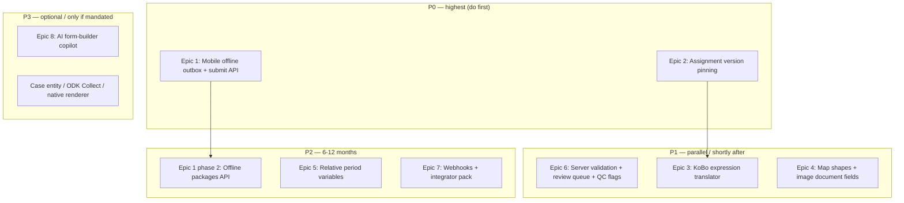

# Community roadmap: field data collection, mobile offline, and SurveyCTO gaps

**Status:** Draft for community contribution (May 2026)  
**Audience:** Contributors, maintainers, humanitarian teams — and AI coding agents picking up issues from this document.

---

## Part 1 — For humans: what this is about and why it matters

### What Humanitarian Databank is

Humanitarian Databank is an open-source platform that helps humanitarian organizations — primarily IFRC National Societies and their partners — collect, steward, and share **structured indicator data** responsibly. The system covers the full organizational reporting cycle:

1. An **admin** builds a form template (questions, indicators, sections, disaggregation by sex/age).
2. The admin creates an **assignment** — sending that template to one or more countries or organizational entities with a deadline.
3. A **focal point** (someone in-country or in a local unit) opens the assignment, fills in the form, and submits it.
4. Admins review, approve or send back for revision, then export aggregated data for reporting (IFRC FDRS, GO platform, regional dashboards).

The repository is a monorepo: **Backoffice** (Flask web app), **Website** (Next.js public portal), and **MobileApp** (Flutter app for focal points and admins on the go).

### Why we compared to SurveyCTO

SurveyCTO is a leading field data collection platform widely used in humanitarian, development, and research settings. Teams often ask: *does Humanitarian Databank replace SurveyCTO? Should we use both? What are we missing?*

In May 2026 we did a thorough technical and product comparison — reviewing the Backoffice codebase, the MobileApp codebase, and SurveyCTO's documented feature set — to answer those questions honestly and turn the findings into something the community can act on.

The short answer: **they solve different problems**. SurveyCTO is optimized for large-scale field enumeration (household surveys, mystery shopping, M&E with GPS and enumerator quality controls). Humanitarian Databank is optimized for **organizational periodic reporting** — standardized indicators, country/National Society assignments, approval cycles, and a public data portal. We use KoBo/SurveyCTO as collection front-ends and import their outputs; we do not try to replace them.

That said, there are **real gaps** that hurt our users — especially around mobile offline reliability and data quality — and those are exactly what this roadmap targets.

### What we are trying to do with this document

We want to:

1. Be transparent about what we found — what works well, what is broken, what is missing.
2. Give contributors a clear starting point: concrete problems, recommended approaches, and the specific files to touch.
3. Help the community make **good decisions** about what to build (and what to deliberately not build).

This is not a wishlist for turning Humanitarian Databank into a full SurveyCTO clone. It is a prioritized set of improvements grounded in how the platform is actually used.

### How to pick up work

- Find an **epic** in Part 3 that matches your skills (Flutter, Flask/Python, JavaScript, docs).
- Open a GitHub issue referencing the epic (e.g. `Epic 1: Mobile offline submission outbox — see docs/COMMUNITY-ROADMAP-FIELD-DATA-AND-MOBILE.md`).
- Read [`CONTRIBUTING.md`](../CONTRIBUTING.md) and the [Developer handbook](DEVELOPER-HANDBOOK.md) before writing code.
- When you ship something, update the **Status** field in the epic (a small PR to this file is welcome).

Questions? Open a GitHub discussion or an issue tagged `community-roadmap`.

---

## Part 2 — For AI agents: full context of what was found

This section documents the technical state of the platform as discovered in the May 2026 review. If you are an AI coding agent picking up an epic, read this section before touching code. It will save you from re-discovering things and making wrong assumptions.

### 2.1 Repository structure

```
c:\Humanitarian Databank\
├── Backoffice/          Flask web app (Python). The system of record.
│   ├── app/
│   │   ├── models/      SQLAlchemy models
│   │   ├── routes/      Blueprints: admin, forms, api, api/mobile, ai
│   │   ├── services/    Business logic (form_data_service, kobo_*, variable_resolution, ai_*)
│   │   ├── static/js/   Frontend JS (form builder, entry form, offline drafts, conditions)
│   │   ├── templates/   Jinja2 (forms/entry_form, forms/form_builder, admin/*)
│   │   ├── plugins/     BasePlugin + BaseFieldType contracts
│   │   └── middleware/  security_headers.py (CSP, Permissions-Policy)
│   ├── plugins/         First-party plugins: interactive_map, emergency_operations
│   ├── config/          config.py (feature flags, disaggregation, document types)
│   └── docs/            User guides, runbooks
├── MobileApp/           Flutter app
│   └── lib/
│       ├── services/    offline_queue_service, assignment_offline_bundle_service,
│       │                webview_auth_draft_host_store, webview_service, api_service
│       ├── providers/   offline_provider, backend_reachability_notifier
│       ├── screens/     dashboard_screen, webview_screen, admin/*
│       └── config/      app_config.dart (endpoint constants), app_router.dart
├── Website/             Next.js public portal
└── docs/                Cross-app docs (DEVELOPER-HANDBOOK.md, this file)
```

### 2.2 Core data model (Backoffice)

Understanding this is essential before touching any form, assignment, or mobile code.

```
FormTemplate
  ├── published_version_id → FormTemplateVersion  (what assignments use)
  └── versions[]          → FormTemplateVersion
        ├── version_number, status (draft|published|archived)
        ├── variables (JSON — cross-form prefill config)
        └── owns: FormPage → FormSection → FormItem

AssignedForm  (one per template+period_name, e.g. "2026 Q1")
  └── AssignmentEntityStatus (AES)  ← THE UNIT OF WORK
        one row per (assigned_form, entity_type, entity_id)
        status: Pending → In Progress → Submitted → Approved / Requires Revision
        └── FormData  (one row per FormItem answer)
              └── RepeatGroupInstance → RepeatGroupData (for repeat sections)

PublicSubmission  (anonymous submissions via unique URL token)
  └── FormData (same structure as AES path)
```

**Key gaps in this model (relevant to epics):**

- `AssignedForm` stores `template_id` only — not `version_id`. Publishing a new template version **immediately changes all open assignments**. This is Epic 2.
- `VariableResolutionService` uses **literal string** `source_assignment_period` (e.g. `"2025 Q1"`). There is no relative period resolution. This is Epic 5.
- There is no `Case` entity. The closest is `AssignmentEntityStatus` per entity per period. Beneficiary/household longitudinal tracking would require a new model.

### 2.3 QuestionType enum (Backoffice/app/models/enums.py)

```python
class QuestionType(enum.Enum):
    text = 'text'
    textarea = 'textarea'
    number = 'number'
    percentage = 'percentage'
    yesno = 'yesno'
    single_choice = 'single_choice'
    multiple_choice = 'multiple_choice'
    date = 'date'
    datetime = 'datetime'
    blank = 'blank'   # instruction/note only
```

Beyond `QuestionType`, a `FormItem` can have `item_type` of `indicator`, `question`, `document_field`, `matrix`, or `plugin_*`. Plugins register custom field types. There is **no** GPS, barcode, signature, or sensor type.

### 2.4 KoBo / XLSForm import — what works and what doesn't

**File:** `Backoffice/app/services/kobo_xls_import_service.py`

Supported mappings (XLSForm → native):

| XLSForm type | Maps to |
|---|---|
| `text`, `textarea` | `question / text` or `textarea` |
| `integer`, `decimal`, `range` | `question / number` |
| `select_one` | `question / single_choice` |
| `select_multiple` | `question / multiple_choice` |
| `date`, `datetime`, `time` | `date`, `datetime`, `datetime` |
| `note` | `question / blank` |
| `image`, `photo`, `audio`, `video`, `file` | `document_field` — **but upload fails at runtime** (server rejects non-office MIME types) |
| `begin_group/end_group` | `FormSection (standard)` |
| `begin_repeat/end_repeat` | `FormSection (repeat)` |

**Explicitly skipped** (logged as warning, item not created):
`geopoint`, `geotrace`, `geoshape`, `calculate`, `hidden`, `barcode`, `background-audio`, `rank`, `acknowledge`, `select_one_from_file`, `select_multiple_from_file`

**Critical bugs in XLS import:**
- `relevant` column is stored as raw XPath string on `FormItem.relevance_condition`. The entry form expects **native JSON** (`{"logic": "AND", "conditions": [...]}`). Non-JSON strings default to always-visible — **imported KoBo relevance does not run**.
- Section parsing uses `row.get('relevant') or row.get('required')` — a `required=yes` group incorrectly populates `relevance_condition`.
- `constraint` column is **not read** at import.

**KoBo data import** (separate service, `kobo_data_import_service.py`) is more mature: handles validation status, entity matching, disaggregation columns, duplicate strategies. This is the stronger path for migrating existing data.

### 2.5 Mobile app architecture — how forms work on mobile

**The mobile app is not a native form engine.** Forms are rendered inside `InAppWebView`. This is by design: it avoids duplicating the Backoffice form engine in Dart.

**Online flow:**
1. Native dashboard lists assignments (from `/api/mobile/v1/admin/content/assignments`).
2. Tapping an assignment opens `WebViewScreen` → loads `https://.../forms/assignment/<id>`.
3. Session/JWT is injected into the WebView by `webview_service.dart`.
4. Save/submit uses the same AJAX routes as the Backoffice web UI.

**Offline flow:**
1. User taps "Download" on an `AssignmentCard` while online.
2. `AssignmentOfflineBundleService` crawls the HTML page + up to ~400 same-origin static assets, rewrites URLs for `file://`, patches out the service worker registration.
3. When offline, `WebViewScreen` loads `file://…/offline_assignment_bundles/assignment_<id>/index.html`.
4. `auth-drafts.js` (Backoffice JS) intercepts Save/Submit → saves to IndexedDB → shows "draft saved" message.
5. **There is no submission outbox.** The user must come back online and manually resubmit.

**Why the offline bundle approach is fragile:**
- Crawls up to 400 assets; ES module rewrites are brittle.
- IndexedDB is origin-scoped (`file://` vs `https://`); `WebViewAuthDraftHostStore` bridges this but only for draft field values, not files.
- Service worker is deliberately disabled in the mobile WebView embed (it caused unstyled pages).

**What exists for offline today:**
- `OfflineQueueService` (SQLite): queues **native API calls** (dashboard, notifications, admin CRUD). Does **not** queue form POSTs.
- `OfflineProvider`: reconnect listener, retries queue, 5-min interval sync, max 3 retries.
- `BackendReachabilityNotifier`: health-check to determine if server is reachable even when network says online.
- `auth-drafts.js`: IndexedDB drafts for authenticated forms (text, select, checkbox — not file inputs).
- `public-drafts.js`: IndexedDB drafts for public forms (similar, but also limited to non-file fields).

**There is no mobile API for form submission.** The mobile API (`/api/mobile/v1/`) covers auth, dashboard, admin CRUD, notifications, public data — not assignment save/submit. Those still go through the web session routes.

### 2.6 The interactive_map plugin — geo capture today

**Files:** `Backoffice/plugins/interactive_map/`

- Renders a Leaflet/OSM/Mapbox map in the entry form.
- Supports GPS "use my location" via `navigator.geolocation`.
- Frontend serializes both `markers` and `shapes` (polygon/line drawing tools exist in UI).
- **Bug:** `PluginDataProcessor._extract_essential_plugin_data` only saves `markers`, drops `shapes`. The schema (`schemas.py`) supports shapes — the processor simply doesn't persist them.
- Data stored as JSON in `FormData.disagg_data`.

### 2.7 Document fields — what is actually allowed

**File:** `Backoffice/app/services/form_data_service.py`

```python
allowed_exts = {'.pdf', '.doc', '.docx', '.xls', '.xlsx', '.ppt', '.pptx'}
```

Despite KoBo import mapping `image`/`photo`/`audio`/`video` → `document_field`, uploads of those file types will **fail at runtime** with an extension validation error. This is a silent incompatibility.

**CSP/Permissions-Policy** also blocks camera and microphone at the HTTP header level:
```
camera=(),
microphone=(),
geolocation=(self)
```

Any web-based photo capture requires both relaxing the Permissions-Policy and extending the allowed upload types.

### 2.8 Data quality — what validates what, where

**At submit time (server-side):** only required-field completeness and document MIME/size. Cross-field `validation_condition` rules are evaluated **client-only** in `form-validation.js`. They are not re-checked server-side.

**Repeat section completeness:** `_is_repeat_instance_complete` in `form_data_service.py` always returns `True` (stubbed). Repeat QC is client-only.

**AI validation:** `AIFormDataValidationService` validates submitted `FormData` values against RAG documents and historical data. Results stored in `AIFormDataValidation` (verdict: good / discrepancy / uncertain). This runs **on demand** in the Data Explorer — not automatically on submit or before approval.

**Review workflow:** Approver clicks "Validate" (approve) or "Reopen". There is no reviewer notes field, no structured "return for correction" flow, no mandatory QC checklist before approve. `review_notes` does not exist on `AssignmentEntityStatus` today.

### 2.9 API and integrations — current surfaces

| Surface | What it does | Auth |
|---------|-------------|------|
| `/api/v1/data/*` | Read-only; data tables, indicators, countries, periods | API key / session |
| `/api/mobile/v1/*` | Dashboard, notifications, admin CRUD, public FDRS data | JWT / session |
| Excel export/import | Assignment template round-trip; indicator/lookup export | Session |
| PDF export | Assignment PDF via WeasyPrint | Session |
| Website sync | `Website/scripts/sync-data.js` pulls `/api/v1/data/tables` | Bearer API key |
| Webhooks | Feature flag `FEATURES_NOTIFICATIONS_WEBHOOKS_ENABLED` exists (default: **false**). **No outbound webhook implementation found.** | — |
| Power BI / Tableau | **Iframe embeds only** — admin-managed URLs in `EmbedContent` model. Not a push/publish data connector. | — |

**API key security gap:** `APIKey.permissions` JSON column exists but **is not enforced** in `data.py`. A valid API key currently gets `elevated_access=True` which bypasses RBAC template scoping. This is a known gap to fix before publishing an integrator guide.

### 2.10 Plugin system — architecture and limits

**Files:** `Backoffice/app/plugins/manager.py`, `base.py`, `form_integration.py`

- Plugins live in `Backoffice/plugins/` as directories or ZIP uploads.
- `BasePlugin` + `BaseFieldType` define the contract.
- Builder integration: server renders `builder.html`; JS module loaded per field type.
- Entry form: `FormIntegration` resolves plugin config; plugin field rendered as `plugin_<type>` `FormItem`.
- Data persistence: `PluginDataProcessor` normalizes plugin JSON into `FormData.disagg_data`.
- **Two production plugins exist:** `interactive_map` and `emergency_operations`.
- `emergency_operations` is display-only — it does not save submitted data.
- **Plugins run in-process with full app privileges.** No sandboxing.
- **Plugin assets are not explicitly listed** in the offline bundle manifest. The HTML crawl may or may not capture all plugin JS/CSS depending on how they are loaded.

### 2.11 Template versioning model

```
FormTemplate
  ├── published_version_id → FormTemplateVersion (what's live)
  └── versions[]
        each version: draft | published | archived
        based_on_version_id (clone lineage)
        owns: FormPage, FormSection, FormItem (all scoped by version_id)
```

Lifecycle: create draft (clone from published) → edit → deploy (publish, archive prior) → discard or delete non-published.

**Critical gap:** `AssignedForm` stores `template_id` only. Entry always loads `template.published_version_id`. If an admin publishes a new version while an assignment is open, **all in-flight submissions immediately see the new form**. This can break data integrity mid-period.

### 2.12 What SurveyCTO has that we don't (summary)

This is the gap list from the May 2026 review, ordered by impact on our users.

| Gap | Impact on our users | Epic |
|-----|---------------------|------|
| No offline submission | Focal points in low-connectivity areas cannot finalize submissions without network | Epic 1 |
| No assignment version pinning | Mid-cycle template changes break in-flight data | Epic 2 |
| KoBo relevance/constraint not translated | Imported forms behave incorrectly; admins don't know | Epic 3 |
| Map shapes dropped on save | Admins see drawing tools but drawn shapes are lost | Epic 4 |
| No image/photo uploads | KoBo forms mapped to `document_field` silently fail | Epic 4 |
| Cross-field rules client-only | Data submitted with invalid values if JS is bypassed | Epic 6 |
| No reviewer notes | Approvers cannot communicate specific corrections | Epic 6 |
| No QC flags on submissions | Data Explorer shows raw data; no automated outlier flags | Epic 6 |
| API key permissions not enforced | Security gap for integrators | Epic 7 |
| No webhooks | Downstream systems must poll; no real-time integration | Epic 7 |
| AI validates data, not templates | AI cannot help admins author forms | Epic 8 |

**Gaps we are deliberately not closing** (out of scope for this platform):

- Enumerator fleet monitoring (audio audits, speed limits, GPS-per-answer)
- Full ODK/XLSForm expression engine
- SurveyCTO Collect parity (native offline packages, background sync for household surveys)
- SOC2 / data residency as in-app product features
- Native Power BI / Zapier certified connectors

---

## Part 3 — Epics for contributors

Each epic includes current state, the specific gap, recommended approach, acceptance criteria, phases, and the exact files to touch.

### Epic 1 — Mobile offline submission outbox (P0)

| | |
|---|---|
| **Status** | open |
| **Repos** | `MobileApp/`, `Backoffice/` |
| **Skills needed** | Flutter (Dart), Flask/Python, JavaScript |
| **Problem** | Users can fill forms offline but cannot submit them offline. `auth-drafts.js` saves a local draft on offline Submit, but there is no queue that syncs the submit to the server when connectivity returns. |

**What exists today**

- `AssignmentOfflineBundleService` downloads form HTML + assets; `WebViewScreen` loads from `file://` offline.
- `WebViewAuthDraftHostStore` + `auth-drafts.js` persist draft field values across the `file://` / `https://` origin boundary.
- `OfflineQueueService` / `OfflineProvider` queue and retry **native API calls** only — not form POSTs.
- No `POST /api/mobile/v1/assignments/<aes_id>/save` or `/submit` endpoint exists.

**Recommended approach**

Keep the Backoffice form engine in WebView. Add a submission outbox:

1. **`offline-outbox.js`** (new Backoffice JS module, loaded alongside `auth-drafts.js` in mobile embed): when offline Submit is pressed, serialize all form field values + `{aesId, action: 'submit'|'save', capturedAt, idempotencyKey}` into a JSON queue in IndexedDB (or extend existing auth-drafts store).
2. **Flutter JS bridge** (extend `WebViewAuthDraftHostStore` pattern): `outboxPush` / `outboxPull` / `outboxAck` handlers.
3. **Mobile API endpoints** (new, in `Backoffice/app/routes/api/mobile/`):
   - `POST /api/mobile/v1/assignments/<aes_id>/save` — JWT auth, idempotency key header, wraps `FormDataService.save_form_data(action='save', ...)`.
   - `POST /api/mobile/v1/assignments/<aes_id>/submit` — same, wraps submit path.
4. **`OfflineProvider`** (Flutter): on reconnect, iterate outbox, POST each entry, mark as done, emit UI update.
5. **Dashboard UI**: pending outbox count badge; "Sync now" button; last sync error display.

**Acceptance criteria**

- [ ] Pressing Submit while offline stores payload in outbox (not only draft text). User sees a "saved to outbox" confirmation.
- [ ] On reconnect, outbox drains automatically. Submission appears as Submitted in Backoffice admin.
- [ ] Duplicate submit (same idempotency key) is idempotent — server returns 200, does not create a second record.
- [ ] User can see pending count and error if sync failed (e.g. validation error on server).
- [ ] Existing online submit path is unchanged.
- [ ] Manual test steps documented in PR (Android + iOS, or emulator).

**Phases**

| Phase | Scope | Effort |
|-------|--------|--------|
| 1 | Outbox JS + Flutter bridge + mobile save/submit API + dashboard sync UI | M |
| 2 | Server-driven `/offline-package` endpoint (JSON schema + asset manifest) to replace brittle HTML crawl | M |
| 3 | Bulk download all assignments, global outbox screen, auto-save on blur/interval | M |
| 4 | Offline file attachment blobs via bridge; upload on sync | L |

**Key files**

- `MobileApp/lib/services/assignment_offline_bundle_service.dart`
- `MobileApp/lib/screens/public/webview_screen.dart`
- `MobileApp/lib/services/webview_auth_draft_host_store.dart`
- `MobileApp/lib/providers/shared/offline_provider.dart`
- `MobileApp/lib/services/offline_queue_service.dart`
- `MobileApp/lib/widgets/assignment_card.dart`
- `Backoffice/app/static/js/forms/modules/auth-drafts.js`
- `Backoffice/app/static/js/forms/modules/ajax-save.js`
- `Backoffice/app/routes/api/mobile/user_dashboard.py` (add submit routes here or new file)
- `Backoffice/app/services/form_data_service.py`
- `Backoffice/app/utils/mobile_auth.py` (JWT auth decorator)

---

### Epic 2 — Assignment version pinning (P0)

| | |
|---|---|
| **Status** | open |
| **Repos** | `Backoffice/` |
| **Skills needed** | Flask/Python, SQLAlchemy, Alembic (DB migration) |
| **Problem** | `AssignedForm` only stores `template_id`. When an admin publishes a new template version, `TemplatePreparationService` resolves to `template.published_version_id` — which immediately changes the form for all open assignments, potentially breaking in-flight data collection. |

**What exists today**

- `FormTemplateVersion`: full versioning (draft → published → archived, clone lineage, per-version items/sections/pages).
- `AssignedForm`: `template_id` only. Entry form always uses `published_version_id`.
- Preview supports `?version_id=` for draft review in the builder, but this is not persisted on assignments.

**Recommended approach**

- Add `version_id = Column(Integer, ForeignKey('form_template_version.id'), nullable=True)` on `AssignedForm`. Nullable initially for backwards compatibility.
- On assignment creation, set `version_id = template.published_version_id`.
- `TemplatePreparationService` / `entry.py`: if `assigned_form.version_id` is set, use it; otherwise fall back to `published_version_id` (legacy assignments).
- Admin deploy UI: when publishing a new version while assignments exist on the prior version, show a warning + optional diff summary (what items changed, added, removed).

**Acceptance criteria**

- [ ] New assignments pin the version that was published at creation time.
- [ ] Publishing a new template version does not change the form seen in existing open assignments.
- [ ] Alembic migration is single-head (see Developer handbook).
- [ ] Existing assignments without `version_id` continue to work (fallback).

**Key files**

- `Backoffice/app/models/assignments.py` (`AssignedForm`)
- `Backoffice/app/models/forms.py` (`FormTemplateVersion`)
- `Backoffice/app/services/template_preparation_service.py`
- `Backoffice/app/routes/forms/entry.py`
- `Backoffice/app/routes/admin/form_builder/versions.py`
- `Backoffice/app/routes/admin/assignment_management.py`

---

### Epic 3 — KoBo / XLSForm bridge improvements (P1)

| | |
|---|---|
| **Status** | open |
| **Repos** | `Backoffice/` |
| **Skills needed** | Flask/Python, ODK/XLSForm knowledge helpful |
| **Problem** | XLSForm `relevant` is stored as raw XPath and does not run in the entry form. `constraint` is not imported. Calculated/hidden types are silently skipped. A section `relevant`/`required` import bug exists. |

**What to build**

1. **Expression translator** (`kobo_xls_import_service.py`): parse common `relevant` and `constraint` XPath patterns and convert to native JSON conditions:
   - `${field_name} = 'value'` → `{"logic": "AND", "conditions": [{"item_id": ..., "condition_type": "equal_to", "value": "value"}]}`
   - `${field_name} != 'value'` → `not_equal_to`
   - `selected(${field_name}, 'value')` → `contains`
   - Numeric comparators: `>`, `<`, `>=`, `<=`
   - Log a warning and store as metadata for patterns that cannot be translated.
2. **Fix section import bug:** `row.get('relevant') or row.get('required')` incorrectly uses `required` as a fallback for `relevance_condition`. Fix to only use `relevant`.
3. **Import `calculate` / `hidden`** as read-only derived metadata on `FormItem` (new config field, not a running engine) so they survive the import and are visible to admins.
4. **Import `constraint`** as `validation_condition` for translatable patterns; store raw for others.

**What to defer**

Full XLSForm round-trip export, ODK runtime, `choice_filter`, `pulldata`, randomization.

**Key files**

- `Backoffice/app/services/kobo_xls_import_service.py`
- `Backoffice/app/services/kobo_data_import_service.py`
- `Backoffice/app/routes/admin/form_builder/kobo.py`
- `Backoffice/app/models/form_items.py` (add `calculate_expression` to config if needed)
- `Backoffice/app/static/js/forms/modules/conditions.js` (native condition evaluator — reference for JSON format)
- `Backoffice/app/static/js/form_builder/modules/conditions.js`

---

### Epic 4 — Multimodal & geospatial (narrow scope) (P1–P2)

| | |
|---|---|
| **Status** | open |
| **Repos** | `Backoffice/`, optionally `MobileApp/` (Android/iOS permissions) |
| **Skills needed** | Flask/Python, JavaScript, mobile (for camera permissions) |
| **Problem** | Map plugin drops drawn shapes on save. `document_field` rejects images at runtime. No signature capture. |

**Quick win 1: Fix map shape persistence**

`PluginDataProcessor._extract_essential_plugin_data` only saves `markers`, discarding `shapes`. The INTERACTIVE_MAP_DATA_SCHEMA in `schemas.py` already supports `shapes`. Fix: persist both.

```python
# plugin_data_processor.py — change:
return {'markers': data.get('markers', [])}
# to:
return {'markers': data.get('markers', []), 'shapes': data.get('shapes', [])}
```

**Quick win 2: Image uploads on document fields**

- Add `configurable_mime_types` to `document_field` config in the form builder.
- Server: respect field-level MIME config in `form_data_service._process_document_upload`.
- EXIF stripping for images (PIL/Pillow, already a dependency).
- Relax `camera=()` to `camera=(self)` in `security_headers.py` for fields configured with image capture.
- MobileApp: add `CAMERA` and `READ_MEDIA_IMAGES` permissions to Android manifest; `NSCameraUsageDescription` to iOS `Info.plist`.

**Medium: Signature plugin**

New plugin `signature_field`: HTML5 canvas → PNG → store as `SubmittedDocument`. Useful for focal point attestation / sign-off.

**Defer**

Barcode/QR, sensors, background audio, full SurveyCTO-grade multimodal. Route large M&E surveys to KoBo/SurveyCTO + import.

**Key files**

- `Backoffice/app/utils/plugin_data_processor.py`
- `Backoffice/plugins/interactive_map/schemas.py`
- `Backoffice/plugins/interactive_map/static/js/map_field.js`
- `Backoffice/app/services/form_data_service.py` (upload validation ~line 1216)
- `Backoffice/app/middleware/security_headers.py`
- `MobileApp/android/app/src/main/AndroidManifest.xml`
- `MobileApp/ios/Runner/Info.plist`

---

### Epic 5 — Longitudinal data / relative period variables (P2)

| | |
|---|---|
| **Status** | open |
| **Repos** | `Backoffice/` |
| **Skills needed** | Flask/Python, SQLAlchemy |
| **Problem** | Cross-round prefill requires per-field template variables with hard-coded period strings (e.g. `"2025 Q1"`). Every new reporting cycle requires admins to update variable configs manually. |

**What exists today**

Template variables (`FormTemplateVersion.variables`) allow linking a field's default value to another field in another assignment/period for the same entity. `VariableResolutionService` resolves these at entry-form load time. `source_assignment_period` is a plain string.

**Recommended approach**

1. Add `source_period_mode` to variable config: `literal` (current behavior), `previous` (one period back), `prior_year_same_quarter`, `prior_year`.
2. `VariableResolutionService`: when `source_period_mode != 'literal'`, resolve `source_assignment_period` from the **current assignment's** period name + mode (e.g. "2026 Q2" → "2026 Q1" for `previous`). Parse common period formats (`YYYY`, `YYYY Qn`, `YYYY Hn`).
3. Optional: `prior_assignment_entity_status_id` on `AssignmentEntityStatus` for explicit chain.
4. Generalize `ImputationService` beyond template-specific code paths.

**Do not build a `Case` entity yet.** Only introduce it if the product needs beneficiary/household longitudinal tracking across different templates.

**Key files**

- `Backoffice/app/services/variable_resolution_service.py`
- `Backoffice/app/routes/forms/entry.py`
- `Backoffice/app/routes/api/assignments.py` (matrix auto-load)
- `Backoffice/app/services/imputation_service.py`
- `Backoffice/app/static/js/form_builder/modules/template-variables.js` (builder UI for variable config)

---

### Epic 6 — Data quality & review workflow (P1)

| | |
|---|---|
| **Status** | open |
| **Repos** | `Backoffice/` |
| **Skills needed** | Flask/Python, SQLAlchemy, JavaScript |
| **Problem** | Cross-field validation rules are client-only; repeat completeness is stubbed server-side; approvers have no structured way to communicate corrections; AI validation results are not surfaced at review time. |

**Phase 1 (quick wins)**

1. **Server-side `validation_condition`:** implement condition evaluation in `FormDataService._validate_for_submission`. The condition JSON format is already documented in `conditions.js` — mirror the logic in Python. Return field-level errors alongside the completeness errors that already exist.
2. **Fix `_is_repeat_instance_complete`:** currently always returns `True`. Implement based on `is_required` flags within repeat group items.
3. **Reviewer notes:** add `review_notes: Text` to `AssignmentEntityStatus`. Show on approve/reopen UI. Optional auto-set `Requires Revision` with the note.
4. **Review queue page:** `/admin/assignments/review-queue` — filter `Submitted` AES rows, sort by overdue/period, show AI verdict if available.
5. **Surface AI verdicts on review form:** `AIFormDataValidation` results already exist per field; show them in the entry form when an approver views a submitted assignment.

**Phase 2**

- `SubmissionQCFlag` model: post-submit automated rules (YoY % change exceeds threshold, required document missing for country, cross-field sum mismatch).
- QC flag column in Data Explorer.
- Async AI validation triggered on submit when `enable_ai_validation` is true on the template version.
- Structured "return for revision" notification with note (extend `notify_assignment_submitted` pattern).

**Phase 3 (only if product pivots to field surveys)**

- Full rules DSL in form builder.
- Enumerator monitoring: GPS, duration, speed flags.
- Audio audits.

**Key files**

- `Backoffice/app/services/form_data_service.py` (`_validate_for_submission`, `_is_repeat_instance_complete`)
- `Backoffice/app/static/js/forms/modules/form-validation.js` (reference for condition logic)
- `Backoffice/app/models/assignments.py` (`AssignmentEntityStatus` — add `review_notes`)
- `Backoffice/app/routes/main/assignments.py` (approve/reopen routes)
- `Backoffice/app/routes/admin/data_exploration.py`
- `Backoffice/app/services/ai_formdata_validation_service.py`
- `Backoffice/app/models/ai_validation.py`
- `Backoffice/app/services/governance_metrics_service.py`
- `Backoffice/app/templates/forms/entry_form/entry_form.html` (approve/reopen buttons ~line 201)

---

### Epic 7 — Integrations, API hardening, webhooks (P2)

| | |
|---|---|
| **Status** | open |
| **Repos** | `Backoffice/`, `Website/` |
| **Skills needed** | Flask/Python, HTTP/webhooks |
| **Problem** | API key `permissions` column is not enforced. No outbound webhooks. No integrator guide. Power BI and Tableau are iframes, not push connectors. |

**Phase 0 (security — do first)**

- Enforce `APIKey.permissions` in `data.py`: scope data access to permitted template IDs and country IDs. The column already exists; the enforcement code does not.
- Document the elevated-access model and when it is appropriate.
- Public URL: add expiry date field + UI to enforce deadline-based revocation.

**Phase 1 (integrator pack)**

- Integrator guide: auth (API key), `/api/v1/data/tables`, pagination, rate limits, versioning policy.
- Reference recipes for Power BI (M/Power Query), Google Sheets (Apps Script), Azure Data Factory.
- Stable export contracts: document what columns appear in Excel exports across template versions.

**Phase 2 (webhooks MVP)**

- `WebhookSubscription` model: `event_type`, `url`, `secret`, `active`.
- Emit signed HMAC-SHA256 HTTP POST on: `submission.submitted`, `submission.approved`, `assignment.created`, `public_submission.received`.
- Retry with backoff; dead-letter log; admin UI to manage subscriptions (extend notifications settings).
- The `FEATURES_NOTIFICATIONS_WEBHOOKS_ENABLED` flag already exists — implement the feature it gates.

**Phase 3 (compliance documentation)**

- Azure shared responsibility matrix (Azure handles infra encryption, TDE; app handles auth, audit, RBAC).
- Subprocessors list (OpenAI, Azure, LibreTranslate where used).
- Do not build SOC2 controls into the application itself.

**Key files**

- `Backoffice/app/routes/admin/api_management.py`
- `Backoffice/app/routes/api/data.py` (API key permission enforcement ~line 471)
- `Backoffice/app/models/api_key_management.py`
- `Backoffice/config/config.py` (`FEATURES_NOTIFICATIONS_WEBHOOKS_ENABLED`)
- `Website/scripts/sync-data.js`

---

### Epic 8 — Plugins, form testing, AI form-builder copilot (P2–P3)

| | |
|---|---|
| **Status** | open |
| **Repos** | `Backoffice/`, `MobileApp/` |
| **Skills needed** | Flask/Python, JavaScript, optionally AI/LLM integration |
| **Problem** | Only two first-party plugins; preview cannot sandbox-save; AI validates submitted data but cannot help author templates; plugin assets may not survive offline bundle crawl. |

**Plugins**

- Write a contributor kit: document `BasePlugin` / `BaseFieldType` contracts, add a starter template ZIP, add a plugin smoke-test pattern (install → builder render → entry render → submit mock data).
- **Offline:** add explicit plugin asset manifest to `AssignmentOfflineBundleService` so plugin JS/CSS is reliably included in offline bundles.
- **Mobile admin:** expose `/admin/plugins` in mobile admin drawer (WebView route). The route constant `AppRoutes.pluginManagement` exists but is not in the drawer.

**Form testing**

- Preview + optional sandbox submit: add a "Test with sandbox assignment" button in form builder that creates a temporary AES for a test country, opens the entry form, and marks it clearly as a test (separate from real data).
- Preview checklist panel: show required field count, condition coverage, inactive plugin warnings.

**AI form-builder copilot (P3 — only after agent infra is stable)**

- New guarded AI tool `propose_template_changes(template_id, instruction)` → returns a **draft JSON diff** (sections/items to add or modify). The agent does not apply changes; the admin reviews and confirms in the form builder.
- Reuse existing `get_template_details` read tool.
- Scope: suggest indicators to add, suggest validation conditions, generate section drafts from a brief. Not SurveyCTO-style XLSForm expression debugging — something more suited to the indicator-bank-centric model.

**What to defer**

SurveyCTO Desktop, native mobile form builder, full ODK Collect integration.

**Key files**

- `Backoffice/app/plugins/manager.py`
- `Backoffice/app/plugins/base.py`
- `Backoffice/plugins/README.md`
- `Backoffice/app/routes/forms/entry.py` (preview implementation)
- `Backoffice/app/services/ai_tools/registry.py`
- `Backoffice/app/services/ai_agent/executor.py`
- `MobileApp/lib/widgets/admin_drawer.dart`

---

## Part 4 — Reference: priorities, non-goals, and decision rules

### Unified priority roadmap



| Priority | Epic | Why |
|----------|------|-----|
| P0 | 1 — Mobile outbox | Largest real-world gap for field focal points |
| P0 | 2 — Version pinning | Protects data integrity during active reporting cycles |
| P1 | 6 — QC & review | High ROI for admins; builds on existing AI/governance infrastructure |
| P1 | 3 — KoBo translator | Makes the import bridge trustworthy instead of silently broken |
| P1 | 4 — Map + images | Low-cost multimodal evidence that fits reporting use cases |
| P2 | 1b — Offline packages | Structural stability for mobile offline |
| P2 | 5 — Relative periods | Better Q1→Q2 carry-forward for multi-cycle reporting |
| P2 | 7 — Webhooks | Enables external BI pipelines without native connectors |
| P3 | 8 — AI copilot | Differentiated value for template authors |

### What we should not build (unless requirements change)

- SurveyCTO **Collect** parity: native ODK packages, audio audits, speed limits, enumerator fleet dashboard
- Full **XLSForm round-trip** export / ODK expression runtime inside Backoffice
- **SOC2 / data residency** as in-app product SKUs — document deployment responsibility instead
- **Zapier / Power BI certified connectors** — publish API + recipes + webhooks instead
- **SurveyCTO Desktop**–style bulk sync console
- **Native Flutter form renderer** — only if WebView reliability fails on target devices
- **End-to-end field encryption** platform-wide — scope narrowly to PII fields if legally required

### MobileApp architecture — what goes where

| Own in Flutter | Delegate to Backoffice WebView |
|----------------|-------------------------------|
| Connectivity detection, reconnect | Form rendering, validation, indicators, plugins |
| Offline bundle download and staleness | Save/submit business logic |
| Submission outbox sync | CSRF/session routes (or JWT mobile API) |
| Pending submission UX, error display | |
| Auth, session injection into WebView | |

Do not duplicate form logic in Dart. Invest in outbox, package API, and sync UX.

### Decision rules for new features

Before starting any feature that sounds like SurveyCTO:

1. **Entity + period grain?** → Extend assignments, variables, or QC (Epics 2, 5, 6).
2. **Enumerator / household longitudinal?** → External collector + import, or Phase 3 Case entity.
3. **Offline submit?** → Epic 1 (outbox + JWT API), not a new form UI in Flutter.
4. **BI / compliance?** → Epic 7 (API, webhooks, docs), not an in-app connector marketplace.
5. **Multimodal field capture at scale?** → Epic 4 narrow scope, or KoBo/SurveyCTO + import.

---

## Part 5 — Full key file index

### MobileApp

| Topic | Path |
|-------|------|
| Offline form bundles | `MobileApp/lib/services/assignment_offline_bundle_service.dart` |
| WebView host | `MobileApp/lib/screens/public/webview_screen.dart` |
| Draft bridge (cross-origin) | `MobileApp/lib/services/webview_auth_draft_host_store.dart` |
| Native API queue | `MobileApp/lib/services/offline_queue_service.dart` |
| Sync orchestration | `MobileApp/lib/providers/shared/offline_provider.dart` |
| Backend reachability | `MobileApp/lib/providers/shared/backend_reachability_notifier.dart` |
| Network availability | `MobileApp/lib/utils/network_availability.dart` |
| Dashboard / form open | `MobileApp/lib/screens/shared/dashboard_screen.dart` |
| Assignment card UI | `MobileApp/lib/widgets/assignment_card.dart` |
| Offline indicator | `MobileApp/lib/widgets/offline_indicator.dart` |
| Admin drawer nav | `MobileApp/lib/widgets/admin_drawer.dart` |
| Endpoint constants | `MobileApp/lib/config/app_config.dart` |
| Route definitions | `MobileApp/lib/config/app_router.dart` |

### Backoffice — forms & entry

| Topic | Path |
|-------|------|
| Authenticated offline drafts | `Backoffice/app/static/js/forms/modules/auth-drafts.js` |
| Public offline drafts | `Backoffice/app/static/js/forms/modules/public-drafts.js` |
| Online AJAX save | `Backoffice/app/static/js/forms/modules/ajax-save.js` |
| Client-side validation | `Backoffice/app/static/js/forms/modules/form-validation.js` |
| Client-side conditions | `Backoffice/app/static/js/forms/modules/conditions.js` |
| Entry form template | `Backoffice/app/templates/forms/entry_form/entry_form.html` |
| Entry form routes | `Backoffice/app/routes/forms/entry.py` |
| Submit + save service | `Backoffice/app/services/form_data_service.py` |
| Service worker | `Backoffice/app/static/js/sw.js` |

### Backoffice — templates & builder

| Topic | Path |
|-------|------|
| Builder JS main | `Backoffice/app/static/js/form_builder/main.js` |
| Builder conditions | `Backoffice/app/static/js/form_builder/modules/conditions.js` |
| Template variables UI | `Backoffice/app/static/js/form_builder/modules/template-variables.js` |
| Form builder routes | `Backoffice/app/routes/admin/form_builder/` |
| Version management | `Backoffice/app/routes/admin/form_builder/versions.py` |
| Template preparation | `Backoffice/app/services/template_preparation_service.py` |
| Variable resolution | `Backoffice/app/services/variable_resolution_service.py` |
| Imputation | `Backoffice/app/services/imputation_service.py` |

### Backoffice — KoBo & import

| Topic | Path |
|-------|------|
| XLSForm structure import | `Backoffice/app/services/kobo_xls_import_service.py` |
| KoBo data export import | `Backoffice/app/services/kobo_data_import_service.py` |
| Import routes | `Backoffice/app/routes/admin/form_builder/kobo.py` |

### Backoffice — models

| Topic | Path |
|-------|------|
| Enums (QuestionType etc.) | `Backoffice/app/models/enums.py` |
| FormItem + config | `Backoffice/app/models/form_items.py` |
| FormTemplate + versions | `Backoffice/app/models/forms.py` |
| Assignments + AES | `Backoffice/app/models/assignments.py` |
| Documents | `Backoffice/app/models/documents.py` |
| API keys | `Backoffice/app/models/api_key_management.py` |
| AI validation | `Backoffice/app/models/ai_validation.py` |

### Backoffice — plugins

| Topic | Path |
|-------|------|
| Plugin contracts | `Backoffice/app/plugins/base.py` |
| Plugin manager | `Backoffice/app/plugins/manager.py` |
| Form integration | `Backoffice/app/plugins/form_integration.py` |
| Data persistence | `Backoffice/app/utils/plugin_data_processor.py` |
| Interactive map plugin | `Backoffice/plugins/interactive_map/` |
| Emergency operations plugin | `Backoffice/plugins/emergency_operations/` |
| Plugin author docs | `Backoffice/plugins/README.md` |

### Backoffice — quality & analytics

| Topic | Path |
|-------|------|
| Data Explorer | `Backoffice/app/routes/admin/data_exploration.py` |
| AI form validation | `Backoffice/app/services/ai_formdata_validation_service.py` |
| Governance metrics | `Backoffice/app/services/governance_metrics_service.py` |
| API registry | `Backoffice/app/routes/admin/api_management.py` |
| Security headers / CSP | `Backoffice/app/middleware/security_headers.py` |

### Documentation

| Topic | Path |
|-------|------|
| Developer handbook | `docs/DEVELOPER-HANDBOOK.md` |
| Contributing | `CONTRIBUTING.md` |
| How the platform works | `Backoffice/docs/getting-started/how-it-works.md` |
| Form builder advanced | `Backoffice/docs/user-guides/admin/form-builder-advanced.md` |
| Review workflow | `Backoffice/docs/user-guides/admin/review-approve-submissions.md` |
| Public URL governance | `Backoffice/docs/user-guides/admin/public-url-submissions.md` |
| Run a reporting cycle | `Backoffice/docs/user-guides/admin/run-a-reporting-cycle.md` |

---

## Contributing checklist

When you pick up an epic:

1. Comment on or open a GitHub issue linking to the epic section above.
2. State your **scope** (phase 1 only, or full epic) in the issue so others don't duplicate.
3. Run relevant tests before and after (`Backoffice/tests/`, manual steps for mobile).
4. Update user-facing docs if your change is visible to focal points or admins (`Backoffice/docs/user-guides/`).
5. For DB changes: single Alembic migration head — see [Developer handbook](DEVELOPER-HANDBOOK.md).
6. For mobile changes: test on Android (emulator minimum) and note iOS status in the PR.

Questions? Open a GitHub discussion or an issue tagged `community-roadmap`.
