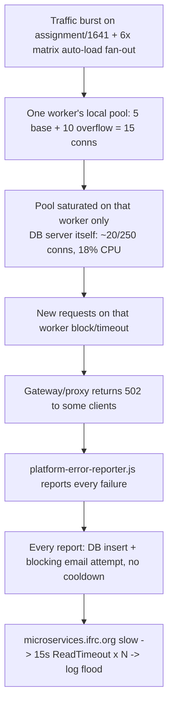

# Platform 502 burst + security-alert email storm — incident writeup & infra recommendations

**Date:** 2026-07-22
**Incident window:** ~07:10–07:15 UTC (09:10–09:15 CEST)
**Author:** Databank engineering (code fixes) + live Azure CLI inventory (infra evidence)
**Audience:** Infra/platform networking, Databank engineering
**Status:** App-side fixes **shipped**; infra items below need an infra decision/action

---

## 1. What users saw

Intermittent HTTP 502s on `https://databank.ifrc.org/forms/assignment/1641?page=0` for a few minutes around 07:12 UTC. The client-side error reporter (`platform-error-reporter.js`) correctly detected these as edge/proxy responses and POSTed to `/api/v1/platform-error`, which in turn logged a `platform_502_bad_gateway` **security event** and tried to email admins for every single report.

The pasted logs showed a storm of `requests.exceptions.ReadTimeout` tracebacks — every alert-email attempt blocked for the full 15s timeout against `microservices.ifrc.org` (IFRC's email microservice) before failing, and this repeated for every report with no throttling.

## 2. Root cause chain — verified against live Azure metrics/config, not just log inference

This was **not** a database-capacity or DB-tier problem. Verified via `az monitor metrics list` / `az postgres flexible-server` / `az webapp` against the live prod resources at the incident timestamp:

| Signal (07:10–07:15 UTC) | Value | Verdict |
|---|---|---|
| `databank-db` CPU % | ~18% (baseline ~10-14%) | Healthy, plenty of headroom |
| `databank-db` memory % | ~55-60% | Healthy, stable — no change vs baseline |
| `databank-db` active connections | ~19-21 (out of `max_connections=250`) | **Nowhere near the server-side limit** |
| App Service `ifrc-databank-app` requests/5min | 127 → **956** (07:10) → 515 (07:15) | Genuine **~5-7x traffic burst**, matches incident window exactly |
| App Service `Http5xx` count | **1** total in the 07:10 bucket | Most user-visible "502s" likely never reached the App Service — see §5 |
| App Service memory working set | ~750-900 MB (P2v3 plan ≈ 3.5-14 GB depending on size) | Healthy |
| App Service avg response time | 0.48-1.68s | No sustained slow-down at the aggregate level |

So: **the DB and the App Service were both healthy in aggregate.** What actually happened is a narrower, per-worker problem:

1. A burst of concurrent requests hit **one Gunicorn worker** (pid 9244) serving `assignment/1641` — likely several users on the same heavy page plus its `/api/v1/matrix/auto-load-entities` fan-out (already flagged in the existing `gateway-504-worker-saturation.md` runbook as firing **6 parallel calls per form open**).
2. That worker's **local** DB connection pool is small: `pool_size=5 + max_overflow=10 = 15` connections max, **per worker** — confirmed live in Azure (`SQLALCHEMY_POOL_SIZE=5` is explicitly set in prod app settings; `SQLALCHEMY_MAX_OVERFLOW` is **not** set at all, so it silently falls back to the code default of `10`).
3. The incident log's own diagnostic confirms exactly this: `DB pool 15/5 checked out (overflow 10)` — that one worker's pool was **100% saturated**, while the DB server itself sat at ~20 total connections out of 250 available. New requests on that worker blocked for `pool_timeout` and started failing/timing out.
4. Every failure was reported by the browser and hit `/api/v1/platform-error`, which logged a `high`-severity security event **and fired a blocking admin-email attempt for every single report** — no server-side dedupe existed. Each attempt burned the full 15s `requests.post` timeout against `microservices.ifrc.org`, which was slow/unresponsive during the window, producing the log flood you pasted.
5. This alerting path is **worker-local**: with `REDIS_URL` unset in prod (confirmed — absent from both `appsettings` and `connection-strings`), any future cross-worker cooldown/circuit-breaker only self-coordinates *within* a process, not across the 3 Gunicorn workers.

## 3. App-side fixes shipped (this session)

These directly stop the **alert-storm amplification** (item 4-5 above) regardless of what infra decides below:

| File | Change |
|---|---|
| `app/services/security/alert_cooldown.py` (new) | Redis-backed (fallback: in-process) "send at most once per window" gate, keyed by `event_type` |
| `app/services/security/monitoring.py` | `SecurityMonitor.log_security_event`/`_send_security_alert` accept `alert_cooldown_seconds`; the security event is **always** logged/recorded, only the **email dispatch** is throttled |
| `app/routes/api/error_log.py` | Platform 5xx reports now pass `PLATFORM_ERROR_ALERT_COOLDOWN_SECONDS` (default 600s / 10 min) |
| `app/services/email/client.py` | New process-local **circuit breaker** around the IFRC email API (`_EmailApiCircuitBreaker`): opens after 3 consecutive no-response failures, short-circuits for 60s (half-open trial after), so a dead mail API stops blocking worker threads for 15s per call; `email_delivery_failure` alerts also get a 10-min cooldown |
| `tests/unit/test_services/test_alert_cooldown.py`, `test_security_monitoring.py`, `test_email_client.py` | New/updated unit tests for cooldown + circuit breaker (all passing) |

**Caveat:** because `REDIS_URL` is unset in prod (§2.5, §4.3), these gates run **per-worker**. With 3 workers you'll now get **at most 3 alert emails per incident per event type** instead of dozens — a big improvement, but not the single fleet-wide email you'd get with Redis configured.

## 4. Infra-facing recommendations

### P0 — cheap, high-value, no risk

| Action | Current (verified live) | Recommended | Why |
|---|---|---|---|
| Set `SQLALCHEMY_MAX_OVERFLOW=20` explicitly in App Service config | **Unset** → falls back to code default `10` | `20` | `azure-deploy.ps1`'s original provisioning intent was `POOL_SIZE=10`/`MAX_OVERFLOW=20`; someone later set `SQLALCHEMY_POOL_SIZE=5` directly in Azure without touching overflow. Config now silently drifted from what the deploy script documents. |
| Set `SQLALCHEMY_POOL_SIZE=10` explicitly | **`5`** (explicit app setting) | `10` | Doubling per-worker pool budget (5+10=15 → 10+20=30) directly targets the failure mode in §2: the DB server has **enormous** headroom (~20/250 connections in use) to absorb this — 3 workers × 30 = 90 max, still only 36% of `max_connections=250`. |
| Provision `REDIS_URL` (Azure Cache for Redis, even Basic C0) | **Not configured** (verified: no app setting, no connection string) | Configure and set `REDIS_URL` | Makes the new alert cooldown/circuit-breaker fleet-wide (1 email instead of up to 3), and also fixes two *already-documented* gaps: ARR-affinity dependency for sessions/rate-limits, and the presence store being per-worker-memory (both called out in `gateway-504-worker-saturation.md`). One Redis instance fixes three separate incident classes. |

### P1 — verify/decide, moderate effort

| Action | Current (verified live) | Recommended | Why |
|---|---|---|---|
| Investigate the orphaned deployment slot `restore-b5c8` | **Running**, 0% traffic routed (confirmed via `az webapp traffic-routing show` → empty) | Confirm with whoever created it whether it's still needed; delete if not | On non-scaled-per-slot plans, a running slot still consumes CPU/RAM on the same App Service Plan instance as production. Its name strongly suggests a prior incident restore — worth a 5-minute check, low urgency since it receives no traffic today. |
| Reconcile Application Gateway 502 counts vs App Service `Http5xx` | App Service logged **1** Http5xx in the whole 07:10-07:15 window while users saw a burst of 502s | Pull AppGW access logs (`backendResponseStatus`, `timeTaken`) for 07:10-07:15 UTC 2026-07-22 | If AppGW itself returned most of the 502s (backend timeout/health-probe failure) rather than the App Service, the real trigger may be the AppGW backend timeout (~30s, per existing runbook) tripping while a request queued behind the saturated worker pool — not the app returning 502 directly. This changes whether the AppGW timeout also needs tuning. Neither Databank engineering nor this account has access to the AppGW resource (owned by subscription `3d7b0c75-…`, per `2026-07-21-staging-rg-appgw-migration-plan.md`) — **infra must pull this**. |
| Batch/lazy-load the matrix auto-load fan-out | 6 parallel `POST /api/v1/matrix/auto-load-entities` per form open (pre-existing, documented in `gateway-504-worker-saturation.md` P1) | Still open | Directly reduces the per-worker concurrent-DB-call burst that saturates the local pool; complements the pool-size bump above rather than replacing it. |

### P2 — monitor, no action needed right now

| Item | Note |
|---|---|
| `databank-db` is `Standard_B1ms` (Burstable, 1 vCore / 2 GiB RAM) with `max_connections` manually overridden from the SKU default (`50`) to `250` | Not implicated in *this* incident (CPU/memory/connections all had headroom), but a Burstable SKU allowing 250 connections means CPU-credit exhaustion under a sustained (not just brief) load spike is a real future risk — each connection has its own backend process; 250 of them contending for 1 vCore's burst credits during a longer/heavier incident could genuinely exhaust the server, unlike this short burst. Keep an eye on CPU-credit / `cpu_percent` trends if traffic grows; no change needed today. |
| `GUNICORN_TIMEOUT`, `GUNICORN_THREADS`, `DB_STATEMENT_TIMEOUT_MS`, `DB_CONNECT_TIMEOUT` are all **unset** in prod, relying on code defaults (60s / 8 / 18000ms / 10s respectively) | These defaults are sane and already tuned for this exact failure mode per `config/gunicorn.conf.py` comments — no urgent change, but consider setting them explicitly in Azure App Settings for auditability (matches the existing `general-incident-triage.md` P0 recommendation). |
| `microservices.ifrc.org` (IFRC email API) was slow/unresponsive during the window | This is an external, IFRC-shared service outside Databank's Azure resources. The circuit breaker (§3) now stops it from blocking Gunicorn threads, but if these timeouts recur often, worth asking the team that owns `microservices.ifrc.org` whether it was degraded at 07:10-07:15 UTC 2026-07-22, independent of this incident. |

## 5. Open questions for infra

1. Can someone with access to the Application Gateway (subscription `3d7b0c75-…`, per the 2026-07-21 staging/AppGW migration doc) pull backend response codes/timing for `databank.ifrc.org` between **07:08-07:18 UTC on 2026-07-22**? This will confirm whether the 502s originated at AppGW (health-probe/backend-timeout) or were passed through from the App Service.
2. Is `restore-b5c8` (deployment slot on `ifrc-databank-app`) still needed? It's running but receives 0% traffic.
3. Any objection to provisioning a small Azure Cache for Redis instance for `REDIS_URL`? This is the single highest-leverage infra change outstanding — it closes three separate documented gaps (alert-storm fan-out, ARR-affinity session/rate-limit coupling, per-worker presence store) with one resource.
4. OK to bump `SQLALCHEMY_POOL_SIZE` (5→10) and add `SQLALCHEMY_MAX_OVERFLOW=20` in the App Service configuration blade? DB headroom confirmed live (250 `max_connections`, ~20 in use at incident peak), so this is low-risk.

## 6. How to verify after changes

- Re-run the CPU/memory/connections/requests metrics pull above for the next real traffic burst and confirm `active_connections` stays comfortably under the new `workers × (pool_size + max_overflow)` ceiling.
- Grep app logs for `DB pool` diagnostic lines during any future 502 report — should no longer show `15/5` at the ceiling.
- Confirm at most one `SECURITY ALERT: platform_502_bad_gateway` **email** per 10-minute window in the mailbox (cooldown), vs. the dozens seen this incident. Underlying `SecurityEvent` rows in the DB should still show every distinct report — cooldown only throttles the email leg.
- If `REDIS_URL` is provisioned, confirm `alert_cooldown.py`'s Redis path is active (`_get_redis()` returns non-`None`) — e.g. via a log line or a quick shell check in a worker process.
